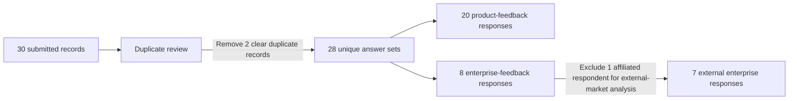
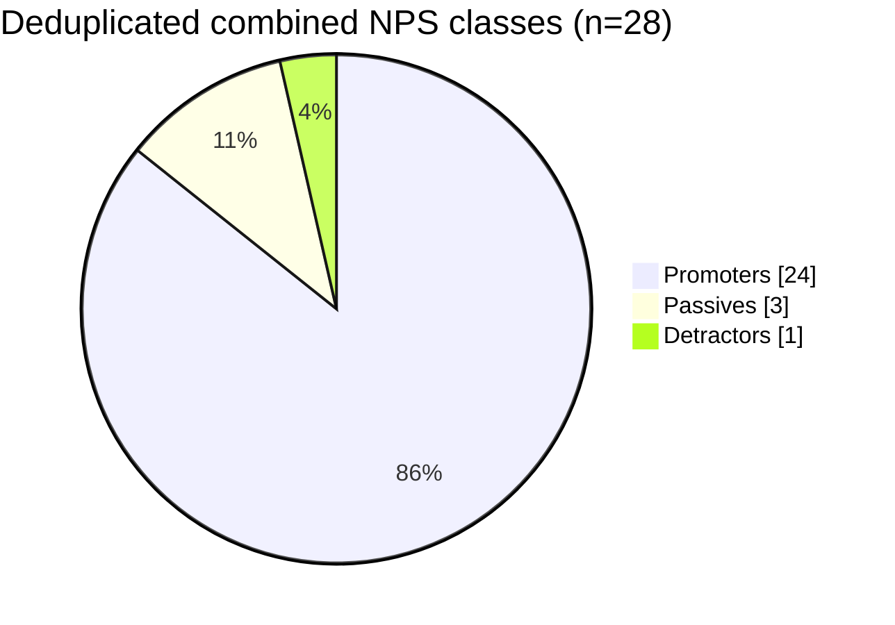
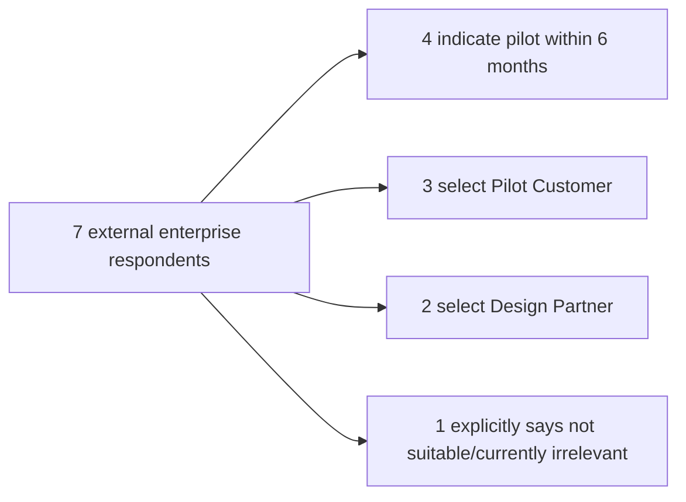
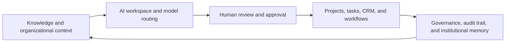

# Enterprise Beta Feedback — Batch 1

**Product:** AXXESS by Triaxis  
**Report type:** Beta research, product diagnosis, and iteration action plan  
**Study window:** 7–20 July 2026  
**Report version:** 1.0  
**Prepared for:** Product, engineering, founders, pilot partners, investors, and accelerator diligence  
**Recommended repository path:** `docs/research/enterprise-beta-feedback-batch-1.md`  
**Confidentiality:** Public-safe aggregate report. Personally identifiable information from the raw response database has been intentionally excluded.

---

## 1. Executive summary

Batch 1 produced a strong but early directional signal that AXXESS's underlying product thesis is resonating: users see value in a unified AI-native operating platform that combines model orchestration, human review, enterprise workflows, knowledge, governance, and institutional coordination.

The cleaned dataset contains **30 submitted survey records representing 28 unique answer sets** after removal of two clear duplicate submissions. The deduplicated sample consists of **20 product-feedback respondents and 8 enterprise-feedback respondents**, of whom **7 are clearly external to the founding or affiliated team**.

The headline NPS remains strong after data cleaning:

- **Product-feedback NPS:** 80.0 on 20 unique responses.
- **Enterprise-feedback NPS:** 87.5 on 8 unique responses.
- **External-enterprise NPS:** approximately 85.7 on 7 clearly external responses.
- **Combined deduplicated NPS:** 82.1 on 28 unique answer sets.

The most important finding is not the NPS itself. It is the separation between enthusiasm for the architecture and dissatisfaction with execution maturity:

1. Users most consistently value **AI Workspace and model routing**, **Human-in-the-Loop review**, and **enterprise workflow/task management**.
2. The three product-survey non-promoters all selected both **slow or unreliable performance** and **unclear product value or use cases**.
3. Respondents who selected **limited integrations** and **features feel incomplete** were nevertheless promoters. This suggests that integrations and completeness are expansion demands from users who already believe in the product, while reliability and clarity are the principal blockers to broader conversion.
4. Among seven external enterprise respondents, **four indicated a pilot horizon of six months or less**, **three explicitly selected Pilot Customer**, and **two selected Design Partner**. These are qualified expressions of intent, not yet contractual traction.

The correct conclusion is therefore:

> **Batch 1 validates the product architecture and exposes a tractable execution gap. It does not yet establish product-market fit, retention, procurement success, or willingness to pay.**

The immediate product priority is to make the existing promise dependable and legible before expanding the surface area further.

---

## 2. Headline metrics

| Metric | Raw database | Deduplicated / diligence view | Interpretation |
|---|---:|---:|---|
| Submitted survey records | 30 | 28 unique answer sets | Two clear duplicate records removed |
| Product-feedback records | 21 | 20 | One duplicate promoter response removed |
| Enterprise-feedback records | 9 | 8 | One duplicate enterprise response removed |
| Clearly external enterprise respondents | — | 7 | One respondent identified as affiliated/core team |
| Combined promoters | 26 | 24 | Strong advocacy signal, but convenience-sample bias applies |
| Combined passives | 3 | 3 | High-value interview pool |
| Combined detractors | 1 | 1 | Highest-priority diagnostic interview |
| Combined NPS | 83.3 | 82.1 | Positive signal survives deduplication |
| Product NPS | 80.95 | 80.0 | 17 promoters, 2 passives, 1 detractor after deduplication |
| Enterprise NPS | 88.89 | 87.5 | 7 promoters, 1 passive after deduplication |
| External-enterprise NPS | — | ~85.7 | 6 promoters, 1 passive; excludes affiliated respondent |
| External respondents indicating pilot in ≤6 months | — | 4 of 7 | Intent only; must be converted into scoped pilots |
| Explicit external Pilot Customer selections | — | 3 | Strongest current pipeline signal |
| Explicit external Design Partner selections | — | 2 | May overlap with other opportunity selections |
| Product respondents rating loss of AXXESS 9–10 | 14 of 21 | 13 of 20 | 65% high attachment on an adapted 0–10 question |
| Product respondents rating AI-native perception 9–10 | 14 of 21 | 13 of 20 | 65% perceive the beta as strongly AI-native |
| **Actionable surveyed data points** | **1,236** | **1,112** | Instrument-weighted atomic survey fields; definition below |

### 2.1 Definition: “actionable surveyed data points”

For transparency, this report uses an **instrument-weighted atomic field metric**, not a claim that every data point is statistically independent.

- The six-question product instrument generates up to **10 atomic decision signals per response**: three scalar ratings, up to three selected value features, up to three selected product problems, and one qualitative improvement response.
- The 34-question enterprise instrument generates up to **114 atomic decision signals per response** after expanding its matrices, module ratings, competitor comparisons, roadmap selections, commercial questions, and qualitative fields.

Therefore:

```text
Raw survey density:
(21 product submissions × 10 atomic fields)
+ (9 enterprise submissions × 114 atomic fields)
= 1,236 actionable surveyed data points

Deduplicated survey density:
(20 unique product responses × 10 atomic fields)
+ (8 unique enterprise responses × 114 atomic fields)
= 1,112 actionable surveyed data points
```

This metric demonstrates the **depth of the instruments**, not the size of the user base. Optional blanks, selections below the allowed maximum, and multiple observations from the same respondent must be considered in statistical interpretation. It should never be presented as 1,112 users, usage events, or independent market validations.

---

## 3. Dataset structure and integrity

### 3.1 Response flow



### 3.2 Duplicate handling

Two duplicate pairs were identified from matching timestamps, identical answer patterns, and identical qualitative responses:

- One product response appeared twice within seconds with the same ratings, feature selections, issue selections, and long-form answer.
- One enterprise response appeared twice with the same respondent identity, timestamp, and answer set.

The duplicates were retained in the raw-source count for auditability but excluded from the main analytical denominator.

### 3.3 Internal and external respondents

One enterprise respondent explicitly identified as a core-team member of an affiliated organization. This record is useful for product QA and completeness testing but should not be included in external customer-validation claims. Accordingly, this report presents:

- total enterprise metrics on eight unique responses; and
- external-enterprise commercial metrics on seven respondents.

### 3.4 Privacy and publication policy

The raw database includes names, organizations, email addresses, locations, and role information. Those details should remain outside a public GitHub repository unless respondents have explicitly consented to publication. This report uses anonymized aggregates and respondent archetypes.

Recommended repository policy:

- Commit this report.
- Do not commit raw response PDFs or respondent emails to a public repository.
- Store raw responses in an access-controlled research directory or encrypted data room.
- If a machine-readable dataset is later committed, use anonymized IDs and remove direct identifiers and free-text fragments that could identify individuals.

---

## 4. Research objectives

Batch 1 was designed to answer six questions:

1. Does the product feel meaningfully AI-native rather than like conventional software with an AI layer?
2. Which product capabilities create the strongest perceived value?
3. Which weaknesses most reduce usefulness or block adoption?
4. Do enterprise respondents trust the product enough to consider sensitive workflows?
5. Is there credible interest in design partnerships, pilots, or eventual purchasing?
6. Which product changes should be sequenced first rather than added indiscriminately?

The surveys were not designed to establish statistically representative market demand. They were designed as an early-stage diagnostic instrument to identify product architecture resonance, friction patterns, and pilot-conversion opportunities.

---

## 5. Survey instruments

### 5.1 Product-feedback pulse survey

The product instrument contained six top-level questions covering:

- likelihood to recommend;
- disappointment if the product disappeared;
- three most valuable current features;
- three issues most reducing usefulness;
- perception of AI-native architecture; and
- one highest-priority qualitative improvement.

This instrument is short enough to maximize completion but sufficiently structured to reveal the difference between value recognition and execution friction.

### 5.2 Enterprise diagnostic survey

The enterprise instrument contained 34 top-level questions and more than 100 atomic fields after matrix expansion. It covered:

- respondent role, organization, geography, and experience;
- overall product experience across eight dimensions;
- 12 modules rated on usefulness, intuitiveness, completeness, and organizational applicability;
- AI-native perception and AI-capability quality;
- security, permissions, governance, auditability, and scalability;
- trust with sensitive data;
- product-loss disappointment;
- primary use case and problem solved;
- gaps and requested capabilities;
- pilot horizon, expected budget, decision-maker, and procurement cycle;
- comparisons with established productivity and enterprise tools;
- desired roadmap features; and
- willingness to participate as a pilot customer, design partner, advisor, investor, strategic partner, mentor, or community member.

This depth is important: a positive top-line rating can be compared against module-level scores, trust, budget, buying-cycle, and stated action. The instrument therefore produces more decision value than a simple satisfaction poll.

---

## 6. NPS analysis

### 6.1 Deduplicated NPS composition



### 6.2 Cohort comparison

| Cohort | Unique responses | Promoters | Passives | Detractors | NPS |
|---|---:|---:|---:|---:|---:|
| Product-feedback | 20 | 17 | 2 | 1 | 80.0 |
| Enterprise-feedback | 8 | 7 | 1 | 0 | 87.5 |
| External enterprise only | 7 | 6 | 1 | 0 | ~85.7 |
| Combined | 28 | 24 | 3 | 1 | 82.1 |

### 6.3 Interpretation

The NPS is directionally encouraging, but four factors prevent it from being treated as proof of PMF:

1. **Small sample:** one response changes enterprise NPS by 12.5 points.
2. **Selection bias:** respondents willing to complete a detailed beta survey are more likely to be engaged or founder-adjacent.
3. **Courtesy and social-desirability bias:** several responses combine very high scores with thin use-case specificity or limited organizational fit.
4. **No behavioral corroboration:** survey advocacy has not yet been matched to sustained usage, pilot completion, procurement, or payment.

The NPS should therefore be used as a prioritization and follow-up signal. The most valuable next step is not to collect more 9s and 10s; it is to convert stated enthusiasm into observable behavior.

---

## 7. Product-feedback findings

### 7.1 Highest-value current capabilities

Deduplicated counts are shown below. Respondents could select up to three, so percentages do not sum to 100%.

| Rank | Capability | Selections | Share of 20 unique respondents |
|---:|---|---:|---:|
| 1 | AI Workspace and model routing | 15 | 75% |
| 2 | Human-in-the-Loop Review Inbox | 12 | 60% |
| 3 | Enterprise workflow and task management | 11 | 55% |
| 4 | Policy controls and governance | 7 | 35% |
| 5 | Documents, knowledge and RAG | 6 | 30% |
| 6 | Multi-tenant security and role-based access | 4 | 20% |
| 7 | Gmail/Microsoft integrations | 3 | 15% |
| 8 | Audit trails and workflow evidence | 1 | 5% |

```text
AI Workspace and model routing        15 | ███████████████ 75%
Human-in-the-Loop Review Inbox        12 | ████████████    60%
Enterprise workflow/task management  11 | ███████████     55%
Policy controls and governance         7 | ███████         35%
Documents, knowledge and RAG           6 | ██████          30%
Multi-tenant security / RBAC           4 | ████            20%
Gmail/Microsoft integrations           3 | ███             15%
Audit trails / workflow evidence       1 | █                5%
```

### 7.2 Architectural interpretation

The data argues against positioning AXXESS primarily as a RAG product or document chatbot. The most valuable pattern is the combination of:

1. **AI orchestration:** workspace, model routing, and AI assistance;
2. **human control:** review, approval, and accountability; and
3. **institutional execution:** workflows, projects, tasks, policy, and governance.

The likely strategic wedge is therefore:

> **An AI-native institutional operating layer that routes intelligence into governed human workflows.**

Knowledge and RAG remain important, but they appear to function as enabling infrastructure rather than the principal differentiated value proposition.

### 7.3 Issues reducing usefulness

| Rank | Issue | Selections | Share of 20 unique respondents |
|---:|---|---:|---:|
| 1 | Limited integrations | 9 | 45% |
| 2 | AI output quality | 8 | 40% |
| 2 | Features feel incomplete | 8 | 40% |
| 4 | Too many steps or approvals | 7 | 35% |
| 5 | Unclear product value or use cases | 6 | 30% |
| 5 | Slow or unreliable performance | 6 | 30% |
| 7 | Difficult onboarding or setup | 4 | 20% |
| 8 | Security or trust concerns | 3 | 15% |
| 9 | Mobile experience | 2 | 10% |
| 9 | User interface or navigation | 2 | 10% |
| 9 | Other | 2 | 10% |

```text
Limited integrations                  9 | █████████ 45%
AI output quality                     8 | ████████  40%
Features feel incomplete              8 | ████████  40%
Too many steps or approvals           7 | ███████   35%
Unclear value or use cases            6 | ██████    30%
Slow or unreliable performance       6 | ██████    30%
Difficult onboarding or setup         4 | ████      20%
Security or trust concerns            3 | ███       15%
Mobile experience                     2 | ██        10%
User interface or navigation          2 | ██        10%
Other                                 2 | ██        10%
```

### 7.4 The promoter/non-promoter differential

This is the strongest diagnostic result in the product survey.

All three non-promoters—two passives and one detractor—selected:

- **slow or unreliable performance**; and
- **unclear product value or use cases**.

All three nevertheless selected **AI Workspace and model routing** as one of the product's most valuable capabilities.

This pattern implies that the core proposition is visible even to the least enthusiastic respondents. The failure mode is not rejection of the product category. It is insufficient reliability and insufficiently clear translation from capability to job-to-be-done.

By contrast:

- all respondents who selected **limited integrations** were promoters; and
- all respondents who selected **features feel incomplete** were promoters.

These are therefore best interpreted as **expansion requests from believers**, not as the first adoption blockers.

### 7.5 Product attachment and AI-native perception

After deduplication:

| Measure | Result | Interpretation |
|---|---:|---|
| Mean likelihood to recommend | ~9.55 / 10 | High stated advocacy |
| Mean disappointment if unavailable | ~8.50 / 10 | Strong early attachment, but not standard PMF methodology |
| Mean AI-native perception | ~8.65 / 10 | Architecture is broadly understood as AI-native |
| Respondents scoring disappointment 9–10 | 13 of 20 (65%) | Strong directional loss aversion |
| Respondents scoring AI-native perception 9–10 | 13 of 20 (65%) | Majority perceive native rather than bolted-on AI |

The disappearance question was asked on a 0–10 scale rather than the standard categorical “very disappointed / somewhat disappointed / not disappointed” PMF question. It should be described as an **attachment signal**, not a formal PMF score.

### 7.6 Qualitative improvement themes

The 20 unique product responses contained 11 substantively actionable free-text answers; eight were blank and one effectively reported no requested change. The actionable comments clustered into:

| Theme | Representative meaning | Product implication |
|---|---|---|
| Output consistency and explainability | More consistent results; concise explanations of AI decisions | Add answer provenance, confidence, rationale, and regression evaluation |
| Integrations and custom workflows | Third-party integrations; customized workflows | Prioritize a narrow integration bundle tied to target workflows |
| Mobile availability | App-store/demo access; better mobile experience | Ship a usable mobile companion after core web reliability |
| Value communication | Make product value and use cases clearer | Redesign onboarding around role-specific jobs and outcomes |
| Usability | More user-friendly; reduce friction | Shorten path to first successful workflow |
| Automation and structure | Startup structure, automatic management, HR development | Indicates demand for packaged workflow templates |

---

## 8. Enterprise-feedback findings

### 8.1 Sample composition

The eight unique enterprise records include respondents from:

- education and academic administration;
- nursing/health education;
- government-adjacent stakeholder roles;
- nonprofit and international development work;
- institutional management;
- policy and development work; and
- general enterprise management.

The unique geographic composition is seven respondents from Asia and one from Africa. One Asian respondent is affiliated with the founding ecosystem and is excluded from external-commercial metrics.

The sample is useful for early institutional-product discovery because it contains experienced professionals and prospective organizational users. It is not yet representative of a single ICP because it spans multiple sectors, organizational forms, and purchasing contexts.

### 8.2 Trust with sensitive organizational data

Among seven clearly external enterprise respondents:

| Trust response | Count | Share |
|---|---:|---:|
| Definitely | 4 | 57% |
| Probably | 2 | 29% |
| Not sure | 1 | 14% |
| Probably not / definitely not | 0 | 0% |

Thus, **6 of 7 external respondents would probably or definitely trust AXXESS with sensitive organizational data**.

This is meaningful because trust is essential to the proposed B2B/B2G category. It is not equivalent to a completed security review. Before this signal can convert into enterprise adoption, AXXESS will need evidence such as:

- explicit data-processing architecture;
- tenant isolation documentation;
- role-based authorization tests;
- audit-log integrity;
- secrets management;
- backup and recovery procedures;
- incident-response policy;
- data-retention and deletion controls; and
- region-specific compliance documentation.

### 8.3 Pilot intent

Among seven external enterprise respondents:

| Commercial signal | Count | Interpretation |
|---|---:|---|
| Stated pilot horizon within 3 months | 1 | Near-term qualified follow-up |
| Stated pilot horizon within 6 months | 3 | Medium-term qualified follow-up |
| Total pilot horizon within 6 months | 4 | 57% of external enterprise sample |
| Explicitly selected Pilot Customer | 3 | Highest-value current conversion targets |
| Explicitly selected Design Partner | 2 | Suitable for co-design and workflow discovery |
| Not suitable / no current relevance | 1 | Useful negative-control response |



Pilot intention must be treated as a lead stage, not traction. The next proof point is a written pilot charter containing a workflow, owner, baseline, success metric, timeline, data-access plan, and commercial next step.

### 8.4 Budget signals

The enterprise database contains budget indications ranging from approximately **$100–$500 annually** to **$5,000+ annually**. At least three external respondents selected the $5,000+ category, while others selected lower bands or left the field unclear.

The polarized answers indicate that the current survey mixes organizations with very different purchasing power and software expectations. Budget responses should not be averaged. Instead, future research should segment by:

- organization size;
- buyer authority;
- current software spend;
- workflow criticality;
- user count;
- required support and implementation; and
- deployment and compliance requirements.

A stated $5,000+ budget is encouraging but remains unvalidated until the respondent is confirmed as a budget holder or procurement influencer.

### 8.5 Decision-makers and buying cycles

Named decision-makers included roles such as:

- CEO;
- executive director;
- project head;
- principal;
- secretary; and
- head of department.

This supports a top-down enterprise sales motion but also reveals that the product must be legible to different buyers. The value proposition for a CEO is not identical to the value proposition for a department head, M&E professional, or operational user.

Buying-cycle answers were inconsistent, occasionally implausibly long, and sometimes unclear. They should not be used to estimate sales velocity. In Batch 2, buying-cycle questions should use fixed ranges and distinguish:

1. time to approve a low-cost pilot;
2. time to approve production software;
3. time to complete security/procurement review; and
4. budget-cycle constraints.

### 8.6 Jobs-to-be-done and use-case breadth

Enterprise respondents identified or implied use cases including:

- enterprise operations and coordination;
- knowledge management;
- project and programme management;
- governance and institutional control;
- CRM and stakeholder coordination;
- AI assistance;
- education administration;
- healthcare and nursing education workflows; and
- government or nonprofit programme operations.

The breadth confirms that the horizontal architecture is understandable. It does not identify a single dominant initial wedge.

The most coherent early wedge emerging from the combined evidence is:

> **AI-enabled institutional and programme operations for organizations that manage documents, stakeholders, approvals, projects, reporting, and human-reviewed decisions.**

Likely early segments include NGOs, government-adjacent programmes, education, health institutions, and professional-service organizations. This should be tested rather than assumed.

### 8.7 High-information respondent archetypes

The following anonymized archetypes are more useful than a simple average:

| ID | Archetype | High-information signals | Recommended follow-up |
|---|---|---|---|
| E-01 | Affiliated policy/development operator | Very positive; enterprise operations; coordination; AI workflow gap; pilot within 3 months | Use for QA and internal workflow design; exclude from external traction |
| E-02 | Senior education professional | High product ratings; uncertain trust; high budget category; limited concrete pilot action | Interview to understand rating/action mismatch |
| E-03 | Experienced government-adjacent stakeholder | Definite trust; very disappointed if lost; pilot within 6 months; selected Pilot Customer | Convert into one government-programme workflow pilot |
| E-04 | Health-education administrator | Definite trust; governance pain; pilot within 3 months; $5,000+ category; Pilot Customer | Strong near-term pilot candidate |
| E-05 | Institutional education professional | Probable trust; somewhat disappointed; pilot within 6 months; Design Partner | Use for usability and workflow-template co-design |
| E-06 | Academic professional with low fit | Probable trust but product not relevant/suitable for organization | Negative-control interview; sharpen qualification rules |
| E-07 | International-development / M&E professional | Definite trust; high attachment; knowledge/programme-management use; $5,000+ category; design-partner interest; asks for more features | Highest-value discovery interview for NGO/programme wedge |
| E-08 | Enterprise manager | Definite trust; AI assistant/CRM use; pilot within 6 months; Pilot Customer | Convert into CRM/stakeholder workflow pilot |

### 8.8 Competitive-comparison results

Respondents generally rated AXXESS favorably against products such as Microsoft productivity tools, Notion, ClickUp, Monday.com, Airtable, Salesforce, Atlassian tools, Google Workspace, SharePoint, and internal organizational tools.

These comparisons are directionally useful but should not be used as a market claim because:

- respondents may not have deep experience with every listed product;
- some response patterns show repeated 4s or 5s across nearly all tools;
- AXXESS was evaluated as a beta rather than through equivalent production deployments; and
- high courtesy scores can create ceiling effects.

The more defensible conclusion is that respondents perceive value in **consolidation**: a single workspace combining capabilities that they currently associate with several separate systems.

---

## 9. Consolidated product thesis emerging from Batch 1

### 9.1 What users appear to be buying conceptually

Users are not primarily responding to “another AI assistant.” They appear to value a system that connects:



The loop matters. AXXESS becomes more differentiated when intelligence is not isolated in a chat window but converted into accountable institutional action and retained as auditable memory.

### 9.2 Strongest validated elements

- Users recognize the platform as AI-native.
- AI workspace/model routing is the leading perceived-value capability.
- Human-in-the-loop review is a major differentiator.
- Workflow and task management are central, not peripheral.
- Governance and role controls matter to institutional respondents.
- Trust is directionally positive among external enterprise respondents.
- There is a small but identifiable pilot/design-partner pool.

### 9.3 Weakest validated elements

- Reliability is not yet sufficient for universal advocacy.
- Product value and use cases are not consistently obvious.
- The current surface area feels incomplete to many promoters.
- Integration demand is strong.
- AI-output consistency and explanation require improvement.
- The sample does not identify one dominant ICP or workflow.
- No retention, production usage, procurement, or payment evidence exists yet.

---

## 10. Product-priority framework

A feature should not be prioritized solely because it received many votes. Batch 1 supports a sequence based on whether a problem blocks adoption, accelerates conversion, or expands the product after activation.

### 10.1 Priority classification

| Priority | Workstream | Evidence | Why now | Batch-1 success criterion |
|---|---|---|---|---|
| P0 | Reliability and performance | Every product non-promoter selected slow/unreliable performance | Reliability blocks trust and invalidates every other feature | ≥99.5% successful core actions; documented latency targets; error telemetry live |
| P0 | Use-case clarity and onboarding | Every product non-promoter selected unclear value/use cases | Users must reach a concrete outcome before exploring breadth | Median first-value time <10 minutes; ≥70% onboarding completion in test cohort |
| P0 | AI-output quality and explainability | 40% selected output quality; qualitative demand for consistent results and explanations | AI confidence is foundational to HITL and governance | Evaluation suite; answer provenance; visible rationale; reduced critical-error rate |
| P0 | Workflow simplification | 35% selected too many steps/approvals | Governance must not become friction | Reduce steps in top workflow by ≥30%; measure completion rate |
| P1 | Core integrations | 45% selected limited integrations; all were promoters | Integrations convert enthusiasm into daily utility | Deliver 2–3 integrations tied to pilot workflows, not a generic catalogue |
| P1 | Complete highest-value workflows | 40% selected incomplete features | Promoters want the promise finished | Three end-to-end workflows work without dead ends |
| P1 | Pilot templates | Enterprise respondents cite operations, governance, knowledge, CRM | Faster pilot setup and clearer ICP learning | Four scoped pilot templates and baseline metrics |
| P1 | Mobile companion | Repeated free-text and roadmap demand | Useful for approvals, notifications, and field access | Mobile supports review/approval, task updates, and notifications reliably |
| P2 | Offline and multilingual capabilities | Appears in enterprise roadmap requests | Important for Global South deployment, but should follow core reliability | Validate with specific pilot requirements before broad build |
| P2 | Vertical modules | Healthcare, government, NGO and financial modules requested | Could sharpen GTM but risks fragmentation | Build configurable templates before separate codebases |
| P2 | Agentic automation | Requested by several respondents | High upside but raises control and reliability requirements | Introduce bounded agents with approval, logs, and rollback |

### 10.2 What not to do

Batch 1 does not support indiscriminately adding every requested feature. Specifically:

- Do not build separate vertical products before validating reusable workflow primitives.
- Do not expand agent autonomy before strengthening human review, logs, and evaluation.
- Do not treat mobile as a substitute for web reliability.
- Do not add many integrations without tying each to an activated workflow.
- Do not market broad enterprise readiness before completing security and operational controls.

---

## 11. 30/60/90-day iteration plan

### Days 0–30: Make the promise reliable and legible

**Objective:** ensure a new qualified user can understand the product, complete one meaningful workflow, and trust the result.

#### Engineering

- Instrument all core actions with success/failure events and latency.
- Establish a reliability dashboard for authentication, workspace creation, document ingestion, retrieval, AI generation, review, approval, task creation, and notifications.
- Define p50, p95, and p99 latency targets.
- Create an AI-output evaluation set using representative enterprise documents and workflows.
- Add source citations/provenance and concise model-rationale display where applicable.
- Fix dead ends and incomplete states in the three highest-value workflows.

#### Product

- Replace capability-first onboarding with role- and outcome-first onboarding.
- Offer three initial paths, for example:
  1. institutional knowledge and AI-assisted decision support;
  2. programme/project workflow with review and approvals; and
  3. stakeholder/CRM coordination with audit trail.
- Reduce the number of required setup decisions before first value.
- Add clear sample data and a guided demo workspace.

#### Research and GTM

- Interview the one detractor and three passives first.
- Interview all four external respondents indicating a pilot within six months.
- Qualify each respondent by user role, buyer authority, workflow urgency, data sensitivity, current tool stack, and budget control.
- Convert expressions of interest into written pilot hypotheses.

#### Exit criteria

- Core workflow completion rate measured.
- Reliability baseline available.
- At least six deep interviews completed.
- Four draft pilot charters prepared.
- Median time to first value measured and below 15 minutes in moderated tests.

### Days 31–60: Convert interest into controlled pilots

**Objective:** run narrowly scoped real-work pilots rather than broad demonstrations.

#### Build

- Ship the two integrations most frequently required by qualified pilots, likely email/calendar and one messaging or document system.
- Release a stable workflow builder or preconfigured workflow templates.
- Add administrative controls required by pilots: user roles, audit logs, export, deletion, and workspace policy.
- Release mobile approval/notification functionality only if stable.

#### Pilot structure

Each pilot should have:

- one workflow;
- one operational owner;
- one executive sponsor or buyer;
- a documented current-state baseline;
- a 30-day duration;
- five to twenty active users, where appropriate;
- agreed success metrics;
- weekly review; and
- a pre-agreed decision on continuation, paid conversion, or closure.

#### Exit criteria

- At least three pilots started.
- At least two pilots have weekly active usage.
- At least one pilot handles a real organizational workflow rather than demo data.
- Security and data-processing documentation shared with pilot partners.

### Days 61–90: Prove retention and commercial conversion

**Objective:** replace survey validation with behavioral and commercial evidence.

- Measure four-week organizational retention.
- Measure repeat workflow completion, not logins alone.
- Identify the workflow with the highest retained usage.
- Test pilot pricing and implementation fees.
- Convert at least one successful pilot to paid continuation or a signed commercial LOI with explicit price and timeline.
- Freeze or deprioritize modules unused in pilots.
- Publish Batch 2 report comparing stated Batch 1 demand with actual usage.

#### Exit criteria

- One paid customer, paid pilot, or signed priced LOI.
- At least two retained pilot organizations at week four.
- A measurable dominant workflow or ICP hypothesis.
- A quantified list of features that users requested but did not use.

---

## 12. Experiment backlog

| Experiment ID | Hypothesis | Method | Primary metric | Decision rule |
|---|---|---|---|---|
| B1-EXP-01 | Reliability is the main blocker for non-promoters | Fix top error paths; retest non-promoters | Core-action success rate; updated recommendation | Continue until no critical workflow failure in test set |
| B1-EXP-02 | Role-specific onboarding improves value clarity | A/B capability-led vs job-led onboarding | First-value completion; time to value | Ship job-led flow if completion improves ≥20% |
| B1-EXP-03 | AI provenance increases trust | Show sources, rationale, and confidence | Accepted-output rate; trust rating; override rate | Retain if acceptance rises without excessive time cost |
| B1-EXP-04 | Email/calendar integration materially increases weekly use | Enable for selected pilot cohort | Weekly workflows per org | Expand only if integrated users show meaningful lift |
| B1-EXP-05 | Human review is a differentiated retention driver | Compare workflows with and without formal review inbox | Review completion and repeat usage | Make central if correlated with retained workflows |
| B1-EXP-06 | Programme operations is a stronger wedge than generic productivity | Run two programme/NGO pilots and two general-enterprise pilots | Activation, retention, willingness to pay | Concentrate GTM on higher-retention segment |
| B1-EXP-07 | Workflow templates outperform blank-slate setup | Offer predefined templates | Setup completion and time | Default to templates if time falls ≥30% |
| B1-EXP-08 | Mobile is most valuable for approvals rather than full workspace use | Release approval-first mobile flow | Mobile weekly approvals and completion | Avoid full mobile parity unless demanded by usage |
| B1-EXP-09 | Vertical modules can be templates rather than separate products | Configure healthcare/government/NGO templates on common primitives | Implementation time; code reuse | Keep shared architecture if ≥80% common components |
| B1-EXP-10 | Promoter integration requests convert to active use | Contact all promoter respondents requesting integrations | Activated integrations and repeat workflows | Prioritize only integrations with committed usage |

---

## 13. Product analytics specification

Survey data should now be connected to product telemetry. The following events are the minimum required for Batch 2.

### 13.1 Activation funnel


### 13.2 Required metrics

| Category | Metric | Definition |
|---|---|---|
| Acquisition | Qualified beta starts | Organizations meeting ICP qualification that begin onboarding |
| Activation | Activated organization | Completes a defined end-to-end workflow within 24 hours |
| Time to value | Median first-value time | Time from first session to first completed useful workflow |
| Reliability | Core-action success rate | Successful critical actions divided by attempts |
| Performance | p50/p95 latency | Latency for retrieval, generation, save, and workflow actions |
| AI quality | Accepted-output rate | AI outputs accepted with no material correction |
| Human control | Override rate | Outputs materially changed or rejected by reviewer |
| Explainability | Evidence-view rate | Share of AI outputs where users inspect sources/rationale |
| Workflow value | Completed workflows per active org | Meaningful completed workflow instances, not page views |
| Retention | Week-1 and Week-4 retained organizations | Organizations completing at least one workflow in period |
| Collaboration | Multi-user activation | Organizations with at least two active users and one handoff |
| Commercial | Pilot-to-paid conversion | Paid continuations divided by completed pilots |
| Expansion | Seats/workflows added | Increase in active users or workflows after initial pilot |

### 13.3 Recommended activation definition

An organization should not be counted as activated merely because a user logs in. A more meaningful Batch 2 activation event is:

> An organization connects or uploads real context, completes an AI-assisted task, sends it through human review, and converts the result into a project, task, approval, or stakeholder action.

This activation definition directly reflects the architecture users valued in Batch 1.

---

## 14. Pilot-conversion protocol

### 14.1 Qualification checklist

A respondent should move from survey lead to pilot candidate only if the following are known:

- exact workflow;
- current process and tools;
- frequency and volume;
- operational pain and cost;
- data type and sensitivity;
- user and buyer roles;
- deployment constraints;
- measurable success condition;
- budget source; and
- timing authority.

### 14.2 Pilot charter template

```text
Organization / anonymized ID:
Pilot owner:
Executive sponsor / buyer:
Workflow being tested:
Current process:
Current baseline time/cost/error rate:
AXXESS modules enabled:
Integrations required:
Users:
Data classification:
Pilot start and end dates:
Success metrics:
Security requirements:
Weekly review cadence:
Commercial continuation price:
Decision date:
```

### 14.3 Pilot success should be behavioral

Do not define pilot success as “positive feedback.” Define it using measures such as:

- workflow completion time reduced by a stated percentage;
- fewer manual handoffs;
- higher retrieval accuracy;
- fewer missed approvals;
- reduced reporting time;
- accepted AI outputs above a defined threshold;
- repeat use without founder prompting; and
- willingness to pay the quoted continuation price.

---

## 15. GitHub iteration and issue-traceability plan

### 15.1 Recommended labels

```text
feedback/batch-1
research/product-survey
research/enterprise-survey
priority/P0
priority/P1
priority/P2
area/reliability
area/onboarding
area/ai-quality
area/explainability
area/workflows
area/integrations
area/mobile
area/security
area/analytics
pilot-required
experiment
```

### 15.2 Recommended issue structure

Every issue created from Batch 1 should contain:

```markdown
## Evidence
- Batch: Enterprise Beta Feedback — Batch 1
- Cohort: Product / Enterprise / External enterprise
- Signal: Count, percentage, or qualitative theme
- Respondent class: Promoter / Passive / Detractor / Pilot candidate

## Problem
What observable user problem exists?

## Hypothesis
What change is expected to improve the outcome?

## Scope
What will and will not be built?

## Acceptance criteria
Measurable functional and reliability criteria.

## Instrumentation
Events and metrics required to evaluate impact.

## Decision date
Date on which the experiment is reviewed.
```

### 15.3 Initial issue backlog

| Issue ID | Suggested title | Priority | Evidence |
|---|---|---|---|
| B1-P0-01 | Instrument and stabilize critical workflow paths | P0 | Reliability selected by every non-promoter |
| B1-P0-02 | Build role-specific onboarding and use-case selection | P0 | Value/use-case ambiguity selected by every non-promoter |
| B1-P0-03 | Add AI answer provenance and concise rationale | P0 | Output-quality and explainability feedback |
| B1-P0-04 | Reduce approval and workflow-step friction | P0 | 35% selected excessive steps/approvals |
| B1-P1-01 | Ship pilot-driven email and calendar integrations | P1 | Integrations were the most selected issue |
| B1-P1-02 | Complete three end-to-end institutional workflows | P1 | 40% selected incomplete features |
| B1-P1-03 | Create NGO/programme-operations pilot template | P1 | Strong international-development respondent signal |
| B1-P1-04 | Create governance/education workflow template | P1 | Health-education and government-adjacent pilot interest |
| B1-P1-05 | Release approval-first mobile companion | P1 | Repeated mobile/app feedback |
| B1-P2-01 | Validate offline and multilingual requirements | P2 | Roadmap requests; Global South relevance |
| B1-P2-02 | Prototype bounded agentic workflows | P2 | Agentic AI requests; requires stronger controls first |

### 15.4 Suggested commit message

```text
research: add Enterprise Beta Feedback Batch 1 analysis and iteration plan
```

---

## 16. What this evidence proves—and what it does not

### 16.1 Supported claims

Batch 1 supports the following statements:

- AXXESS received 30 submitted beta-feedback records representing 28 unique answer sets after deduplication.
- The product and enterprise cohorts generated high directional NPS values that remain high after duplicate removal.
- Users most frequently identified AI orchestration, human review, and enterprise workflow management as the current value core.
- Reliability and use-case clarity are the clearest blockers among non-promoters.
- Integration and feature-completeness requests mostly come from promoters who already value the product.
- Most external enterprise respondents expressed probable or definite trust with sensitive organizational data.
- Four external enterprise respondents indicated pilot intent within six months; three selected Pilot Customer and two selected Design Partner.
- The surveys were detailed, producing 1,112 deduplicated instrument-weighted actionable data points.

### 16.2 Unsupported claims

Batch 1 does not yet prove:

- product-market fit;
- statistically representative demand;
- sustained user retention;
- paid willingness to use the product;
- enterprise security approval;
- production-scale reliability;
- a repeatable sales cycle;
- a dominant initial ICP;
- procurement conversion; or
- superiority to named competitors in equivalent production conditions.

### 16.3 Investor-grade phrasing

Recommended wording:

> AXXESS completed its first structured beta-feedback batch with 30 submissions representing 28 unique answer sets after duplicate removal. The deduplicated product cohort produced NPS 80 and the enterprise cohort NPS 87.5. Across the product cohort, AI workspace/model routing, human-in-the-loop review, and enterprise workflow management were the strongest perceived-value areas. All non-promoters cited both unreliable performance and unclear use cases, giving us a precise P0 iteration agenda. Among seven external enterprise respondents, four indicated a pilot horizon of six months or less, three explicitly selected Pilot Customer, and two selected Design Partner. We are now converting survey interest into scoped workflow pilots and measuring activation, reliability, retention, and willingness to pay.

Avoid wording such as “we have achieved PMF,” “30 enterprise customers,” or “1,112 users/data validations.”

---

## 17. YC-oriented interpretation

YC is likely to take the report seriously to the extent that it demonstrates three founder behaviors:

1. **The founders collected structured evidence rather than relying only on compliments.**
2. **The founders found the uncomfortable result inside the positive result:** non-promoters recognize the value but are blocked by reliability and clarity.
3. **The founders converted feedback into a narrow, testable build-and-sell plan.**

The strongest YC narrative is not the absolute NPS. It is the speed of the learning loop:


The next YC-grade update should contain behavioral evidence, for example:

- number of organizations activated;
- number of real workflows completed;
- week-four retained organizations;
- error/latency improvement;
- pilot agreements signed;
- paid pilot revenue; and
- one workflow users repeatedly choose without prompting.

---

## 18. Limitations and bias register

| Limitation | Effect | Mitigation |
|---|---|---|
| Small sample | High sensitivity to individual responses | Report counts and denominators; repeat with larger cohort |
| Convenience sampling | Likely overstates enthusiasm | Recruit cold and role-qualified respondents |
| Founder proximity | Courtesy bias and affiliated responses | Separate internal, warm, and cold cohorts |
| Duplicate submissions | Inflates promoter count and geography | Deduplicate using answer, identity, and timestamp checks |
| Multi-sector sample | Weakens ICP inference | Establish sector quotas in Batch 2 |
| Survey self-report | Intent may not convert to behavior | Require pilots, usage logs, and payment tests |
| Response-style inflation | Matrix averages may be artificially high | Focus on trade-offs, ranking, and observed behavior |
| Optional blanks | Reduces comparability | Make critical commercial questions required or use “unknown” |
| Ambiguous buying-cycle answers | Cannot estimate sales velocity | Use fixed ranges and separate pilot vs production procurement |
| Adapted disappointment question | Not directly comparable to standard PMF survey | Use standard categorical PMF question in Batch 2 |
| Vendor-generated category NPS | Can misinterpret issue selections as positive features | Use selection counts; do not use category NPS for multi-select questions |
| No telemetry linkage | Cannot correlate ratings with use | Assign anonymized respondent IDs and connect to product events |
| No paid usage | Willingness to pay remains hypothetical | Quote prices in pilots and require commercial decision dates |

---

## 19. Batch 2 research design

Batch 2 should test the hypotheses generated here rather than repeat the same survey to collect more positive scores.

### 19.1 Sample targets

- Minimum 50 external respondents.
- At least 20 who complete a real workflow in AXXESS.
- At least 10 budget holders or direct procurement influencers.
- At least 10 respondents sourced outside the founders' immediate network.
- Separate quotas for:
  - nonprofit/international development;
  - education/health institutions;
  - government-adjacent programmes;
  - professional services/MSME; and
  - general enterprise operations.

### 19.2 Required segmentation

Each response should be tagged by:

- user, administrator, buyer, or executive sponsor;
- cold, warm, affiliated, or existing relationship;
- demo-only, sample-data use, or real-workflow use;
- organization size;
- current tools;
- workflow frequency;
- data sensitivity;
- budget authority; and
- pilot readiness.

### 19.3 Survey changes

- Replace free-text buying cycle with fixed ranges.
- Ask separately about pilot budget and annual production budget.
- Add the standard PMF question: “How would you feel if you could no longer use AXXESS?” with categorical answers.
- Require respondents to rank the single most important feature and single most important problem.
- Ask what the respondent used in the product, not merely what looked valuable.
- Ask for the last real task they attempted.
- Ask what they use today and the switching cost.
- Include a price test with realistic packages.
- Separate “would pilot” from “can authorize a pilot.”
- Ask permission for a follow-up interview and anonymized case study.

### 19.4 Batch 2 success standard

Batch 2 should be considered successful only if it produces:

- a narrower ICP hypothesis;
- one dominant retained workflow;
- measurable reliability improvement;
- three or more real pilots;
- at least two organizations retained for four weeks; and
- one paid continuation, paid pilot, or priced LOI.

---

## 20. Final assessment

Batch 1 is a credible early research milestone. It is stronger than a shallow NPS screenshot because the underlying database includes module-level, trust, commercial, roadmap, competitive, and qualitative evidence. The deduplication exercise shows that the headline result is not dependent on duplicate records. The survey depth generates **1,112 deduplicated instrument-weighted actionable data points**, while the promoter/non-promoter differential identifies a clear sequence for product work.

The product thesis is surviving contact with users:

- AI orchestration is valued.
- Human review is valued.
- Workflow execution is valued.
- Institutional governance is relevant.

The remaining challenge is not to add every requested feature. It is to transform a broad, impressive beta into a dependable product that solves one high-value workflow repeatedly for one qualified organizational segment.

The next evidence threshold is therefore explicit:

> **From high-intent survey validation to reliable workflow activation, retained organizational usage, and paid pilot conversion.**

---

## Appendix A — Core formulas

### NPS

```text
NPS = (% Promoters) − (% Detractors)
```

Promoters score 9–10, passives 7–8, and detractors 0–6.

### Deduplicated combined NPS

```text
Promoters = 24 / 28 = 85.71%
Detractors = 1 / 28 = 3.57%
NPS = 85.71 − 3.57 = 82.14
```

### Product NPS

```text
Promoters = 17 / 20 = 85%
Detractors = 1 / 20 = 5%
NPS = 80
```

### Enterprise NPS

```text
Promoters = 7 / 8 = 87.5%
Detractors = 0 / 8 = 0%
NPS = 87.5
```

### External-enterprise NPS

```text
Promoters = 6 / 7 = 85.71%
Detractors = 0 / 7 = 0%
NPS ≈ 85.7
```

---

## Appendix B — Data-source register

| Source | Records | Use in report |
|---|---:|---|
| Product-feedback raw response archive | 21 | Ratings, selections, qualitative feedback, duplicate review |
| Enterprise-feedback raw response archive | 9 | Module ratings, trust, use cases, pilot intent, budgets, roadmap, duplicate review |
| Product NPS report | 21 | Cross-check of NPS classes and aggregate feature/issue counts |
| Enterprise NPS report | 9 | Cross-check of overall NPS and geographic aggregate |

---

## Appendix C — Report maintenance

Recommended versioning:

| Version | Trigger |
|---|---|
| 1.0 | Initial Batch 1 analysis |
| 1.1 | Correction of any transcription or classification issue |
| 1.2 | Addition of interview findings from detractor/passives/pilot leads |
| 2.0 | Batch 2 behavioral and pilot results |

Every change should document:

- source added or corrected;
- denominator affected;
- metric changed;
- product decision changed; and
- owner/date.
