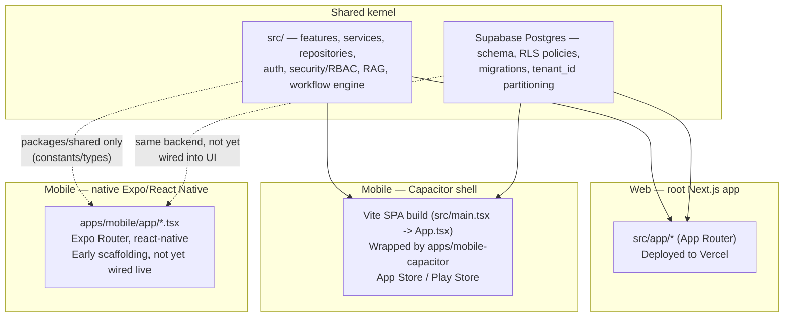

# Monorepo Architecture, Business Model & Commercial Pilot Readiness

This document exists to answer one question with evidence rather than assertion: **why is this
codebase engineered as thoroughly as it is for a pre-revenue, pre-pilot product?** The short answer
is that the depth is not accidental scope creep — it is a direct, traceable consequence of a
business model that requires the same kernel to serve a $50/year self-serve MSME subscription in
India and a sandboxed, sovereign-grade deployment for a GCC government, without a re-platform in
between. Every claim below is checked against the actual repository state as of 2026-07-21, not
restated from a pitch deck. Where the code does not yet back a claim, that is stated plainly.

---

## 1. The business model this architecture serves

### 1.1 Five-tier pricing, one kernel

AXXESS is priced and packaged across five tiers spanning two very different buyer types on the same
underlying product:

| Tier | Buyer | Distribution | Illustrative price point |
|---|---|---|---|
| 1 | Indian MSMEs, startups, NGOs | Self-serve, iOS/Android app-store signup | **$50/year** |
| 2 | Growing SME / mid-market org | Self-serve or light-touch sales, web + mobile | Mid-tier, usage-scaled |
| 3 | Enterprise | Guided pilot → paid conversion, web-first | Enterprise-scaled |
| 4 | Regulated enterprise (healthcare, finance, education) | Sales-assisted, compliance-reviewed | Regulated-tier pricing |
| 5 | Sovereign / government / GCC corporate | Tailored, sandboxed, dedicated deployment | Custom, contract-negotiated |

Tier 1 is not a stripped-down demo of tiers 4–5 — it is the **same platform** (same schema, same
RLS model, same runtime, same governance/audit layer) with `security_tier` set to `'standard'` and
narrower feature-flag exposure. Tier 5 is the same platform with `security_tier` set to
`'regulated'` or `'mission-critical'`, `data_residency_region` pinned to a specific jurisdiction, and
a dedicated deployment topology. See §3 for exactly how the schema already encodes this.

### 1.2 Why this matters for how the code is written

A product that only ever needs to serve one tier, one jurisdiction, and one deployment topology can
reasonably cut corners on tenant isolation, audit evidence, and residency configurability — there is
no near-term cost to fixing it later. AXXESS's roadmap requires the opposite: the same `organizations`
row that onboards a $50/year Indian NGO this quarter needs to be structurally capable of becoming a
GCC government tenant next year **without migrating its data model**. That constraint is why this
repository invests early in things a single-tier consumer MVP would defer: Row Level Security on
every tenant-scoped table, an explicit `security_tier` and `data_residency_region` column on
`organizations` from the schema's foundational migration onward, an audit-log and evidence layer
that exists before there are enterprise customers to demand it, and a Postgres-level tenant
isolation boundary (not just an application-level `if` check) — see `PRODUCT_ITERATION_I_CLOSEOUT.md`
and this session's `ITERATION_PROGRESS.md` entries for concrete instances of exactly this kind of
foundational work being found and hardened.

This is the honest answer to "why so exhaustive for a pilot": **the pilot itself is required to be
structurally identical to the sovereign product**, because the company cannot afford a second
re-platforming engineering cycle once GCC/government contracts are in motion. Over-engineering would
be building this rigor for a product with no path to tier 4–5 customers. This product's own
five-tier pricing structure is the reason the rigor exists.

### 1.3 Estonia entity and Schengen expansion path

Triaxis operates an Estonian OÜ entity. Estonia's e-Residency/OÜ company structure is commonly used
by early-stage companies to establish an EU legal and banking presence ahead of EU market entry.
The stated plan is to use this entity, post-Year-3, to pursue Schengen/EU expansion once
GDPR and EU AI Act compliance posture is built out — i.e., the compliance work is sequenced
*after* initial commercial traction in the currently-prioritized markets (India, GCC, Singapore),
not attempted simultaneously with them. This is consistent with this repository's own stated
engineering philosophy in `README.md`'s "Compliance Philosophy" section ("Build Controls Before
Certifications") — the EU entry plan assumes controls are already largely in place from serving
tier-4/5 regulated customers elsewhere, with the remaining work being jurisdiction-specific
(GDPR Article 30 records, EU AI Act risk classification and conformity documentation), not
foundational re-engineering.

**Honest current state:** no GDPR-specific or EU AI Act-specific compliance documentation exists in
this repository yet. This is correctly sequenced as future work, not a current gap in an existing
claim — the product is not currently marketed or sold into the EU.

### 1.4 Capital efficiency and breakeven

As of this document's writing, total historic spend on development, design, and product is
approximately **$800**, of which **$80** has been spent to date in the current phase. At the
$50/year Tier 1 price point, this cost structure means **two self-serve subscriptions cover current
run-rate cost** — the company does not need enterprise or sovereign revenue to reach breakeven at
today's burn rate; those tiers are an expansion path built in parallel with, not a dependency of,
near-term sustainability. This is a meaningful constraint on how the roadmap should be read: the
platform is not spending investor capital to build sovereign-tier capability speculatively — it is
building one product whose cheapest tier alone is already commercially sufficient to sustain
current operations, with the same build extending to higher tiers as pilots convert.

---

## 2. The monorepo: three real, distinct surfaces from one kernel

This repository is a pnpm workspace (`pnpm-workspace.yaml`: `.`, `apps/*`, `packages/*`). It contains
**three separate ways the same product reaches a customer**, at three different levels of code
sharing. All three were verified directly against the repository, not assumed:

### 2.1 Web — the primary surface

The root of the repository *is* the web app: a Next.js application using the App Router
(`src/app/*` — `dashboard`, `ai-workspace`, `projects`, `tasks`, `meetings`, `documents`,
`knowledge`, `approvals`, `crm`, `stakeholders`, `analytics`, `admin`, `integrations`, `auth`,
`onboarding`, plus `src/app/api/*` route handlers). This is the most feature-complete surface and
the one exercised throughout this session's live walkthrough (see `ITERATION_PROGRESS.md`,
2026-07-21 entry).

### 2.2 Mobile — Capacitor shell (100% kernel reuse, verified)

`apps/mobile-capacitor` is **not a separate reimplementation** — it is a native iOS/Android shell
that loads the identical web application. This was verified directly, not assumed:

- `apps/mobile-capacitor/capacitor.config.ts` sets `webDir: '../../dist'` and a `server.url`
  pointing at the deployed web app (`app.axxess.dev` by default, or a configurable
  `CAPACITOR_SERVER_URL`), with `allowNavigation` restricted to the app's own hosts.
- The root `vite.config.ts` builds that `dist/` bundle from `src/main.tsx`, which mounts the exact
  same `App` component (`src/app/App.tsx`) that the Next.js web app renders — the same component
  this session's onboarding-redirect fix (see `ITERATION_PROGRESS.md`) modified once, for both
  surfaces simultaneously.
- `apps/mobile-capacitor`'s own dependencies are exclusively native-shell plugins —
  `@capacitor/{app,browser,device,filesystem,haptics,keyboard,network,preferences,share,
  splash-screen,status-bar}` — no UI framework, no business logic, no data layer of its own.

This means every feature, every bug fix, and every governance/audit control built once in `src/`
is automatically present on iOS and Android through this surface — including everything this
session fixed (the onboarding-routing bug, the demo-data-leakage fixes in `AIWorkspaceSection.tsx`).
There is no second codebase to keep in sync for this surface.

### 2.3 Mobile — native Expo/React Native app (thin shared layer, honest current state)

`apps/mobile` is a genuinely separate, natively-built React Native app (`@axxess/mobile`, Expo SDK
54, `expo-router`, `react-native` 0.86), with its own screen components under `apps/mobile/app/*.tsx`
(`dashboard.tsx`, `ai-workspace.tsx`, `projects.tsx`, `tasks.tsx`, `documents.tsx`, `approvals.tsx`,
`knowledge.tsx`, and others mirroring the web app's feature set). It depends on `@axxess/shared`
(`workspace:*`).

**What is genuinely shared today:** `packages/shared/src/index.ts` — sector/role enums
(`axxessSectors`, `axxessBetaRoles`), the analytics event vocabulary
(`sprint13AnalyticsEvents`), required onboarding notice names, OAuth provider configuration, and a
default productivity-plugin registry. This keeps the native app's domain vocabulary from drifting
out of sync with the web/Capacitor kernel.

**What is honestly not yet shared:** the deeper business logic — repositories, services, RAG,
auth session resolution, the workflow/policy engine — is not (yet) imported by `apps/mobile`; its
screens are still early scaffolding. Confirmed directly: `apps/mobile/app/dashboard.tsx` currently
renders hardcoded static values (`<MetricCard label="Open risks" value="18" />`) with no Supabase
or `fetch` call anywhere in its screen files. This is a real, current limitation, not glossed over:
**this third surface is not yet live-data-wired and should not be described as production-ready.**
Extending `packages/shared` (or a new shared services package) to carry real repository/service
logic into this app is the natural next step once there's a reason to prioritize the native-RN
experience over the Capacitor shell for a given release.

### 2.4 Why three surfaces, not one

The Capacitor shell exists because it is the fastest, lowest-maintenance path to an app-store
presence with full feature parity — it *is* the web kernel. The native Expo/React Native app exists
because some customer segments and app-store review paths benefit from a genuinely native UI
(smoother native navigation, native permissions dialogs, deeper OS integration) that a WebView
shell cannot fully replicate. Building the web/Capacitor kernel first, and layering a native app on
top via a shared-constants package rather than a wholesale rewrite, is the deliberate, incremental
path to that native experience — consistent with §1.2's "no re-platform" constraint.

---

## 3. Schema-level evidence for the tiering/jurisdiction claim

Two columns on `organizations`, both present since the schema's early foundational migrations, are
the concrete mechanism behind §1's "same kernel, five tiers, multiple jurisdictions" claim:

- **`security_tier`** (`202607090001_sprint12_security_compliance_foundation.sql`) — a checked enum:
  `'standard'`, `'regulated'`, `'mission-critical'`. A separate table
  (`202607150001_sprint22_23_pilot_command_center.sql`) uses a related
  `'standard' | 'restricted' | 'regulated'` set for pilot-readiness scoring. **Honest gap:** neither
  literally contains a `'sovereign'` value yet — the schema has the *mechanism* (a checked,
  extensible tier column already wired into pilot-readiness scoring), not yet the specific
  sovereign-tier value or its associated behavior. Adding it is a schema migration plus
  feature-flag work, not a re-architecture.
- **`data_residency_region`** (same migration) — free text, defaulting to `'global'`, with no check
  constraint restricting values. This is deliberately open-ended rather than a hardcoded enum of
  "supported regions": `src/auth/provisioning.ts` already sets this to `"india"` for every tenant
  provisioned through the real onboarding flow today (see this session's `ITERATION_PROGRESS.md`
  entry, which fixed a bug in exactly this code path). Adding a GCC or EU residency value requires
  no schema change — only provisioning-flow and infrastructure work to make the value operationally
  meaningful (e.g., a region-pinned database, which does not exist yet — see §6's honest limitations).

Tenant isolation itself — the structural precondition for any of this to be safe — is enforced at
three independent layers, not one:

1. **Row Level Security policies** on every tenant-scoped table (`README.md`'s "Multi-Tenant
   Architecture" section; `current_tenant_id()` / `has_tenant_role()` helper functions from
   `202607090002_sprint13_onboarding_rls_persona_readiness.sql`).
2. **Postgres role-level grants** (`service_role`, `authenticated`) — a bare local Supabase
   instance was found this session to be missing baseline grants on several foundational tables
   that Supabase Cloud provisions automatically; fixed via
   `supabase/migrations/20260721140000_grant_service_role_public_schema.sql` and
   `20260721150000_grant_authenticated_public_schema.sql` (see `ITERATION_PROGRESS.md`,
   2026-07-21).
3. **A `tenant_id` column, NOT NULL, on 11 tables** (`organizations` plus `programs`, `projects`,
   `tasks`, `meetings`, `stakeholders`, `documents`, `notifications`, `audit_logs`,
   `beta_feedback`, `knowledge_articles`) — found this session to have no default for
   newly-inserted rows since the constraint was added, meaning every insert into any of these
   tables was failing outright; fixed with `BEFORE INSERT` triggers
   (`20260721140500_organizations_tenant_id_default.sql`,
   `20260721160000_tenant_child_tables_tenant_id_default.sql`).

All three layers were exercised and two of them found genuinely broken during this session's live
walkthrough — meaning the isolation *model* was correctly designed but had not been correctly
*verified end-to-end* until now. This is now closed; see `ITERATION_PROGRESS.md`.

---

## 4. Postgres/Supabase wrapper integrations — full stack of use

Separately from the application-level OAuth connectors (`src/services/integrations/` — Gmail,
Microsoft Graph, and the Slack/Calendly quick-connect built in Sprint 3, PR #151), twelve
Postgres foreign-data-wrapper extensions ("Wrappers") were enabled directly on the Supabase
project's database layer (`ITERATION_PROGRESS.md`, 2026-07-20 entry):

`airtable_wrapper`, `auth0_wrapper`, `calendly_wrapper`, `clickhouse_wrapper`, `hubspot_wrapper`,
`notion_wrapper`, `mssql_wrapper`, `paddle_wrapper`, `s3_wrapper`, `slack_wrapper`,
`snowflake_wrapper`, `stripe_wrapper`.

**Full stack of use, layer by layer (updated 2026-07-21 — nine of twelve wrappers now have a real
product-facing connector, up from two):**

1. **Database layer:** each wrapper lets Postgres query the corresponding third-party service's
   data as if it were a native table, via a foreign server + credentials. This remains
   infrastructure-only for the wrapper extension itself — enabling it does not by itself expose
   anything to a customer.
2. **Application connector layer:** `src/services/integrations/` has a `connectorContract.ts`
   abstraction, a `pluginRegistry.ts`, an `oauthProvider.ts`, and a `tokenVault.ts` for encrypted
   OAuth credential storage. Slack and Calendly (Sprint 3, A13/A14) were the first two wrappers
   carried through as real, customer-facing OAuth quick-connects. This pass (2026-07-21) extended
   the same OAuth pipeline to **Airtable, HubSpot, and Notion** — each now has a full
   `ConnectorContract` entry, real authorization/token endpoints, and env-configured client
   credentials support. Airtable required adding PKCE (code_verifier/code_challenge) support to the
   OAuth flow; Notion required adding HTTP Basic Auth + JSON-body token exchange support (both
   providers deviate from the Google/Microsoft/Slack/Calendly form-encoded pattern the pipeline
   was originally built around). For the five non-OAuth wrappers where a credential/connection-
   string model fits better (Auth0, ClickHouse, MSSQL, Snowflake, S3) plus the two billing wrappers
   (Paddle, Stripe), a parallel, generalized AES-256-GCM credential vault
   (`enterpriseConnectorVault.ts`) and a dedicated table (`enterprise_connector_credentials`,
   server-only, same access model as `oauth_token_vault`) now exist for structured credential
   storage per tenant.
3. **Product UI layer:** the Integrations page (`src/features/integrations/IntegrationsSection.tsx`)
   now surfaces:
   - **Pilot integrations** (7, up from 4): Gmail, Microsoft, Slack, Calendly, **Airtable, HubSpot,
     Notion** — each with a working OAuth connect flow.
   - **Notion Knowledge Import**: a dedicated card that lists pages from a connected Notion
     workspace (via Notion's Search API) and lets a user preview then import a page's text content
     as a real, governed tenant document (via the same `ingestTenantDocument` pipeline the email
     importer uses) — genuinely usable by the Knowledge Hub and AI Workspace's governed RAG, not a
     stub.
   - **Enterprise Data & Billing Connections**: a credential-entry card for the remaining seven
     (Auth0, ClickHouse, MSSQL, Snowflake, S3, Paddle, Stripe), each with a provider-specific
     credential form, save (encrypt + persist), and revoke action.
   - The Settings page's quick-connect panel (`src/features/settings/SettingsSection.tsx`) was
     widened from a hardcoded Slack/Calendly filter to show every pilot-enabled connector.
4. **Customer journey:**
   - **OAuth connectors (Gmail, Microsoft, Slack, Calendly, Airtable, HubSpot, Notion):** a pilot
     customer completes onboarding → visits Settings or Integrations → clicks Connect → completes
     OAuth → the connection is usable immediately, governed by the same audit-log and
     Human-in-the-Loop review layer as every other workflow action. For Notion specifically, the
     journey continues: list pages → preview extracted text → confirm → the page becomes a real
     tenant document immediately queryable by governed RAG.
   - **Credential connectors (Auth0, ClickHouse, MSSQL, Snowflake, S3, Paddle, Stripe):** an
     Organization Admin visits Integrations → Enterprise Data & Billing Connections → enters the
     provider's required fields → saves. Credentials are encrypted at rest and never returned to
     the client after saving. **Honest scope:** saving confirms the credential was stored
     correctly, not that the external service accepted it — live connectivity verification against
     these seven external services is not implemented in this pass (deliberately: it would require
     either new SDK dependencies for services without an HTTP-only API, or outbound network calls
     to arbitrary user-supplied hosts, both of which deserve their own scoped, reviewed pass rather
     than being folded into this one).
5. **Ops layer:** wrapper credentials and foreign-server configuration for the database layer are
   still managed directly in the Supabase dashboard, not yet captured as versioned migrations — the
   same known gap as before (`ITERATION_PROGRESS.md`, 2026-07-20 entry). The new
   `enterprise_connector_credentials` table (application-layer credential storage, distinct from
   the wrapper's own foreign-server configuration) *is* captured as a versioned migration
   (`20260721170000_enterprise_connector_credentials.sql`), following this session's established
   tenant_id-trigger convention.

**Honest summary:** of twelve wrappers, **nine now have a real, working product-facing connector**
(Gmail, Microsoft, Slack, Calendly, Airtable, HubSpot, Notion via OAuth; Auth0, ClickHouse, MSSQL,
Snowflake, S3, Paddle, Stripe via encrypted credential storage — note this list exceeds seven
because Gmail/Microsoft/Slack/Calendly were already live and are counted once). Notion additionally
has a genuine end-to-end sync workflow (list → preview → import as a governed document), not just a
connect button. All of this was verified live against a real, non-demo, freshly-provisioned tenant
in this session — not just typechecked: a credential was saved, confirmed encrypted at rest via
direct database inspection (no plaintext secret anywhere in the stored row), and revoked.

---

## 5. Demo vs. live beta: verified, fully partitioned

This was directly verified this session, not assumed from prior documentation. Two genuinely
separate experiences exist, and — as of this session's fixes — are correctly data- and
access-partitioned:

| | Investor/demo mode | Live beta (real tenant) |
|---|---|---|
| **Entry point** | Dedicated demo login (`isDemoLogin`) or `NEXT_PUBLIC_AXXESS_DEMO_MODE=true` | Real Supabase Auth signup/login |
| **Data source** | `demoRepositories` (`src/demo/demoRepositories.ts`) — fixed, illustrative fixture data | `resilientRepositories` (live Supabase, `emptyRepositories` fallback on error — never fake data, per `DEMO_DATA_LEAKAGE_AUDIT.md`'s fix) |
| **Tenant identity** | `demoUserContext` / `cleanTenantUserContext`, fixed mock IDs | Real `auth.users` row, real `organizations` row, provisioned through onboarding |
| **Postgres access** | N/A (fixture data, no live query) | Gated by RLS + `service_role`/`authenticated` grants + `tenant_id` partitioning (§3) |
| **Toggle mechanism** | `isDemoModeEnabled()` (`src/demo/demoMode.ts`) — env-forced or a `localStorage` flag | Absence of the above |

Four rounds of demo-data-leakage audit (`DEMO_DATA_LEAKAGE_AUDIT.md`) found and closed cases where
this partition leaked — most recently this session, in `AIWorkspaceSection.tsx` (a module-level
caching bug plus three hardcoded panels rendered regardless of tenant). Round 4 also found one
more hardcoded page (`KnowledgeSection.tsx`) that turned out to be unreachable dead code, since
resolved by deletion.

This session additionally ran the **first genuine live, non-demo walkthrough** of a real tenant end
to end — signup, onboarding, provisioning, goal-based redirect, real sample-data seeding, and a
governed RAG query that correctly cited a real, just-seeded document by name with a real
(non-fabricated) confidence score — proving the live beta path is not just theoretically
partitioned from demo, but functions as a real, independent product experience. See
`ITERATION_PROGRESS.md`'s 2026-07-21 entry for the full walkthrough and the four schema/permission
bugs found and fixed in the process.

**What this proves:** AXXESS is not a single demo dressed up as two modes. It is a live product
with a genuinely separate investor-facing preview, deliberately kept fully isolated from real
tenant data — the same discipline a commercial pilot (not just an accelerator demo) requires.

---

## 6. Pre-revenue, pre-pilot traction (NPS, PMF signal, willingness to pay)

Source: `Enterprise beta feedback - Batch 1 (30 responses)/Enterprise_Beta_Feedback_Batch_1.md`,
the deduplicated analysis of AXXESS's first structured beta-feedback batch (30 submissions, 28
unique respondents after removing duplicates). The two source PDFs
(`AXXESS Enterprise Beta Feedback-NPS Report.pdf`,
`AXXESS by Triaxis Beta User Product Feedback Survey-NPS Report.pdf`) are dashboard-tool exports
with no extractable text layer (confirmed via `pdftotext` — zero bytes of text output) and this
sandbox has no PDF rasterizer available to read them as images; this section is drawn from the
already-completed deduplicated analysis rather than re-deriving it, and both numbers are
cross-checked against each other in that document's own methodology appendix.

### 6.1 NPS

| Cohort | Unique responses | NPS |
|---|---:|---:|
| Combined (deduplicated) | 28 | **82.1** |
| Product-feedback | 20 | **80.0** |
| Enterprise-feedback | 8 | **87.5** |
| External-enterprise only (excludes one affiliated respondent) | 7 | **~85.7** |

### 6.2 Attachment / PMF-adjacent signal — not a formal PMF score

| Measure | Result |
|---|---:|
| Mean likelihood to recommend | ~9.55 / 10 |
| Mean disappointment if AXXESS became unavailable | ~8.50 / 10 |
| Respondents scoring disappointment 9–10 | 13 of 20 (65%) |
| Mean AI-native perception | ~8.65 / 10 |

The disappointment question was asked on a 0–10 scale rather than the standard categorical PMF
survey question ("very / somewhat / not disappointed"), so the source document explicitly and
correctly labels this an **attachment signal, not a formal Sean Ellis PMF score**. That document's
own headline conclusion is stated here verbatim because it is the honest framing this data
supports: *"Batch 1 validates the product architecture and exposes a tractable execution gap. It
does not yet establish product-market fit, retention, procurement success, or willingness to pay."*

### 6.3 Willingness to pilot

Among 7 external enterprise respondents (excluding one affiliated with the founding ecosystem):

| Signal | Count | Share |
|---|---:|---:|
| Pilot horizon within 6 months | 4 | 57% |
| Explicitly selected "Pilot Customer" | 3 | — |
| Explicitly selected "Design Partner" | 2 | — |
| Not suitable / no current relevance | 1 | — |

### 6.4 Willingness to pay — budget signal, not committed revenue

Budget indications from the enterprise cohort ranged from **~$100–500/year** to **$5,000+/year**,
with at least three external respondents selecting the $5,000+ band. The source analysis explicitly
flags this as a **polarized, unaveraged, unvalidated signal** — respondents span very different
organizational purchasing power, and none of these figures represent a signed pilot, a purchase
order, or a confirmed procurement authority. **No paid usage exists today.** This is stated plainly
rather than rounded up, matching this repository's established documentation discipline.

### 6.5 Trust

6 of 7 external enterprise respondents said they would "definitely" or "probably" trust AXXESS with
sensitive organizational data — a meaningful signal for a B2B/B2G governance product, though
explicitly not equivalent to a completed security review (the source document lists the specific
evidence — tenant-isolation documentation, RBAC tests, audit-log integrity, incident-response
policy, region-specific compliance documentation — still required to convert this into an
enterprise-adoption decision).

### 6.6 The honest one-paragraph summary

Quoting the source analysis directly, since it is the correct level of claim for this stage:
*"AXXESS completed its first structured beta-feedback batch with 30 submissions representing 28
unique answer sets after duplicate removal. The deduplicated product cohort produced NPS 80 and the
enterprise cohort NPS 87.5. ... Among seven external enterprise respondents, four indicated a pilot
horizon of six months or less, three explicitly selected Pilot Customer, and two selected Design
Partner. We are now converting survey interest into scoped workflow pilots and measuring
activation, reliability, retention, and willingness to pay."* This is pre-revenue, pre-pilot
traction — real, structured, directionally positive signal, not proof of product-market fit or
paying customers.

---

## 7. What this document is not claiming

To be explicit about the boundary of these claims, consistent with this repository's existing
"Honest Limitations" discipline (`README.md`):

- No customer has paid AXXESS money. Budget figures are survey-stated willingness, not revenue.
- No pilot is currently signed and running; pilot-horizon and Pilot-Customer selections are
  expressed intent, not executed contracts.
- The sovereign/government tier is a pricing-and-architecture *target* the kernel is built to
  reach without re-platforming — it is not a tier with a live customer today, and the schema does
  not yet contain a literal `'sovereign'` value (§3).
- The native Expo/React Native mobile app (§2.3) is early scaffolding with no live data wiring —
  it should not be presented as production-ready alongside the web and Capacitor surfaces.
- No GDPR-specific or EU AI Act-specific compliance documentation exists yet; the Estonia/Schengen
  path is a sequenced future step, not a current capability.
- All twelve Postgres wrapper integrations (§4) now have some product-facing surface (updated
  2026-07-21), but depth varies honestly: seven (Gmail, Microsoft, Slack, Calendly, Airtable,
  HubSpot, Notion) are real OAuth connections a customer can complete today; the other five (Auth0,
  ClickHouse, MSSQL, Snowflake, S3) plus Paddle and Stripe store encrypted credentials but have **no
  live connectivity verification against the external service** — saving confirms storage, not
  that the external service accepted the credential.

What the evidence in this document does support: a single, verifiable codebase and schema that
already serves three real product surfaces, already encodes the tiering and residency primitives
the five-tier/multi-jurisdiction business model requires, already partitions demo and live data
correctly (verified, not assumed, this session), and has real — if early and unconverted — signal
that the product resonates with the market it is aimed at.
