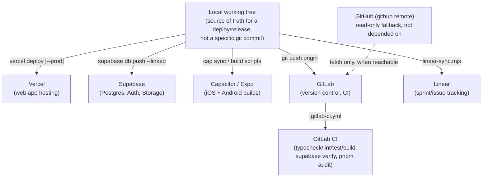

# GitHub-Independent Operations

## Why this exists

This repo's original GitHub account (`axxess-triaxis`) got suspended mid-project -- `git
fetch`/`git push` started returning "Your account is suspended." Every workflow that assumed
GitHub was reachable broke at once: deployment (if it had been Git-triggered), CI validation
(GitHub Actions), issue tracking sync, and the ability to push code anywhere at all.

The fix isn't "wait for GitHub to come back" -- it's removing the dependency entirely. Every tool
this project relies on (Vercel, Supabase, GitLab, Capacitor, Linear) has its own CLI or API that
talks to it directly, with no Git host as an intermediary. This document is the map of that
control plane: what each piece does, how they fit together, and which document has the full detail
for each.

## The control plane, end to end

Nothing in this diagram requires GitHub. It's kept as a remote (`github`, renamed from `origin`
during the migration -- see `docs/GITLAB_MIRROR.md`) purely as a read source when it's reachable,
never as a dependency for deploying, migrating, building, or tracking work.

## Per-tool quick reference

| Tool | What it's for | CLI entry point | Full doc |
|---|---|---|---|
| Vercel | Hosts the web app | `pnpm run vercel:deploy:preview` / `:production` | `docs/VERCEL_DEPLOYMENT.md` |
| Supabase | Postgres, Auth, Storage backend | `pnpm run supabase:migrate:remote[:apply]` | `docs/SUPABASE_CLI.md` |
| GitLab | Version control + CI (the new `origin`) | `pnpm run gitlab:mirror[:dry-run]` | `docs/GITLAB_MIRROR.md` |
| GitLab CI | Automated typecheck/lint/test/build/audit | `.gitlab-ci.yml` (runs automatically on push/MR) | This document, section below |
| Capacitor | iOS/Android native app builds | `pnpm run mobile:capacitor:*` | `docs/MOBILE_RELEASE_RUNBOOK.md` |
| Linear | Sprint/actionable tracking | `pnpm run linear:sync` | `docs/LINEAR_SYNC.md` |

## What's fully working today vs. what's built-but-unverified

Built, tested, and confirmed working end to end in this environment:

- **GitLab as the writable remote.** All local branches and tags pushed and tracked correctly
  (`docs/GITLAB_MIRROR.md`), though a known gap was found and documented there: local `main` had
  drifted behind the true GitHub history at the time of the initial migration push.
- **Vercel CLI deploy.** Already authenticated on this machine, project already linked
  (`.vercel/project.json`), `scripts/deploy-vercel.mjs` runs the same quality gates CI does before
  deploying.
- **Supabase CLI's local workflow** (`supabase start`, migrations, RLS tests) -- exercised
  extensively this session (see `ITERATION_PROGRESS.md`'s 2026-07-21 entries).
- **Capacitor's Android build path**, confirmed locally on Windows (`cap sync` completes fully,
  native project regenerated correctly).

Built and reviewed, but not yet run for real (each is honestly flagged this way in its own doc,
not silently assumed to work):

- **`scripts/supabase-migrate-remote.mjs`** against a real remote project -- this environment has
  never linked to one (no real Supabase access token/project ref available here).
- **`scripts/linear-sync.mjs`** against a real Linear workspace -- no `LINEAR_API_KEY`/
  `LINEAR_TEAM_KEY` available here. The parsing logic (reading
  `PRE_DEMO_ACTIONABLES.md`) has been run and confirmed correct; the GraphQL calls have not.
  See `docs/LINEAR_SYNC.md`.
- **Capacitor's iOS build path** past the `cap sync` step -- confirmed to require a Mac
  (CocoaPods/Xcode), which this environment doesn't have.
- **`.gitlab-ci.yml`** itself -- written and YAML-validated locally, but never actually run inside
  a real GitLab CI pipeline (this environment has no way to trigger one). The job definitions
  mirror `.github/workflows/ci.yml`/`supabase-cli.yml` closely enough that they should behave the
  same way, but "should" isn't "confirmed."

## Adding this to a new machine

1. Clone the repo from GitLab: `git clone https://gitlab.com/triaxis-ventures-private-limited-group/axxess-triaxis.git`
2. `pnpm install`
3. Copy `.env.example` to `.env.local` and fill in what you need -- see
   `docs/ENVIRONMENT_VARIABLES.md` for exactly which variables matter for which of the five
   environments (local, Vercel, Supabase, GitLab CI, mobile).
4. `npx vercel login` (only if `npx vercel whoami` shows nothing) then `pnpm run vercel:link` --
   one-time, links this checkout to the `axxesstriaxis` Vercel project.
5. `supabase link --project-ref <ref>` -- one-time, needed only for
   `pnpm run supabase:migrate:remote*`.
6. Everything else (GitLab CI, Capacitor builds, Linear sync) works from the clone as-is once the
   relevant environment variables are set.

None of the above touches GitHub at any point.
