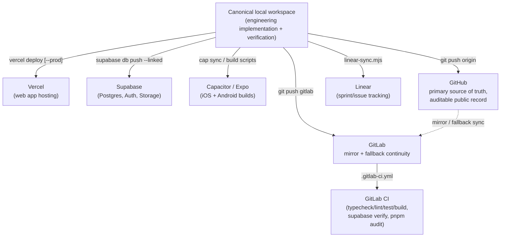

# GitHub-Independent Deployment Operations

## Why this exists

This document defines the operating model for AXXESS source control and deployments.

GitHub remains the primary source-of-truth repository and auditable public record for AXXESS source history where the account and repository are reachable.

GitLab is maintained as a mirror and fallback continuity repository. It is used when GitHub access, availability or policy state blocks normal repository operations.

Neither GitHub nor GitLab should be treated as the deployment mediator. Every deployment and provider operation should be performed through the target provider's CLI, API or dashboard-level control plane:

- Vercel through Vercel CLI/API
- Supabase through Supabase CLI/API
- Capacitor/mobile builds through Capacitor, Android, Apple or provider-specific tooling
- Linear through Linear API/CLI automation
- Other integrations through their own provider APIs

This model exists because GitHub availability was disrupted during development. Workflows that assumed GitHub was always reachable broke at once. The durable fix is not to remove GitHub as source control; it is to decouple deployment operations from Git hosting.

GitHub and GitLab are therefore version-control and audit systems. They preserve source history, review context, provenance and public/private record. They are not required to be in the runtime path for deploying, migrating, releasing or operating AXXESS.

## GitHub Account-Status Incident

As of 2026-07-22, the GitHub account suspension affecting the AXXESS GitHub organization/repository is under appeal with GitHub Support.

GitHub Support has taken up the appeal. At the time of this documentation update, GitHub has not disputed the explanation provided in the appeal, but the account has not yet been documented here as reinstated.

Support ticket:

```text
4589741
```

GitHub Support reply:

```text
Date: 2026-07-21 22:54 UTC
Sender: GitHub Support
Support representative: Brian

GitHub Support stated that, in order to discuss the axxess-triaxis account, the request must come from an email address verified on the account. They advised either forwarding the ticket to that verified address and replying from there, or opening a new request through the GitHub "cannot sign in" support form. They also stated that quoting ticket ID 4589741 would speed up the process.
```

Action taken after GitHub Support reply:

```text
The GitHub Support email was forwarded to the email address attached to the affected GitHub account.
The follow-up reply was then sent from that verified GitHub account email address.
```

The appeal states that:

- The suspended GitHub account is the primary personal account and owns organization repositories used for legitimate AXXESS software development by Triaxis Ventures.
- No notification email with a reason or remediation steps was received before or after the suspension.
- In the days before the suspension, the account was used for high-volume legitimate software development activity, including frequent commits, pull requests, CI updates, Supabase/Vercel integrations, authentication improvements and mobile build preparation.
- The activity was performed while rapidly iterating with AI-assisted development tools.
- If the activity triggered an automated abuse or automation-detection system, the likely cause was the unusual volume and cadence of legitimate development work, not spam, phishing, malware distribution, unauthorized access, deceptive automation or an intentional Terms of Service violation.
- The appeal requests human review, clarification of the specific policy concern and reinstatement if the suspension was an automated false positive.
- The appeal expresses willingness to rotate credentials, revoke integrations or take any required corrective action.

Local evidence screenshot:

```text
C:\Users\Sudipta Sarmah\Downloads\unnamed.png
```

The screenshot shows GitHub sign-in blocked with a message stating that account access has been suspended due to a Terms of Service violation and requesting contact with support for more information.

Operational impact:

- GitHub remains the intended primary source-of-truth repository and auditable public record when reachable.
- GitLab remains the mirror/fallback continuity repository while the GitHub appeal is pending.
- Deployment operations remain detached from GitHub and GitLab availability and should use provider CLIs/APIs.
- Future documentation should update this section when GitHub Support provides a specific reason, remediation instruction, reinstatement decision or final appeal outcome.

Current incident status:

```text
Open - pending GitHub Support review after verified-email follow-up.
```

Future update log:

| Date | Update | Evidence |
|---|---|---|
| 2026-07-21 22:54 UTC | GitHub Support requested follow-up from an email address verified on the affected account and provided ticket ID 4589741. | Support email from GitHub Support representative Brian. |
| 2026-07-22 | The support email was forwarded to the verified GitHub account email address and the appeal follow-up was sent from that verified email. | User-confirmed operational update. |

Closure criteria:

- GitHub Support confirms reinstatement, final denial, remediation requirements or another formal outcome.
- The outcome is documented here with date, ticket reference and operational impact.
- Repository remotes and deployment-governance docs are updated if the outcome changes the GitHub/GitLab operating model.
- Any required credential rotation, integration revocation or automation change is documented separately.

## Source-Control Policy

The intended repository hierarchy is:

1. GitHub: primary source of truth and auditable public record.
2. GitLab: mirror repository and fallback continuity remote if GitHub fails.
3. Local canonical workspace: active engineering workspace for implementation and verification.

Current repository URLs:

```text
GitHub primary:
https://github.com/axxess-triaxis/AXXESSTRIAXIS

GitLab mirror/fallback:
https://gitlab.com/triaxis-ventures-private-limited-group/axxess-triaxis
```

The canonical local workspace is:

```text
C:\Users\Sudipta Sarmah\OneDrive - State Bank of India\Documents\AXXESS-TRIAXIS
```

The current expected remotes are:

```text
origin  https://github.com/axxess-triaxis/AXXESSTRIAXIS.git
gitlab  https://gitlab.com/triaxis-ventures-private-limited-group/axxess-triaxis.git
```

Operational rule:

- Prefer GitHub for normal source-of-truth commits, review history and public auditability when reachable.
- Mirror to GitLab for continuity.
- Use GitLab as fallback if GitHub becomes unavailable.
- Do not make deployments depend on GitHub or GitLab webhooks as the only execution path.
- Verify deployments directly through provider CLIs/APIs.

## The control plane, end to end



Nothing in this diagram requires GitHub or GitLab to mediate deployment. The Git hosts preserve source history and audit evidence. Vercel, Supabase, Capacitor/mobile and Linear operations are executed and verified through their own control planes.

## Per-tool quick reference

| Tool | What it's for | CLI entry point | Full doc |
|---|---|---|---|
| Vercel | Hosts the web app | `pnpm run vercel:deploy:preview` / `:production` | `docs/VERCEL_DEPLOYMENT.md` |
| Supabase | Postgres, Auth, Storage backend | `pnpm run supabase:migrate:remote[:apply]` | `docs/SUPABASE_CLI.md` |
| GitHub | Primary source-of-truth repository and auditable public record | `git push origin` | This document |
| GitLab | Mirror/fallback continuity remote + CI | `pnpm run gitlab:mirror[:dry-run]` | `docs/GITLAB_MIRROR.md` |
| GitLab CI | Automated typecheck/lint/test/build/audit | `.gitlab-ci.yml` (runs automatically on push/MR) | This document, section below |
| Capacitor | iOS/Android native app builds | `pnpm run mobile:capacitor:*` | `docs/MOBILE_RELEASE_RUNBOOK.md` |
| Linear | Sprint/actionable tracking | `pnpm run linear:sync` | `docs/LINEAR_SYNC.md` |

## What's fully working today vs. what's built-but-unverified

Built, tested, and confirmed working end to end in this environment during the canonical migration:

- **GitLab as the verified writable continuity remote.** The canonical migration pushed the unified
  workspace to GitLab and verified `main`, `canonical/sprint-1-35-unified-gitlab`, and
  `fix/live-tenant-onboarding-and-rag-walkthrough` at commit
  `615faf218fbfe538dcdcd1eb1a079ee05ad65b4b`.
- **Vercel CLI deploy.** Already authenticated on this machine, project already linked
  (`.vercel/project.json`), `scripts/deploy-vercel.mjs` runs the same quality gates CI does before
  deploying.
- **Supabase CLI's local workflow** (`supabase start`, migrations, RLS tests) -- exercised
  extensively this session (see `ITERATION_PROGRESS.md`'s 2026-07-21 entries).
- **Capacitor's Android build path**, confirmed locally on Windows (`cap sync` completes fully,
  native project regenerated correctly).

Built and reviewed, but not yet run for real (each is honestly flagged this way in its own doc,
not silently assumed to work):

- **`scripts/supabase-migrate-remote.mjs`** against a real remote project -- this environment has
  never linked to one (no real Supabase access token/project ref available here).
- **`scripts/linear-sync.mjs`** against a real Linear workspace -- no `LINEAR_API_KEY`/
  `LINEAR_TEAM_KEY` available here. The parsing logic (reading
  `PRE_DEMO_ACTIONABLES.md`) has been run and confirmed correct; the GraphQL calls have not.
  See `docs/LINEAR_SYNC.md`.
- **Capacitor's iOS build path** past the `cap sync` step -- confirmed to require a Mac
  (CocoaPods/Xcode), which this environment doesn't have.
- **`.gitlab-ci.yml`** itself -- written and YAML-validated locally, but never actually run inside
  a real GitLab CI pipeline (this environment has no way to trigger one). The job definitions
  mirror `.github/workflows/ci.yml`/`supabase-cli.yml` closely enough that they should behave the
  same way, but "should" isn't "confirmed."

## Adding this to a new machine

1. Clone the repo from GitLab: `git clone https://gitlab.com/triaxis-ventures-private-limited-group/axxess-triaxis.git`
2. `pnpm install`
3. Copy `.env.example` to `.env.local` and fill in what you need -- see
   `docs/ENVIRONMENT_VARIABLES.md` for exactly which variables matter for which of the five
   environments (local, Vercel, Supabase, GitLab CI, mobile).
4. `npx vercel login` (only if `npx vercel whoami` shows nothing) then `pnpm run vercel:link` --
   one-time, links this checkout to the `axxesstriaxis` Vercel project.
5. `supabase link --project-ref <ref>` -- one-time, needed only for
   `pnpm run supabase:migrate:remote*`.
6. Everything else (GitLab CI, Capacitor builds, Linear sync) works from the clone as-is once the
   relevant environment variables are set.

None of the deployment steps above require GitHub or GitLab as an intermediary.

## Deployment Governance Rule

All future deployment runbooks should distinguish:

- `Source control`: GitHub primary, GitLab mirror/fallback.
- `Deployment execution`: provider CLI/API.
- `Deployment evidence`: provider logs, release IDs, migration status, build artifacts and screenshots.
- `Audit evidence`: commits, tags, changelog, sprint log and migration/deployment records.

A deployment should not be described as successful merely because a commit was pushed. It is successful only when the target provider reports the deployment, migration, release or sync as successful.

Likewise, a Git repository should not be described as the deployment source when the actual release was performed by CLI. It should be described as the source-control record for the code that was deployed.
