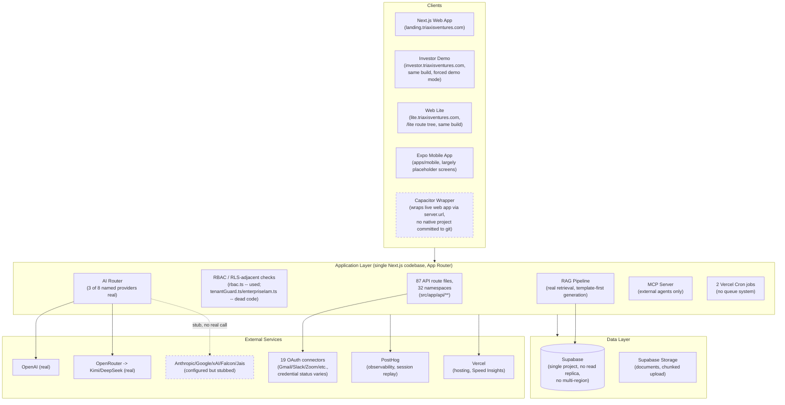
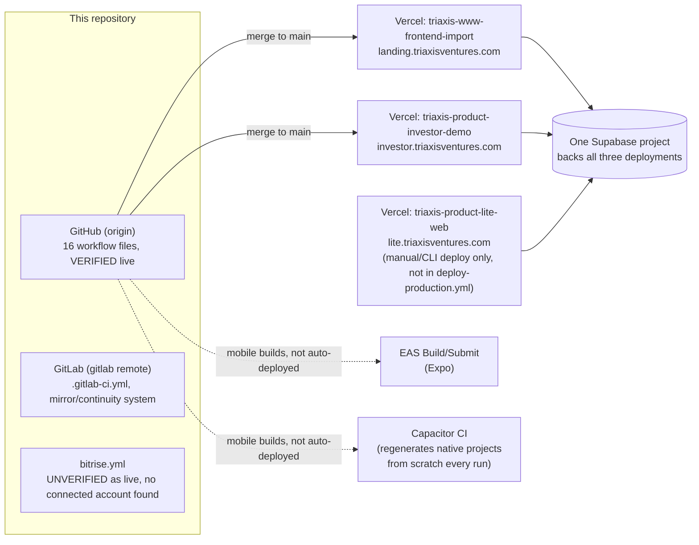

# Phase 4 -- Architecture Maturity

This phase synthesizes the architecture already traced with exact citations in Phases 0-3 (frontend/backend/database/auth/storage/vector-layer/LLM-providers/agent-layer/integration-layer/mobile) and adds four things not previously covered: CI/CD topology, deployment/hosting topology, technical-debt markers, and schema-quality/failure-domain analysis. The 12-dimension evaluation at the end is this phase's own judgment, made explicitly, not deferred.

---

## System architecture

**Reading this diagram:** dashed boxes/arrows are things that look real from the outside (configured, named, priced) but are not real in the sense this audit uses the word (a stub, or a wrapper with no committed native project). This distinction is the single most important thing Phases 2-3 established and it belongs in the architecture picture, not just the capability tables.

## Deployment & CI/CD topology

**CI/CD, precisely:** three CI systems exist. GitHub Actions (16 workflows) is confirmed live -- `docs/GITHUB_INDEPENDENT_OPERATIONS.md` cites a specific real run ID against a real commit. GitLab CI exists as a documented continuity system, stood up during a real GitHub account suspension (ticket-referenced, abuse-detection theory, later reinstated) -- its own docs make a claim about a specific audited pipeline run that is plausible but not independently verifiable from a static repo checkout, so it's recorded as CORROBORATED, not VERIFIED. `bitrise.yml` (140 lines, 6 documented workflows) has no connected-account evidence anywhere in the repo and is explicitly listed elsewhere in this repo's own docs as still-needing provider-side setup -- this is orphaned tooling, not explained by the GitHub-outage narrative that explains GitLab's existence.

**Deployment, precisely:** three separate Vercel projects, all built from this one repository, all backed by the same single Supabase project. The third (`lite.triaxisventures.com`) was not previously known to this audit's earlier sessions and is not covered by the automated `deploy-production.yml` workflow -- it's deployed manually/via CLI, meaning it can silently drift out of sync with what's on `main` in a way the other two cannot. `apps/mobile` (Expo) and the Capacitor wrappers are not Vercel-deployed at all; mobile builds run through separate, less-automated pipelines (EAS Build/Submit, Capacitor CI that regenerates native projects from scratch every run, per Phase 2).

---

## A concrete architectural-evolution artifact: the `organization_id`/`tenant_id` schema drift

Rather than force a narrative epoch structure onto architectural evolution (Phase 1 already declined to do that from sprint labels alone), this phase found one specific, dated, high-signal piece of real evolution evidence worth recording in full: `organization_id` is the canonical tenant column across the schema (615 occurrences, 30 of 35 migration files). A later migration (`202607090002_sprint13_onboarding_rls_persona_readiness.sql`) added a **second, redundant `tenant_id` column** to 10 core tables (`programs`, `projects`, `tasks`, `meetings`, `stakeholders`, `documents`, `notifications`, `audit_logs`, `beta_feedback`, `knowledge_articles`), backfilled as a mirror of `organization_id`, purely for RLS-policy convenience (`current_tenant_id()`'s own comment: "Returns the active organization_id").

This redundant column **caused two real, separate production outages**, each requiring its own emergency hotfix migration with a `BEFORE INSERT` trigger:
- `20260721140500_organizations_tenant_id_default.sql` -- every new organization signup failed a `NOT NULL` violation because `provisionTenantForUser()` never set the new column.
- `20260721160000_tenant_child_tables_tenant_id_default.sql` -- every write to the 10 child tables failed the same way, because no repository set it explicitly.

This is real, dated, cited evidence of a genuine architectural mistake (introducing a redundant column instead of just using the one that already existed) being made, causing real damage, and being patched around rather than removed. It is exactly the kind of artifact this audit is designed to surface -- not because it reflects poorly on execution (the fix was fast and the pattern of finding real incidents in migration history is, per Phase 2, a recurring sign of genuine engineering rigor, not the opposite) but because the redundant column is still there today, a standing source of future drift risk for anyone writing a new migration or RLS policy who reaches for the wrong one of the two columns.

---

## 12-dimension evaluation

| Dimension | Assessment | Evidence |
|---|---|---|
| **Modularity** | Good at the feature-section level (`src/features/*`, one section per product area, mostly self-contained); weaker at the cross-cutting-concern level -- two divergent RBAC/permission systems coexist (one used, one dead code, per Phase 2), and mobile has three parallel, unreconciled implementations rather than one modular abstraction with platform-specific adapters. |
| **Coupling** | The generic tenant-repository pattern (`createMutableTenantRepository`, one config-driven factory for most CRUD resources) is a genuinely good low-coupling design -- most feature sections don't hand-roll their own data access. RAG and agent-tool code, by contrast, reach directly into `supabaseAdminRest`/service-role clients rather than going through the same repository abstraction, which is both a coupling inconsistency and (per Phase 3, Q-005) a security-relevant one. |
| **Scalability** | Unproven, not architecturally blocked. Single Supabase project, no read replica, no multi-region -- fine at current (pre-revenue, ~5-tenant) scale, but nothing in the architecture has been load-tested or designed against a specific target (no rate limiting anywhere, per Phase 2's Ops cluster; no job queue, only 2 ad hoc Vercel Cron endpoints for background work). |
| **Maintainability** | Better than a typical codebase this young, evidenced concretely: zero `TODO`/`FIXME`/`XXX`/`HACK` comments and zero `@deprecated` tags across 743 TS/TSX files in `src/` (this phase's own count) -- debt is recorded in dated closeout docs and in-code prose rather than left as silent markers, which is a real, checkable discipline, not just a style preference. Undercut by the RBAC/mobile duplication noted under Modularity, and by an unused `date-fns` dependency alongside two different ad hoc inline date-formatting approaches instead of one shared utility. |
| **Tenant isolation** | Strong at the RLS-policy-design level (near-universal `organization_id` scoping, RLS enabled on effectively all 109 tables, per Phase 2's Ops cluster) and now partially proven at the runtime level for 4 of 6 core resource types via a real production two-tenant harness (Q-004, PARTIALLY CLEARED). Weakened materially by the RAG-retrieval service-role bypass (Q-005, OPEN ISSUE) -- the one surface an AI answer is actually grounded in uses a fundamentally different, weaker isolation mechanism than the rest of the app, and was never covered by the harness that tested everything else. |
| **Extensibility** | Genuinely good in the two places it was built deliberately for: the connector/OAuth engine (19 providers on one generic contract, adding a 20th is a small diff, per Phase 2 Cluster 4) and the AI provider abstraction (one clean interface, adding a real 9th provider is one factory function, per Phase 3 #6). Poor in the one place the product most needs it for an enterprise buyer: there is no configurable/tenant-specific workflow engine at all (Phase 2 Cluster 2, #7/#8) -- every tenant gets an identical, hardcoded onboarding journey. |
| **API design** | Structurally coherent -- 87 route files across 32 namespaces, a consistent shared-auth-helper pattern, tenant-scoped repository access used consistently for CRUD resources (Phase 2 Cluster 4, #8). Missing hardening layers expected at production/enterprise scale: no rate limiting anywhere (a named, self-documented TODO in `docs/API.md`, not silently missing), and no request-schema validation library (no zod usage found in API routes). |
| **Schema quality** | Mostly sound (275 foreign-key references across 27 of 35 migration files; only legitimately-exempt tables lack `organization_id`) but carries one concrete, high-signal defect: the `organization_id`/`tenant_id` redundant-column drift documented above, which has already caused two real production outages and remains unresolved (the redundant column is still present, not removed). |
| **Technical debt** | Low by conventional marker-counting (zero TODO/FIXME/deprecated tags) but real and specific where it exists: a fully dead permission-layer module (`tenantGuard.ts`/`enterpriseIam.ts`, unit-tested but zero production call sites, per Phase 2), an unused declared dependency (`date-fns`), three unreconciled mobile strategies, and the standing `organization_id`/`tenant_id` drift above. This pattern -- debt that's real but not marked with conventional tags -- means a future engineer scanning for `TODO` would systematically undercount it; the debt lives in prose comments and dated docs instead. |
| **Failure domains** | Single point of failure at the data layer: one Supabase project backs all three Vercel deployments and every client (web, investor demo, Lite, and indirectly mobile). A Supabase-account-level or Vercel-account-level outage takes down everything simultaneously -- there is no redundancy, failover, or multi-region design anywhere in migrations, config, or docs. `docs/BACKUP_DR.md` defines RPO/RTO targets and a restore runbook, but this is a policy document, not evidence a restore has ever actually been drilled -- recorded as CLAIMED, not VERIFIED, per this audit's own discipline. |
| **Vendor dependence** | High and concentrated: Supabase (database, auth, storage), Vercel (hosting, all 3 projects), and, for anything beyond local-deterministic RAG, OpenAI/OpenRouter. This is a normal and reasonable set of choices for a company at this stage -- flagged here as a fact for Phase 12 (Capital Efficiency)/Phase 16 (Red Team) to weigh, not as a criticism in itself. |
| **Portability** | Low, by design choice rather than accident -- the app is tightly built around Supabase's specific Auth/PostgREST/RLS model (service-role vs. JWT-scoped client distinction is load-bearing throughout the codebase, per Phase 3) and Vercel's specific deployment model (Edge middleware via `src/proxy.ts`, Vercel Cron, environment-variable-per-project semantics that already caused a real cross-project instrumentation gap this session found independently). Migrating off either platform would be a substantial rewrite, not a configuration change. |
| **Enterprise deployment readiness** | Mixed, and this is the dimension Phase 5 will score properly -- noted here only as a preview: real per-tenant RLS and audit logging exist; real gaps exist too (no rate limiting, billing is a placeholder, i18n is entirely absent, the RAG isolation gap is an open, acknowledged issue, and a third, undocumented-in-automation Vercel project (`lite.triaxisventures.com`) can silently drift from what CI actually validates). |

---

## What Phase 4 establishes

- A complete architecture map (system diagram + deployment/CI-CD diagram), assembled from Phases 0-3's existing citations plus four newly-investigated areas.
- A third Vercel deployment target (`lite.triaxisventures.com`) not previously surfaced in this audit, confirmed to exist but not covered by the automated production-deploy workflow.
- Three parallel CI systems, one confirmed live, one documented-but-unauditable-from-here, one apparently orphaned (no connected-account evidence found for Bitrise).
- One concrete, dated, high-signal architectural-evolution artifact (the `organization_id`/`tenant_id` schema drift) with a real, cited incident history -- used in place of a forced sprint-label epoch narrative, consistent with Phase 1's own decision not to force epochs from unreliable labels.
- An explicit 12-dimension architectural-quality judgment, made directly by this phase rather than deferred, each grounded in specific prior findings rather than a fresh unsupported opinion.

## What Phase 4 does NOT establish

- A security/compliance severity score for any of the gaps named here (rate limiting, RAG isolation, billing placeholder, single point of failure) -- that is Phase 5's job specifically.
- Whether the GitLab CI pipeline-run claim in `docs/GITLAB_MIRROR.md` is accurate -- flagged as CORROBORATED, not independently verified, and not chased further this phase since it doesn't change any capability classification.
- Whether Bitrise is planned for future use or should be considered abandoned tooling -- not asked as a formal question this phase, since (per the Founder Query Protocol's own guidance) it doesn't materially change any classification, score, or chronology; noted here for completeness rather than escalated.
