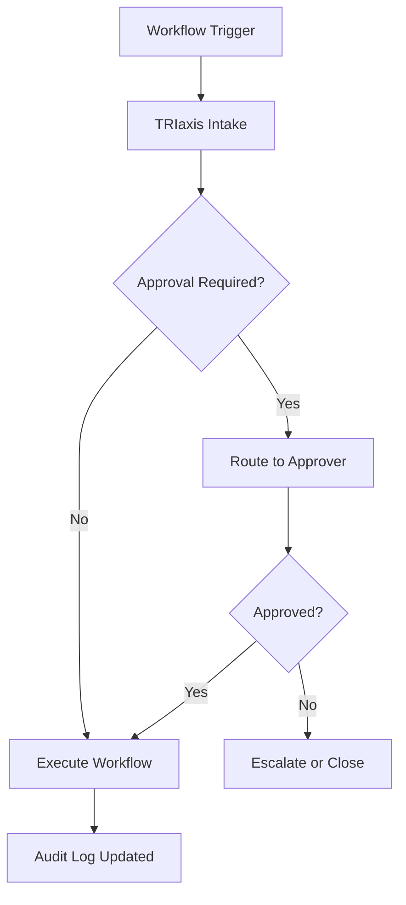

# AXXESS TRIaxis Workflow Documentation

This folder contains GitHub-ready workflow documentation for AXXESS TRIaxis.

The workflows are intended to document operating models designed by Mrs. Ritashree Mahanta, Cofounder & COO, AXXESS, and Domain Head - Healthcare, Non-Profits & Educational Institutions.

## Documentation Principles

- Preserve Ritashree Mahanta's terminology, sequencing, and operational intent.
- Make every workflow implementation-ready for product, engineering, operations, customer success, and enterprise buyers.
- Describe both the human process and the TRIaxis-enabled AI workflow.
- Make governance, auditability, approvals, role boundaries, and escalation paths explicit.
- Use Mermaid charts where they clarify sequence, decision points, ownership, or system architecture.

## Folder Structure

```text
docs/
  workflows/
    README.md
    workflow-template.md
    workflow-intake.md
    healthcare/
    non-profits/
    education/
    shared/
```

## Included Draft Workflows

| Workflow | Domain | File |
|---|---|---|
| Discharge Approval and Delegation Authority | Healthcare | `healthcare/discharge-approval-delegation-workflow.md` |
| OPD Follow-Up Investigation Adherence | Healthcare | `healthcare/opd-follow-up-investigation-adherence.md` |
| NRTS/NUID Registration Tracking | Education / Healthcare Administration | `education/nrts-nuid-registration-tracking.md` |

## Recommended File Naming

Use lowercase, hyphen-separated names:

```text
patient-onboarding.md
donor-engagement.md
student-support-case-management.md
grant-reporting.md
```

## Workflow Status Labels

Use one status label at the top of each workflow:

- `Draft`: Raw workflow has been converted into the standard documentation format.
- `Under Review`: Awaiting Ritashree Mahanta's review or domain validation.
- `Approved`: Approved for GitHub publication.
- `Implementation Ready`: Approved and ready for engineering execution.
- `Live`: Implemented in TRIaxis or Web Lite.

## Standard Workflow Sections

Each workflow should include:

1. Purpose
2. Domain
3. Actors
4. Trigger
5. Preconditions
6. Step-by-step flow
7. Decision points
8. Exceptions
9. Escalation paths
10. Data inputs
11. Data outputs
12. Roles and permissions
13. Audit trail
14. KPIs
15. Risks and controls
16. Acceptance criteria
17. Implementation notes
18. Mermaid charts

## Mermaid Rendering

GitHub supports Mermaid diagrams in Markdown. Use Mermaid for:

- Process flows
- Approval flows
- Sequence diagrams
- Role handoffs
- Data movement
- State transitions

Example:



## How To Add a New Workflow

1. Place Ritashree Mahanta's raw workflow notes in `workflow-intake.md` or in a new draft file.
2. Copy `workflow-template.md` into the correct domain folder.
3. Rename the file using the workflow name.
4. Preserve original domain terminology.
5. Fill all sections using the source workflow.
6. Add Mermaid charts only where they improve clarity.
7. Mark assumptions clearly.
8. Send for domain review before publication.
