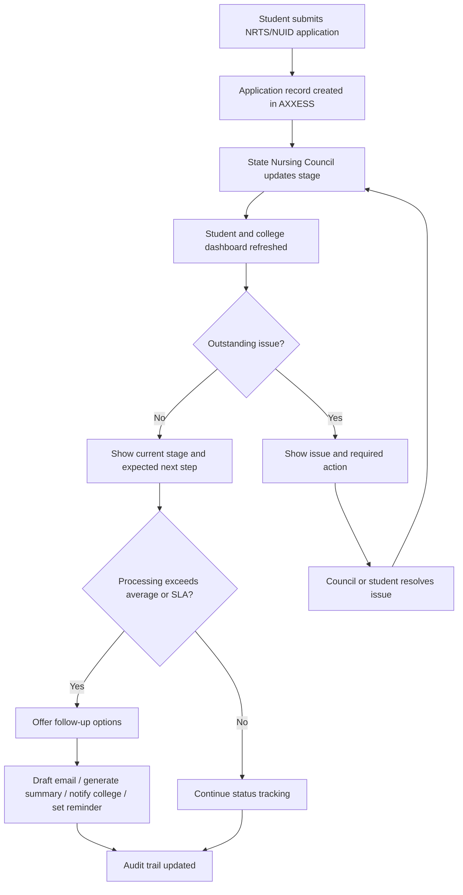
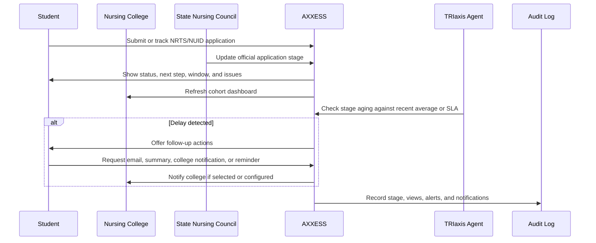

# NRTS/NUID Registration Tracking Workflow

**Status:** Draft  
**Domain:** Education / Healthcare Administration  
**Workflow Owner:** Mrs. Ritashree Mahanta, Cofounder & COO, AXXESS  
**Document Owner:** AXXESS TRIaxis Team  
**Last Updated:** 2026-08-06  
**Version:** 0.1

## 1. Purpose

This workflow enables State Nursing Councils, nursing colleges, and nursing students to track NRTS/NUID registration through a single integrated AXXESS platform.

The problem is administrative uncertainty. After graduation, nurses apply for NRTS/NUID registration. Once the application is submitted, students, colleges, and employers often lack visibility into where the application is in the process. Until the NUID or registration number is issued, many newly graduated nurses cannot complete employment formalities or confidently commit to a joining date.

AXXESS provides real-time registration status visibility, reduces phone calls and physical visits to the Nursing Council, and gives colleges and students a clear operational view of the application lifecycle.

## 2. Scope

### In Scope

- Student registration status tracking
- State Nursing Council registrar updates
- Nursing college dashboard
- Student self-service status view
- Delay detection
- Follow-up email drafting
- Application reference summary generation
- College notification
- Reminder scheduling
- Audit trail of status changes

### Out of Scope

- Determination of statutory eligibility unless configured by the State Nursing Council
- Replacement of State Nursing Council decision-making authority
- Employment offer management
- Background verification outside the registration workflow

## 3. Actors

| Actor | Role in Workflow | TRIaxis Access Level |
|---|---|---|
| Registrar, State Nursing Council | Provides official status updates and process decisions | Council Admin / Registrar |
| Nursing Council Staff | Verifies documents and updates application stages | Council User |
| Nursing College Faculty | Monitors graduate registration status | College Admin / Faculty |
| Nursing Student / Graduate | Tracks own NRTS/NUID registration status | Student User |
| Employer | Receives joining timeline from student where applicable | External Stakeholder |
| TRIaxis Agent | Summarizes status, detects delays, drafts follow-ups, sends reminders | System |

## 4. Trigger

The workflow begins when a newly graduated nurse submits an NRTS/NUID registration application through AXXESS or when the State Nursing Council imports/updates an application record.

## 5. Preconditions

- State Nursing Council tenant is configured.
- Nursing college tenant or institution profile is linked where applicable.
- Student identity and college relationship are verified.
- Application reference number exists.
- Registration stages are configured by the State Nursing Council.
- RBAC permissions distinguish Registrar, Council Staff, College Faculty, and Student access.

## 6. Data Inputs

| Input | Source | Required | Notes |
|---|---|---|---|
| Student profile | College / student submission | Yes | Includes identity and contact details |
| Application reference number | Council / AXXESS application workflow | Yes | Used for tracking |
| NRTS/NUID application date | Application record | Yes | Example: application received on 18 July |
| Current stage | Council Staff / Registrar update | Yes | Example: State Nursing Council verification |
| Expected next step | Workflow configuration | Yes | Example: document validation |
| Document status | Council verification workflow | Conditional | Flags missing or invalid documents |
| Processing benchmarks | Recent applications / council SLA | Conditional | Used to estimate window |

## 7. Student Status View

Example student query:

> "What's the status of my NRTS registration?"

Example AXXESS reply:

```text
Application received: 18 July
Current stage: State Nursing Council verification
Expected next step: Document validation
Estimated processing window: 8-15 working days based on recent applications
Outstanding issues: None
```

If delays occur:

```text
Your application has remained at the verification stage for 22 days.
This exceeds the recent average.

Would you like me to:
- draft a follow-up email,
- generate the application reference summary,
- notify your nursing college,
- or remind you every three days until status changes?
```

## 8. Nursing College Dashboard

Instead of answering repeated phone calls, college faculty can view a dashboard such as:

| Metric | Count |
|---|---:|
| Graduates | 240 |
| Registrations completed | 190 |
| Under verification | 38 |
| Document issues | 9 |
| Pending council clarification | 3 |

Students can log in themselves. Faculty immediately know where every graduate stands.

## 9. Step-by-Step Flow

| Step | Owner | Action | TRIaxis Capability | Output |
|---:|---|---|---|---|
| 1 | Student / Council | Application is submitted or imported | Registration workflow | Application record created |
| 2 | Council Staff | Updates application stage | Workflow status update | Current stage visible |
| 3 | Registrar | Provides official process-level updates | Admin dashboard | Verified council status |
| 4 | TRIaxis Agent | Calculates expected next step and estimated window | Analytics / workflow rules | Status summary |
| 5 | Student | Logs in to check status | Student self-service portal | Personal application timeline |
| 6 | College Faculty | Views cohort dashboard | College dashboard / analytics | Batch-level visibility |
| 7 | TRIaxis Agent | Detects delay beyond recent average or SLA | Analytics / rule trigger | Delay alert |
| 8 | Student | Chooses follow-up action | Conversational workflow | Email draft, summary, college notification, or reminder |
| 9 | AXXESS | Logs status views, updates, and notifications | Audit logs | Traceable status history |

## 10. Decision Points



## 11. Exceptions

| Exception | Detection Method | Resolution | Owner |
|---|---|---|---|
| Missing document | Council verification update | Notify student and college | Council Staff |
| Application stuck beyond average | Benchmark or SLA rule | Offer follow-up options | TRIaxis Agent |
| Council clarification pending | Council stage update | Notify college and student | Registrar / Council Staff |
| Student profile mismatch | Identity validation | Hold tracking until corrected | Council Staff |
| College linkage missing | Institution mapping check | Request college verification | College Admin |
| Duplicate application | Application reference check | Merge or flag for council review | Registrar |

## 12. Escalation Paths

| Scenario | Escalate To | SLA | Notes |
|---|---|---|---|
| Document issue unresolved | College Faculty / Student | Configurable | Student may need to re-upload documents |
| Application exceeds SLA | Registrar / Council Staff | Configurable | Follow-up summary generated |
| Duplicate or conflicting record | Registrar | Same working day | Manual review required |
| Student employment joining risk | College Faculty / Student | Configurable | Student receives expected timeline summary |
| System sync issue | AXXESS Admin / Council IT | Same working day | Preserve last known status |

## 13. Data Outputs

| Output | Destination | Format | Audit Requirement |
|---|---|---|---|
| Student status summary | Student portal | Conversational and structured view | Required |
| College cohort dashboard | College dashboard | Aggregate metrics | Required |
| Council application queue | Council dashboard | Structured queue | Required |
| Delay alert | Student / college / council notification | Notification | Required |
| Follow-up email draft | Student workflow | Draft text | Required if generated |
| Application reference summary | Student / college / council | Structured summary | Required |
| Reminder schedule | Student workflow | Reminder event | Required |

## 14. Roles and Permissions

| Capability | Registrar | Council Staff | College Faculty | Student | TRIaxis Agent |
|---|---:|---:|---:|---:|---:|
| Configure registration stages | Yes | Conditional | No | No | No |
| Update official status | Yes | Yes | No | No | No |
| View all council applications | Yes | Yes | No | No | Conditional |
| View college cohort status | Conditional | Conditional | Yes | No | Conditional |
| View own application | No | No | No | Yes | Conditional |
| Draft follow-up email | Yes | Yes | Yes | Yes | Yes |
| Notify college | Yes | Yes | Yes | Student initiated | Yes, by rule |
| Generate reference summary | Yes | Yes | Yes | Yes | Yes |
| View audit trail | Yes | Yes | Conditional | Own activity only | No |

## 15. Audit Trail

Every registration record should log:

- Application submission date
- Application reference number
- Student identity and college linkage
- Stage changes
- User who updated each stage
- Timestamp of each update
- Outstanding issue flags
- Document issue updates
- Student status views
- College dashboard updates
- Delay alerts
- Follow-up email drafts
- Notifications sent
- Reminder schedules
- Final registration completion date

## 16. KPIs

| KPI | Definition | Measurement Source |
|---|---|---|
| Average registration processing time | Time from application received to registration completed | Application timestamps |
| Stage aging | Time spent in each registration stage | Stage history |
| Student self-service rate | Percentage of status checks done by students directly | Portal analytics |
| Call reduction | Reduction in phone calls to college or council | Operations reporting |
| Document issue rate | Percentage of applications with document issues | Verification logs |
| SLA breach rate | Percentage exceeding configured processing window | Analytics |
| Completion rate | Percentage of graduates with completed registration | Dashboard metrics |

## 17. Risks and Controls

| Risk | Impact | Control |
|---|---|---|
| Incorrect status displayed | Student or employer confusion | Official council-controlled status updates |
| Unauthorized student data access | Privacy breach | Tenant isolation and RBAC |
| College sees records outside cohort | Data exposure | Institution linkage and access rules |
| Delay estimates treated as guarantees | Miscommunication | Label as estimated processing window |
| Council staff fail to update status | Stale information | Aging alerts and registrar dashboard |
| Duplicate records | Tracking confusion | Application reference validation |

## 18. Acceptance Criteria

- Registrar can configure and publish application stages.
- Council Staff can update application status.
- Student can view own NRTS/NUID status.
- Nursing College can view cohort-level dashboard.
- AXXESS shows current stage, expected next step, estimated processing window, and outstanding issues.
- AXXESS detects when an application exceeds recent average or configured SLA.
- AXXESS can draft a follow-up email and generate an application reference summary.
- AXXESS can notify the nursing college when student-initiated follow-up is required.
- AXXESS can schedule recurring reminders until status changes.
- All status updates and notifications are logged.

## 19. Implementation Notes

Required TRIaxis capabilities:

- Workflow orchestration
- Integrations
- Notifications
- Audit trails
- Role-based access
- Conversational AI for status explanation
- College and council dashboards
- Tenant isolation
- Analytics

This workflow should be positioned as an administrative transparency layer for State Nursing Councils, nursing colleges, and nursing students. It helps make the registration workflow conversational instead of bureaucratic.

## 20. Sequence View



