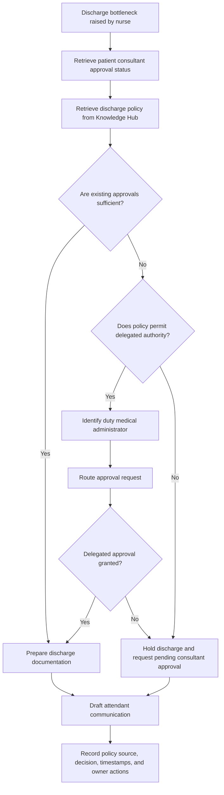
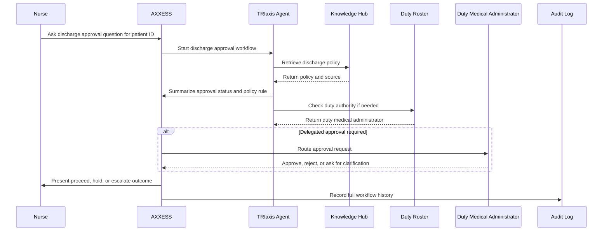

# Discharge Approval and Delegation Authority Workflow

**Status:** Draft  
**Domain:** Healthcare  
**Workflow Owner:** Mrs. Ritashree Mahanta, Cofounder & COO, AXXESS  
**Document Owner:** AXXESS TRIaxis Team  
**Last Updated:** 2026-08-06  
**Version:** 0.1

## 1. Purpose

This workflow enables hospital staff to resolve discharge approval bottlenecks when multiple consultants are involved and one or more approving doctors are unavailable.

The workflow is not intended to replace clinical judgment. It is intended to remove the operational chaos surrounding a clinical decision by helping the care team retrieve applicable discharge policy, check delegation authority, identify the appropriate duty authority, prepare documentation, communicate clearly with the patient's family, and record every action in an audit trail.

## 2. Scenario

A patient has been treated by four consultants.

- Two consultants have signed the discharge.
- One consultant is in a long surgery.
- One consultant is on leave.
- The patient's attendant is pressuring the nursing team and threatening legal action if discharge is delayed or additional charges are raised.

At this point, the nurse does not have time to call multiple departments, search hospital policy PDFs, check WhatsApp groups, identify delegation authority, and document the decision manually.

The nurse opens AXXESS and asks:

> "AXXESS, patient ID 48129. Can the patient be discharged with two consultant approvals? Show applicable hospital policy, identify delegated authority if additional approval is required, notify the duty medical administrator, prepare the discharge documentation, log every action, and draft an explanation for the attendant."

## 3. Scope

### In Scope

- Discharge approval status check
- Hospital Knowledge Hub policy retrieval
- Delegation authority lookup
- Duty roster check
- Duty medical administrator notification
- Discharge documentation preparation
- Family communication draft
- Approval routing when policy requires it
- Audit trail generation

### Out of Scope

- Clinical diagnosis
- Modification of treatment plans
- Final medical decision-making without authorized human approval
- Legal determination of liability

## 4. Actors

| Actor | Role in Workflow | TRIaxis Access Level |
|---|---|---|
| Nurse | Initiates the workflow and communicates with the attendant | Clinical User |
| Treating Consultant | Provides discharge approval | Consultant |
| Duty Medical Administrator | Reviews delegation or escalation when required | Approver |
| Hospital Administrator | Configures policies, rosters, and escalation rules | Admin |
| Patient Attendant | Receives explanation and discharge communication | External Stakeholder |
| TRIaxis Agent | Retrieves policy, checks records, prepares workflow actions, and logs activity | System |

## 5. Trigger

The workflow starts when a discharge is operationally blocked because required consultant approvals are incomplete, delayed, disputed, or unclear.

## 6. Preconditions

- Patient record exists in AXXESS.
- Consultant approval status is available.
- Hospital discharge policy is indexed in the Knowledge Hub.
- Delegation rules and duty roster are configured.
- Nurse is authenticated and authorized to initiate discharge support workflow.
- Duty Medical Administrator role is mapped in RBAC.

## 7. Data Inputs

| Input | Source | Required | Notes |
|---|---|---|---|
| Patient ID | Hospital record / nurse query | Yes | Example: patient ID 48129 |
| Consultant list | Patient care team record | Yes | Identifies all consultants linked to the case |
| Approval status | Discharge module / EHR integration | Yes | Signed, pending, unavailable, delegated |
| Hospital discharge policy | Knowledge Hub | Yes | Must be current and approved |
| Delegation authority rules | Policy / admin configuration | Yes | Determines whether alternate approval is allowed |
| Duty roster | Hospital roster system / manual configuration | Yes | Identifies duty medical administrator |
| Attendant concern | Nurse entry / communication log | Conditional | Used to draft explanation |

## 8. Step-by-Step Flow

| Step | Owner | Action | TRIaxis Capability | Output |
|---:|---|---|---|---|
| 1 | Nurse | Opens AXXESS and enters voice or text request | Voice interface / workflow intake | Discharge support workflow initiated |
| 2 | TRIaxis Agent | Retrieves patient discharge status | Patient record / workflow orchestration | Approval status summary |
| 3 | TRIaxis Agent | Retrieves relevant discharge policy | Enterprise RAG / Knowledge Hub | Policy excerpt and source reference |
| 4 | TRIaxis Agent | Checks whether delegation rules apply | Rule evaluation / policy retrieval | Delegation requirement result |
| 5 | TRIaxis Agent | Checks duty roster | Integration / roster lookup | Current duty authority identified |
| 6 | TRIaxis Agent | Determines whether escalation is required | Workflow rules / RBAC | Escalate or proceed recommendation |
| 7 | Duty Medical Administrator | Reviews case if policy requires approval | Human approval | Approval, rejection, or clarification |
| 8 | TRIaxis Agent | Prepares discharge workflow and documentation | Document drafting / task creation | Draft discharge documentation |
| 9 | Nurse | Reviews and confirms communication to attendant | Human review | Approved explanation |
| 10 | TRIaxis | Logs every action | Audit logs | Complete audit trail |

## 9. Decision Points

## 10. Exceptions

| Exception | Detection Method | Resolution | Owner |
|---|---|---|---|
| Discharge policy unavailable | Knowledge Hub lookup fails | Escalate to hospital administrator | Nurse / Admin |
| Policy version conflict | Multiple active policies found | Route to duty medical administrator | TRIaxis Agent |
| Duty roster unavailable | Roster lookup fails | Use manual escalation list | Nurse |
| Delegation authority unclear | Policy confidence flag | Require human review | Duty Medical Administrator |
| Attendant dispute escalates | Nurse flags incident | Add incident note and notify administrator | Nurse |
| Consultant approval record missing | Patient record mismatch | Request clarification from treating unit | Nurse / Coordinator |

## 11. Escalation Paths

| Scenario | Escalate To | SLA | Notes |
|---|---|---|---|
| Delegation authority required | Duty Medical Administrator | Immediate | Approval must be logged |
| Policy ambiguity | Medical Superintendent / Hospital Admin | Immediate | Do not auto-execute |
| Family dispute or threat | Duty Medical Administrator | Immediate | Preserve communication record |
| Missing consultant status | Treating unit coordinator | Same shift | Prevent undocumented discharge |
| System integration unavailable | Hospital operations team | Same shift | Manual fallback required |

## 12. Data Outputs

| Output | Destination | Format | Audit Requirement |
|---|---|---|---|
| Consultant approval summary | Discharge workflow record | Structured status | Required |
| Policy reference | Workflow record | Source-linked excerpt | Required |
| Delegation authority result | Approval module | Rule outcome | Required |
| Duty authority notification | Task / notification | Message and timestamp | Required |
| Discharge documentation draft | Document module | Draft document | Required |
| Attendant explanation | Communication log | Reviewed message | Required |
| Final decision | Patient record / discharge workflow | Approved, held, escalated | Required |

## 13. Roles and Permissions

| Capability | Nurse | Consultant | Duty Medical Administrator | Hospital Admin | TRIaxis Agent |
|---|---:|---:|---:|---:|---:|
| Initiate discharge support workflow | Yes | Yes | Yes | Yes | No |
| View consultant approval status | Yes | Yes | Yes | Yes | Conditional |
| Retrieve discharge policy | Yes | Yes | Yes | Yes | Yes |
| Determine delegation rule match | No | No | Yes | Yes | Yes, recommendation only |
| Approve delegated discharge | No | Conditional | Yes | Yes | No |
| Draft family communication | Yes | No | Yes | Yes | Yes |
| Send family communication | Yes | Conditional | Yes | Yes | No |
| Override workflow decision | No | No | Conditional | Yes | No |
| View audit log | Yes | Yes | Yes | Yes | No |

## 14. Audit Trail

The audit trail must record:

- Patient ID
- Nurse initiating the query
- Query timestamp
- Consultant approval status at time of query
- Policy source retrieved from Knowledge Hub
- Policy version
- Delegation rule evaluated
- Duty roster lookup result
- Notification sent to duty medical administrator
- Approval decision and timestamp
- Discharge documentation generated
- Attendant communication drafted and reviewed
- Final action taken
- Any exception or manual override

## 15. KPIs

| KPI | Definition | Measurement Source |
|---|---|---|
| Discharge bottleneck resolution time | Time from nurse query to clear proceed/hold/escalate outcome | Workflow timestamps |
| Policy retrieval success rate | Percentage of cases where relevant policy is retrieved | Knowledge Hub logs |
| Delegated approval turnaround time | Time from routed approval to decision | Approval logs |
| Manual call reduction | Reduction in interdepartmental calls for discharge clarification | Operations reporting |
| Family communication response time | Time from bottleneck to reviewed explanation | Communication logs |
| Audit completeness | Percentage of workflows with complete source, decision, and action logs | Audit logs |

## 16. Risks and Controls

| Risk | Impact | Control |
|---|---|---|
| Incorrect policy retrieval | Unsafe or non-compliant discharge | Source-linked policy excerpts and human review |
| Unauthorized discharge approval | Patient safety and governance risk | RBAC and delegated approval gate |
| Missing consultant status | Incomplete clinical clearance | Mandatory approval status check |
| Over-reliance on AI | Clinical or administrative error | AI is recommendation-only for discharge authority |
| Poor family communication | Dispute escalation | Human-reviewed explanation |
| Weak defensibility | Inability to prove process followed | Tamper-evident audit trail |

## 17. Acceptance Criteria

- Nurse can initiate workflow using patient ID.
- AXXESS retrieves current consultant approval status.
- AXXESS retrieves the applicable discharge policy from the Knowledge Hub.
- AXXESS identifies whether delegation rules apply.
- AXXESS checks the duty roster and routes approval if required.
- No discharge authority is granted by AI without authorized human approval.
- Attendant communication is drafted and reviewed before use.
- Every action is logged with timestamp, user, source, and outcome.
- Final outcome is clearly marked as proceed, hold, escalated, or closed.

## 18. Implementation Notes

Required TRIaxis capabilities:

- Enterprise RAG
- Knowledge Hub
- Workflow orchestration
- RBAC
- Audit logs
- Policy retrieval
- Voice interface
- Agent coordination
- Human approval
- Explainability

Integrations may include hospital EHR, discharge module, duty roster, messaging, document management, and incident reporting.

## 19. Sequence View

