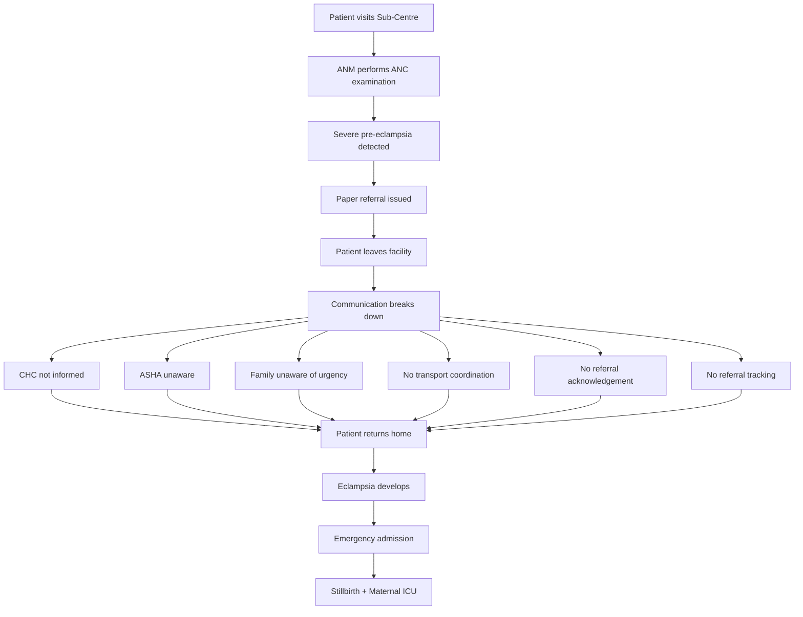
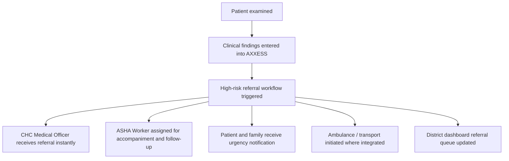
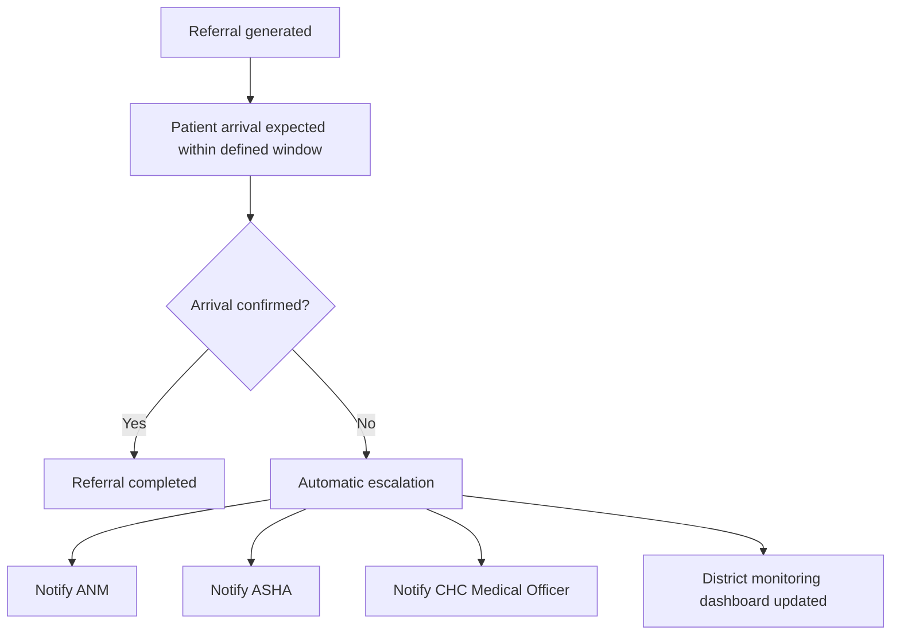
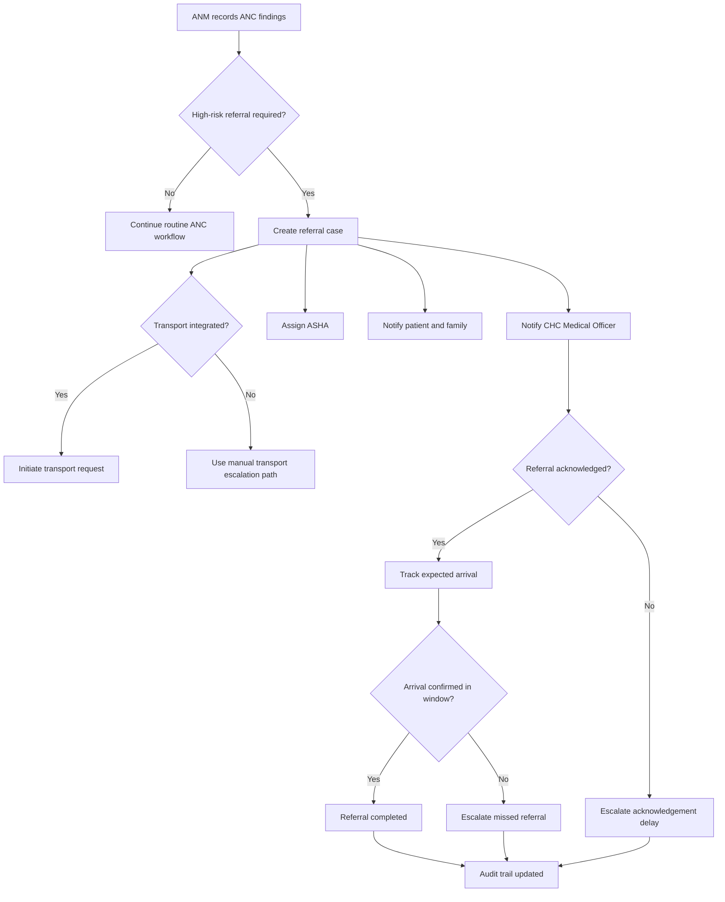

# Preventing Maternal Complications Through Intelligent Referral Coordination

**Status:** Draft  
**Domain:** Healthcare / Public Health / Maternal and Child Health  
**Workflow Owner:** AXXESS TRIaxis Team  
**Document Owner:** AXXESS TRIaxis Team  
**Last Updated:** 2026-08-07  
**Version:** 0.1

## 1. Purpose

This workflow helps frontline health workers, referral facilities, ASHA workers, patients, families, and district health administrators coordinate high-risk maternal referrals through AXXESS.

The workflow is not designed to replace clinical judgment. It ensures that once a healthcare professional identifies danger signs and initiates referral, the health system executes the referral reliably, visibly, and with a complete audit trail.

## 2. Problem Statement

Severe maternal complications frequently arise not because frontline healthcare workers fail to recognize danger signs, but because communication between levels of the health system breaks down.

In this scenario, the ANM correctly identifies severe pre-eclampsia, with BP 170/110 mmHg and pedal oedema, and advises referral. However, the referral process depends entirely on paper documentation and manual follow-up.

The patient never reaches the referral facility, progresses to eclampsia, requires ICU admission, and the baby is stillborn.

The failure is therefore operational, not clinical.

## 3. Current Workflow Without AXXESS

## 4. AXXESS Intelligent Referral Workflow

## 5. Scope

### In Scope

- ANC danger sign capture
- High-risk referral workflow trigger
- CHC Medical Officer notification
- ASHA assignment
- Patient and family SMS/app notification
- Transport coordination where integrated
- Referral acknowledgement
- Expected arrival window tracking
- Missed referral escalation
- District monitoring dashboard
- Audit trail of referral actions

### Out of Scope

- Independent AI diagnosis
- AI prescription or clinical treatment decisions
- Replacement of ANM, ASHA, CHC Medical Officer, or district health authority
- Emergency medical transport operation where no transport integration exists
- Legal determination of clinical negligence

## 6. Actors

| Stakeholder | Role in AXXESS | Access Level |
|---|---|---|
| ANM | Record assessment and initiate referral | Frontline Health Worker |
| ASHA | Escort patient, counsel family, confirm follow-up | Field Worker |
| CHC Medical Officer | Acknowledge referral and prepare receiving facility | Referral Facility Approver |
| Patient & Family | Receive clear emergency instructions | External Beneficiary |
| Ambulance / Transport Provider | Receive transport request where integrated | External Partner |
| District Administration | Monitor referral completion and delays | District Admin |
| TRIaxis Agent | Orchestrates notifications, tracking, escalation, and summaries | System |

## 7. Trigger

The workflow begins when an ANM or authorized frontline worker records high-risk maternal findings and initiates referral.

Example trigger:

- BP 170/110 mmHg
- Pedal oedema
- Severe pre-eclampsia suspected or identified by health worker
- Referral advised

## 8. Preconditions

- Patient profile exists or is created at the Sub-Centre.
- ANM is authenticated and authorized.
- Referral facility mapping is configured.
- CHC Medical Officer contact and acknowledgement workflow are configured.
- ASHA worker mapping is configured for the patient area.
- Patient or family contact details are available.
- Transport integration or manual transport escalation path is configured where available.
- Expected arrival windows and escalation thresholds are configured.

## 9. Data Inputs

| Input | Source | Required | Notes |
|---|---|---|---|
| Patient identity | Sub-Centre / ANM entry | Yes | Minimum required identity for referral tracking |
| ANC examination findings | ANM | Yes | Includes BP and observed danger signs |
| Referral reason | ANM | Yes | Example: severe pre-eclampsia |
| Referral facility | Facility mapping | Yes | CHC or higher facility |
| ASHA assignment | Area mapping | Yes | For accompaniment and family follow-up |
| Patient/family contact | Registration / ANM entry | Conditional | Used for urgent SMS/app notification |
| Transport request | Ambulance integration / manual workflow | Conditional | Required where transport support is available |
| Expected arrival window | Protocol / district configuration | Yes | Used for missed referral escalation |

## 10. Automated Follow-Up Logic

## 11. Step-by-Step Flow

| Step | Owner | Action | TRIaxis Capability | Output |
|---:|---|---|---|---|
| 1 | ANM | Records ANC findings in AXXESS | Frontline form / mobile workflow | Clinical finding record |
| 2 | ANM | Initiates high-risk referral | Referral workflow | Referral case created |
| 3 | TRIaxis | Notifies CHC Medical Officer instantly | Notification / referral routing | Receiving facility alert |
| 4 | TRIaxis | Assigns ASHA for accompaniment and follow-up | Field worker mapping | ASHA task |
| 5 | TRIaxis | Sends patient/family urgency message | SMS/app communication | Patient instruction record |
| 6 | TRIaxis | Initiates ambulance/transport workflow where integrated | Transport integration | Transport request |
| 7 | CHC Medical Officer | Acknowledges referral | Human acknowledgement | Facility preparedness |
| 8 | ASHA | Confirms contact, counselling, or accompaniment | Field follow-up | Follow-up status |
| 9 | TRIaxis | Tracks expected arrival window | Referral monitoring | Countdown and status |
| 10 | CHC / Receiving Facility | Confirms patient arrival | Referral completion | Arrival timestamp |
| 11 | TRIaxis | Escalates if arrival not confirmed | Escalation workflow | ANM, ASHA, CHC, district alerts |
| 12 | District Administration | Monitors delayed or missed referrals | District dashboard | Referral performance visibility |
| 13 | TRIaxis | Records all actions and communications | Audit logs | Complete referral trail |

## 12. Human-in-the-Loop Design

Clinical decision-making remains with healthcare professionals.

AXXESS does not independently diagnose or prescribe treatment.

Instead, it:

- Orchestrates communication
- Coordinates stakeholders
- Tracks referral completion
- Escalates missed referrals
- Maintains an auditable digital trail

## 13. Decision Points

## 14. Exceptions

| Exception | Detection Method | Resolution | Owner |
|---|---|---|---|
| CHC does not acknowledge referral | No acknowledgement within threshold | Escalate to CHC Medical Officer and district dashboard | TRIaxis |
| ASHA unavailable | No acknowledgement / leave status | Assign alternate ASHA or notify supervisor | Field Coordinator |
| Patient/family unreachable | SMS/app delivery failure / ASHA report | ASHA follow-up and manual contact attempt | ASHA |
| Transport unavailable | Transport request failure | Escalate to manual transport coordination | District Administration |
| Patient does not arrive | Arrival not confirmed in expected window | Notify ANM, ASHA, CHC Medical Officer, and district dashboard | TRIaxis |
| Referral facility capacity issue | CHC response | Route to alternate facility if configured | CHC / District |
| Data entry incomplete | Required field validation | Request completion before referral closure | ANM |

## 15. Escalation Paths

| Scenario | Escalate To | SLA | Notes |
|---|---|---|---|
| High-risk referral created | CHC Medical Officer, ASHA, District Dashboard | Immediate | Simultaneous notification |
| CHC acknowledgement missing | CHC Medical Officer / District Admin | Configurable, urgent | Receiving facility must confirm |
| ASHA acknowledgement missing | Field supervisor | Configurable, urgent | Alternate assignment may be needed |
| Patient arrival delayed | ANM, ASHA, CHC Medical Officer, District Admin | Immediate after threshold | Missed referral risk |
| Transport request failed | District transport coordinator | Immediate | Manual fallback |
| Maternal emergency reported | CHC / emergency protocol | Immediate | Clinical escalation remains human-led |

## 16. Data Outputs

| Output | Destination | Format | Audit Requirement |
|---|---|---|---|
| Referral case | Referral dashboard | Structured record | Required |
| CHC notification | Communication log | Message and timestamp | Required |
| CHC acknowledgement | Referral record | Acknowledged / pending | Required |
| ASHA task | Field worker dashboard | Task and status | Required |
| Patient/family message | Communication log | SMS/app record | Required |
| Transport request | Transport workflow | Request and status | Conditional |
| Expected arrival countdown | Referral dashboard | Timer/status | Required |
| Missed referral escalation | District dashboard | Alert record | Required if triggered |
| Arrival confirmation | Referral record | Timestamp | Required |
| Audit trail | Referral case | Chronological record | Required |

## 17. Roles and Permissions

| Capability | ANM | ASHA | CHC Medical Officer | District Admin | Patient/Family | TRIaxis Agent |
|---|---:|---:|---:|---:|---:|---:|
| Record ANC findings | Yes | Conditional | Yes | Conditional | No | No |
| Initiate referral | Yes | Conditional | Yes | Conditional | No | No |
| Acknowledge referral | No | Conditional | Yes | Yes | No | No |
| Confirm patient follow-up | Conditional | Yes | Conditional | Conditional | No | No |
| Confirm arrival | No | No | Yes | Conditional | No | No |
| View own instructions | No | No | No | No | Yes | No |
| Monitor district referrals | No | No | Conditional | Yes | No | Conditional |
| Trigger escalation | Yes | Yes | Yes | Yes | No | Yes, by rule |
| View audit trail | Conditional | Conditional | Yes | Yes | Own communication only | No |

## 18. Audit Trail

Every workflow instance should record:

- Patient referral ID
- ANM identity
- ANC findings entered
- Referral reason
- Referral timestamp
- Receiving facility
- CHC notification timestamp
- CHC acknowledgement timestamp
- ASHA assignment timestamp
- ASHA acknowledgement and follow-up status
- Patient/family message delivery status
- Transport request and status where integrated
- Expected arrival window
- Arrival confirmation timestamp
- Missed referral escalation events
- District dashboard updates
- Final referral status

## 19. KPIs

### Operational Metrics

| KPI | Definition |
|---|---|
| Referral acknowledgement time | Time from referral creation to CHC acknowledgement |
| Patient travel initiation time | Time from referral creation to transport or ASHA follow-up initiation |
| Referral completion rate | Percentage of referrals confirmed at receiving facility |
| Missed referral rate | Percentage of referrals not completed within expected window |
| Escalation frequency | Number of escalations per referral cohort |

### Clinical Metrics

| KPI | Definition |
|---|---|
| Time from diagnosis to admission | Time between high-risk finding and receiving facility admission |
| Severe maternal complication rate | Rate of serious complications after referral trigger |
| Eclampsia incidence | Incidence among high-risk referrals |
| Maternal mortality | Maternal deaths in tracked referral cohort |
| Stillbirth rate | Stillbirths in tracked referral cohort |
| Neonatal mortality | Neonatal deaths in tracked referral cohort |

### Governance Metrics

| KPI | Definition |
|---|---|
| Referral audit completeness | Percentage of referral events fully logged |
| Facility responsiveness | CHC acknowledgement and readiness performance |
| Worker accountability | ANM/ASHA task completion and acknowledgement rate |
| District referral performance | District-level completion, delay, and escalation patterns |

## 20. Risks and Controls

| Risk | Impact | Control |
|---|---|---|
| Referral not acknowledged | Receiving facility unprepared | CHC acknowledgement requirement and escalation |
| ASHA unaware | Patient/family not supported | ASHA assignment and acknowledgement tracking |
| Family underestimates urgency | Patient returns home | Clear SMS/app urgency message and ASHA counselling task |
| Transport not coordinated | Delay in reaching facility | Transport integration or manual escalation |
| Patient does not arrive | Preventable complication | Expected arrival window and automatic escalation |
| District cannot see missed referrals | Systemic failures repeat | District monitoring dashboard |
| AI seen as diagnosing | Clinical safety concern | Human-in-the-loop and no AI diagnosis/prescription |
| Weak accountability | No learning after adverse event | Complete referral audit trail |

## 21. Acceptance Criteria

- ANM can record high-risk ANC findings.
- ANM can initiate a high-risk referral workflow.
- CHC Medical Officer receives instant referral notification.
- ASHA is assigned for accompaniment and follow-up.
- Patient and family receive clear emergency instructions.
- Transport request is initiated where integrated.
- CHC acknowledgement is tracked.
- Expected arrival window is monitored.
- Failure to confirm arrival triggers automatic escalation.
- District dashboard shows delayed and missed referrals.
- Complete referral audit trail is available.
- AXXESS does not independently diagnose, prescribe, or replace clinical authority.

## 22. Implementation Notes

Required TRIaxis capabilities:

- Frontline health worker forms
- Referral workflow
- Patient/family notification
- ASHA assignment
- CHC acknowledgement
- Transport integration or manual escalation
- Expected arrival tracking
- District dashboard
- Escalation rules
- RBAC
- Audit logs
- Offline/mobile-friendly field workflow where required
- Local language notification support where required

## 23. Enterprise Value Proposition

Traditional digital health systems primarily digitize patient records.

AXXESS digitizes care coordination.

Rather than functioning only as an Electronic Health Record, AXXESS serves as an operational intelligence layer that connects frontline workers, referral facilities, administrators, and patients through intelligent workflow orchestration.

By ensuring that every referral is acknowledged, tracked, and escalated when necessary, AXXESS reduces communication failures that contribute to preventable maternal and neonatal complications.

The value lies not in replacing clinical judgment, but in ensuring that once the right clinical decision is made, the health system executes it reliably.

## 24. One-Line Pitch

> "Maternal referrals should not fail after the danger sign is recognized. AXXESS helps the health system execute the referral, track arrival, and escalate before a preventable complication becomes a tragedy."

