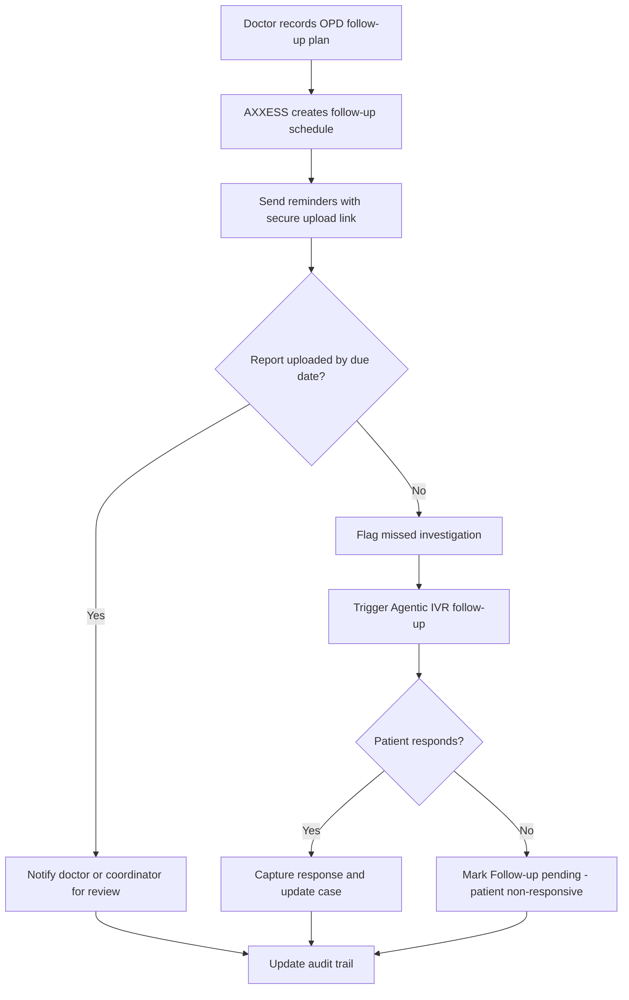
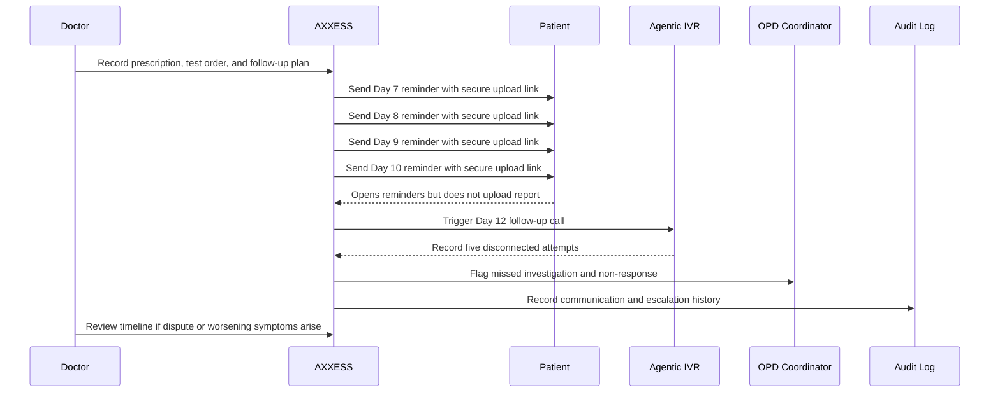

# OPD Follow-Up Investigation Adherence Workflow

**Status:** Draft  
**Domain:** Healthcare  
**Workflow Owner:** Mrs. Ritashree Mahanta, Cofounder & COO, AXXESS  
**Document Owner:** AXXESS TRIaxis Team  
**Last Updated:** 2026-08-06  
**Version:** 0.1

## 1. Purpose

This workflow ensures that OPD follow-up instructions, investigation orders, reminders, patient responses, and non-response events are executed, documented, and provable.

The workflow is not saying "AI will diagnose the patient." It is saying "AI will make sure the follow-up process is executed, documented, and provable."

The value proposition is broader than liability reduction:

- Better patient adherence
- Earlier detection of missed follow-ups
- Less manual administrative work
- Better continuity of care
- A documented communication trail

## 2. Scenario

A patient visits the OPD.

The doctor prescribes:

- 7 days of medication
- A blood test on Day 10
- Follow-up based on the report

The patient completes the medication but ignores the investigation. On Day 20, symptoms worsen. The patient alleges:

> "The doctor never told me to come back."

AXXESS allows the doctor and provider organization to see the complete communication and follow-up history.

## 3. Scope

### In Scope

- OPD instruction capture
- Investigation order tracking
- Automatic follow-up scheduling
- Reminder messaging
- Secure upload links
- Delivery and read receipts
- Agentic IVR follow-up
- Patient non-response classification
- Escalation history
- Audit trail for quality assurance and defensibility

### Out of Scope

- AI diagnosis
- AI treatment prescription
- Legal conclusion that negligence did or did not occur
- Replacement of doctor judgment

## 4. Actors

| Actor | Role in Workflow | TRIaxis Access Level |
|---|---|---|
| Doctor | Prescribes medication, orders investigation, reviews follow-up status | Clinician |
| Patient | Receives reminders and uploads report | External User |
| OPD Coordinator | Monitors missed follow-ups and escalations | Coordinator |
| TRIaxis Agent | Schedules reminders, tracks response, triggers IVR, summarizes audit trail | System |
| Hospital Administrator | Configures protocols, templates, SLAs, and escalation rules | Admin |

## 5. Trigger

The workflow starts when a doctor records an OPD plan that includes a time-bound investigation, follow-up requirement, report upload, or patient action.

## 6. Preconditions

- Patient contact details are verified.
- Patient consent and communication preferences are recorded.
- Doctor's OPD note or order includes clear follow-up instructions.
- Reminder schedule is configured.
- Secure upload link service is available.
- IVR escalation rules are configured if required by protocol.

## 7. Data Inputs

| Input | Source | Required | Notes |
|---|---|---|---|
| OPD visit record | Doctor / EHR / AXXESS OPD module | Yes | Includes date, doctor, and patient ID |
| Prescription | Doctor entry / document upload | Yes | Example: 7 days of medication |
| Investigation order | Doctor entry / lab order | Yes | Example: blood test on Day 10 |
| Follow-up instruction | Doctor entry | Yes | Defines expected next action |
| Patient contact details | Registration record | Yes | Used for reminders and IVR |
| Upload link | AXXESS secure link service | Yes | Sent with reminders |
| Reminder schedule | Workflow rule | Yes | Example: Days 7, 8, 9, and 10 |

## 8. Step-by-Step Flow

| Step | Owner | Action | TRIaxis Capability | Output |
|---:|---|---|---|---|
| 1 | Doctor | Records medication, investigation, and follow-up plan | OPD workflow / document capture | Follow-up plan created |
| 2 | TRIaxis Agent | Converts plan into timeline | Workflow orchestration | Follow-up schedule |
| 3 | TRIaxis | Sends reminder on Day 7 | Messaging / secure upload link | Delivery record |
| 4 | TRIaxis | Sends reminders on Days 8, 9, and 10 | Messaging / notification rules | Delivery and read receipts |
| 5 | Patient | Opens reminders but does not upload report | Patient link tracking | Read receipt without upload |
| 6 | TRIaxis | Detects missed report after Day 10 | Workflow rule | Missed investigation flag |
| 7 | TRIaxis Agent | Places automated follow-up IVR call on Day 12 | Agentic IVR | Call attempt logs |
| 8 | TRIaxis | Records five disconnected call attempts | IVR logs | Non-response evidence |
| 9 | TRIaxis | Marks case as "Follow-up pending - patient non-responsive" | Case status automation | Escalation-ready status |
| 10 | Doctor / Coordinator | Reviews timeline when issue arises | Audit timeline | Communication history available |

## 9. AXXESS Timeline

The doctor opens AXXESS. The audit trail immediately shows:

- Prescription issued
- Test order generated
- Follow-up automatically scheduled
- Reminder messages sent on Days 7, 8, 9, and 10
- Every reminder contained a secure upload link
- Messages were delivered
- Patient opened four reminders
- No report uploaded
- Day 12: Agentic IVR placed an automated follow-up call
- Five call attempts
- All disconnected by the patient
- Case automatically marked as "Follow-up pending - patient non-responsive"

## 10. Decision Points

## 11. Exceptions

| Exception | Detection Method | Resolution | Owner |
|---|---|---|---|
| Invalid patient contact | Delivery failure | Request updated contact details | OPD Coordinator |
| Patient opens reminder but does not upload report | Link tracking | Continue reminder and IVR sequence | TRIaxis |
| Upload link expires | Link status | Reissue secure link | TRIaxis / Coordinator |
| Patient uploads wrong document | Document validation | Request correct report | Coordinator |
| IVR calls disconnect | IVR logs | Mark non-responsive after configured attempts | TRIaxis |
| Emergency symptom reported | Patient response / IVR input | Escalate immediately to clinical team | Coordinator |

## 12. Escalation Paths

| Scenario | Escalate To | SLA | Notes |
|---|---|---|---|
| Missed investigation after due date | OPD Coordinator | Next working day | Review and follow up |
| Repeated non-response | OPD Coordinator / Doctor | Configurable | Status becomes non-responsive |
| Patient reports worsening symptoms | Doctor / emergency protocol | Immediate | Clinical escalation |
| Communication failure | Registration desk / coordinator | Same day | Update patient contact details |
| Dispute or allegation | Hospital administrator / quality team | Immediate | Retrieve audit timeline |

## 13. Data Outputs

| Output | Destination | Format | Audit Requirement |
|---|---|---|---|
| Follow-up schedule | Workflow module | Timeline | Required |
| Reminder messages | Communication log | Message record | Required |
| Secure upload links | Patient communication | Link event | Required |
| Delivery receipts | Communication log | Timestamped receipt | Required |
| Read receipts | Communication log | Timestamped event | Required |
| IVR call attempts | IVR log | Attempt record | Required |
| Non-response status | Case record | Status update | Required |
| Audit timeline | Doctor / quality team view | Chronological record | Required |

## 14. Roles and Permissions

| Capability | Doctor | OPD Coordinator | Hospital Admin | Patient | TRIaxis Agent |
|---|---:|---:|---:|---:|---:|
| Create follow-up plan | Yes | Conditional | Yes | No | No |
| View follow-up timeline | Yes | Yes | Yes | Own only | Conditional |
| Send reminders | Conditional | Yes | Yes | No | Yes |
| Upload report | No | No | No | Yes | No |
| Trigger IVR | Conditional | Yes | Yes | No | Yes |
| Mark non-responsive | Yes | Yes | Yes | No | Yes, by rule |
| View audit trail | Yes | Yes | Yes | Own communication only | No |
| Modify protocol | No | No | Yes | No | No |

## 15. Audit Trail

Every workflow instance should record:

- OPD visit timestamp
- Doctor identity
- Prescription issued
- Investigation ordered
- Follow-up due date
- Reminder schedule created
- Reminder content and delivery timestamp
- Secure upload link generated
- Delivery receipts
- Read receipts
- Uploaded document status
- IVR trigger timestamp
- IVR attempts and outcomes
- Patient responses or lack of response
- Status change to "Follow-up pending - patient non-responsive"
- User who reviewed or escalated the case

## 16. KPIs

| KPI | Definition | Measurement Source |
|---|---|---|
| Investigation adherence rate | Percentage of patients who upload required report by due date | Upload logs |
| Reminder engagement rate | Percentage of reminders opened | Read receipts |
| Missed follow-up detection time | Time from due date to missed investigation flag | Workflow timestamps |
| IVR contact success rate | Percentage of IVR attempts resulting in patient response | IVR logs |
| Non-response rate | Percentage marked as patient non-responsive | Case status logs |
| Coordinator workload reduction | Reduction in manual follow-up calls | Operations reporting |
| Audit completeness | Percentage with full reminder, link, and IVR history | Audit logs |

## 17. Risks and Controls

| Risk | Impact | Control |
|---|---|---|
| Patient contact details incorrect | Reminders fail | Contact verification and delivery failure alerts |
| Patient ignores reminders | Missed investigation | Multi-day reminders and IVR follow-up |
| Upload link misused | Privacy risk | Secure expiring links |
| Overstatement of legal protection | Misleading positioning | Use defensibility and protocol adherence language |
| AI seen as diagnosing | Clinical risk | Position AI as workflow execution and documentation support |
| Missing audit data | Weak quality record | Mandatory event logging |

## 18. Legal and Regulatory Positioning

Do not state that the doctor or hospital cannot be held liable for negligence.

Use this safer positioning:

> "AXXESS provides a complete, tamper-evident record of follow-up actions and patient communications, helping healthcare providers demonstrate adherence to documented protocols and supporting quality assurance, continuity of care, and, where relevant, their legal and regulatory position."

## 19. Acceptance Criteria

- Doctor can record medication, investigation, and follow-up requirements.
- AXXESS creates a follow-up timeline automatically.
- Reminder messages are sent on configured days.
- Each reminder includes a secure upload link.
- Delivery and read receipts are recorded.
- Missed report upload triggers a workflow flag.
- Agentic IVR is triggered according to protocol.
- Disconnected IVR attempts are logged.
- Case can be marked "Follow-up pending - patient non-responsive."
- Doctor can view a complete audit timeline.

## 20. Sequence View

