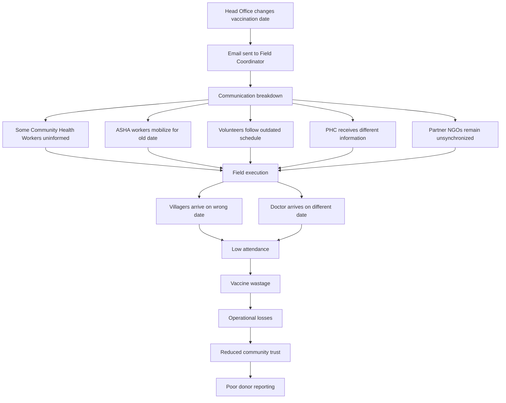
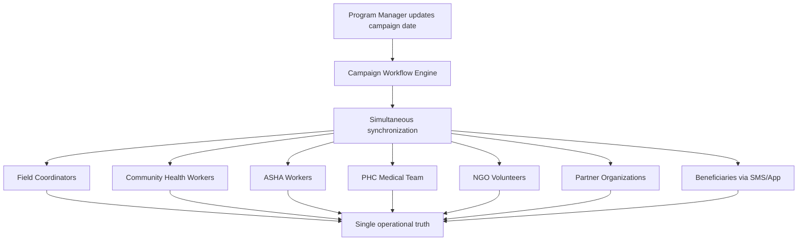
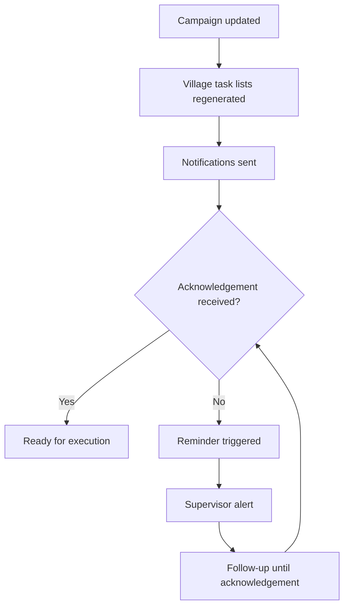
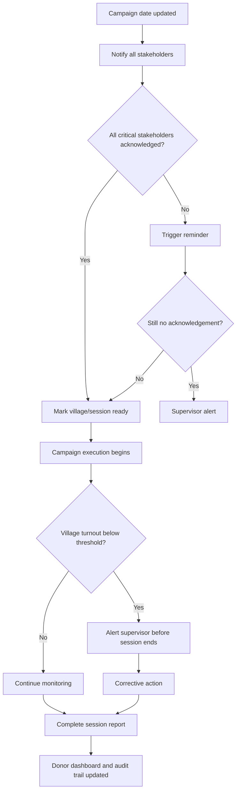

# Coordinated Immunization Campaign Management Workflow

**Status:** Draft  
**Domain:** Non-Profits / Public Health / Community Health / Program Delivery  
**Workflow Owner:** AXXESS TRIaxis Team  
**Document Owner:** AXXESS TRIaxis Team  
**Last Updated:** 2026-08-07  
**Version:** 0.1

## 1. Purpose

This workflow helps NGOs, public health teams, PHCs, field coordinators, ASHA workers, volunteers, partner organizations, and donors coordinate large-scale immunization campaigns through a single synchronized operating layer.

The workflow addresses information synchronization, acknowledgement, readiness monitoring, escalation, and donor-visible reporting. It does not replace healthcare professionals or NGO program leadership.

## 2. Problem Statement

Large-scale community health programs depend on seamless coordination across multiple organizations and field teams.

Even a minor schedule change can trigger cascading operational failures when updates are communicated through fragmented channels such as email, WhatsApp, phone calls, or paper notices.

In this scenario, vaccine supply delays require postponing the immunization drive by three days.

Although the Program Manager updates the schedule, the communication fails to reach every stakeholder.

The result is poor beneficiary turnout, wasted resources, donor dissatisfaction, and reduced community trust.

The operational failure lies in information synchronization, not program planning.

## 3. Current Workflow Without AXXESS

## 4. AXXESS Intelligent Campaign Workflow

Every stakeholder receives the same update simultaneously.

There is only one operational truth.

## 5. Scope

### In Scope

- Campaign date and schedule updates
- Village-level task list regeneration
- Field team notifications
- Beneficiary SMS/app notifications
- Stakeholder acknowledgement tracking
- Reminder and supervisor alert workflows
- Village-level readiness monitoring
- Volunteer attendance tracking
- PHC participation tracking
- Beneficiary turnout tracking
- Vaccine utilization tracking
- Task completion tracking
- Incident reporting
- Donor dashboards and outcome reports
- Audit trail

### Out of Scope

- Clinical immunization decision-making
- Vaccine procurement decisions
- Replacement of PHC medical authority
- Replacement of NGO program leadership
- Automatic change of health protocol without authorized approval

## 6. Actors

| Stakeholder | Responsibility | TRIaxis Access Level |
|---|---|---|
| Program Manager | Publish campaign updates and monitor execution | Program Admin |
| Field Coordinator | Coordinate field operations | Field Manager |
| Community Health Worker | Conduct awareness and beneficiary mobilization | Field User |
| ASHA Worker | Mobilize beneficiaries and provide follow-up | Field User / External Partner |
| PHC Team | Deliver immunization services | Health Partner |
| Volunteers | Support logistics and beneficiary management | Volunteer User |
| Partner Organizations | Coordinate multi-organization support | Partner User |
| Beneficiaries | Receive campaign updates and attend sessions | External Beneficiary |
| Donors | Access real-time program dashboards and outcome reports | Donor Viewer |
| TRIaxis Agent | Synchronizes updates, tracks acknowledgements, detects risk, and escalates | System |

## 7. Trigger

The workflow begins when a Program Manager creates or updates an immunization campaign schedule, village plan, PHC allocation, beneficiary mobilization plan, vaccine availability status, or field execution task.

## 8. Preconditions

- Campaign workspace is configured.
- Village list and session locations are mapped.
- Field Coordinators, Community Health Workers, ASHA workers, PHC team members, volunteers, partner organizations, and donor viewers are mapped.
- Notification channels are configured.
- Beneficiary communication consent and contact details are available where required.
- Readiness thresholds, turnout thresholds, escalation rules, and reporting metrics are configured.
- Campaign schedule and vaccine availability status are captured.

## 9. Data Inputs

| Input | Source | Required | Notes |
|---|---|---|---|
| Campaign schedule | Program Manager / Head Office | Yes | Includes original and updated dates |
| Village list | Program plan | Yes | Used for village-level task lists |
| Beneficiary list | NGO / PHC / field records | Conditional | Must follow consent and data access rules |
| Vaccine availability status | PHC / supply update | Yes | Example: supply delay by three days |
| Field team roster | NGO / partner organization | Yes | CHWs, ASHA workers, volunteers |
| PHC participation plan | PHC team / public health authority | Yes | Session date, staff, location |
| Notification channels | SMS / app / WhatsApp Business / email | Yes | Configured per stakeholder |
| Readiness checklist | Program template | Yes | Village-level readiness |
| Donor reporting metrics | Donor agreement / program design | Conditional | Outcome reporting requirements |

## 10. Workflow Execution

## 11. Step-by-Step Flow

| Step | Owner | Action | TRIaxis Capability | Output |
|---:|---|---|---|---|
| 1 | Program Manager | Updates campaign date due to vaccine supply delay | Campaign workspace | Updated campaign schedule |
| 2 | TRIaxis | Regenerates village-level task lists | Workflow engine | Updated village plans |
| 3 | TRIaxis | Sends synchronized notifications to all mapped stakeholders | Notifications / WhatsApp Business / SMS / app / email | Delivery events |
| 4 | Field Coordinator | Confirms revised operational plan | Acknowledgement workflow | Field acknowledgement |
| 5 | CHWs / ASHA Workers | Confirm updated mobilization date | Acknowledgement workflow | Mobilization acknowledgement |
| 6 | PHC Team | Confirms revised service date and staff availability | Partner workflow | PHC readiness status |
| 7 | Volunteers | Confirm availability and revised schedule | Volunteer workflow | Volunteer attendance plan |
| 8 | Beneficiaries | Receive updated date and instructions | SMS/app communication | Beneficiary notification record |
| 9 | TRIaxis | Tracks missing acknowledgements | Reminder workflow | Reminder and supervisor alert |
| 10 | TRIaxis | Monitors execution in real time | Field dashboard | Village readiness and turnout status |
| 11 | Supervisor | Responds to low-turnout or readiness alert | Escalation workflow | Corrective action |
| 12 | TRIaxis | Records utilization, attendance, incidents, and completion | Audit logs / dashboards | Donor-ready report |

## 12. Real-Time Monitoring

During execution, AXXESS continuously tracks:

- Village-level readiness
- Volunteer attendance
- PHC participation
- Beneficiary turnout
- Vaccine utilization
- Task completion
- Incident reports

If attendance in any village falls below predefined thresholds, supervisors receive alerts before the session concludes, allowing corrective action while the campaign is still in progress.

## 13. Human-in-the-Loop

AXXESS does not manage the immunization program.

Healthcare professionals and NGO staff continue making operational decisions.

AXXESS ensures that every participant works from the same information, confirms receipt, and provides complete visibility throughout campaign execution.

## 14. Decision Points

## 15. Exceptions

| Exception | Detection Method | Resolution | Owner |
|---|---|---|---|
| Vaccine supply delayed | Program Manager update / PHC update | Reschedule campaign and synchronize stakeholders | Program Manager |
| CHWs uninformed | Missing acknowledgement | Reminder and supervisor alert | Field Coordinator |
| ASHA workers follow old date | Conflicting field report | Send corrected notice and confirm acknowledgement | Field Coordinator |
| Volunteers follow outdated schedule | Missing acknowledgement / attendance mismatch | Regenerate volunteer task list | Volunteer Coordinator |
| PHC receives different information | PHC acknowledgement mismatch | Escalate to Program Manager | Program Manager |
| Partner NGO unsynchronized | Partner acknowledgement missing | Notify partner lead and escalate | Partner Coordinator |
| Beneficiaries arrive on wrong date | Field incident report | Send corrected beneficiary communication and log incident | Field Coordinator |
| Low turnout during session | Real-time turnout threshold | Alert supervisor for corrective mobilization | Supervisor |
| Vaccine wastage risk | Utilization threshold | Alert PHC and Program Manager | PHC Team |

## 16. Escalation Paths

| Scenario | Escalate To | SLA | Notes |
|---|---|---|---|
| Critical stakeholder does not acknowledge update | Field Coordinator / Program Manager | Same day | Required before readiness status |
| PHC participation not confirmed | Program Manager | Immediate | Session cannot be marked ready |
| Village readiness below threshold | Field Coordinator | Before campaign date | Corrective action required |
| Beneficiary turnout below threshold | Supervisor | During session | Allows same-day mobilization |
| Vaccine utilization abnormal | PHC Team and Program Manager | During session | Reduce wastage risk |
| Incident reported | Program Manager | Immediate | Logged for donor reporting |
| Donor reporting gap | Program Manager / M&E Lead | Same day | Complete data before report generation |

## 17. Data Outputs

| Output | Destination | Format | Audit Requirement |
|---|---|---|---|
| Updated campaign schedule | Campaign workspace | Structured schedule | Required |
| Village task lists | Field dashboard | Task list | Required |
| Stakeholder notifications | Communication log | Message and delivery status | Required |
| Acknowledgement records | Campaign dashboard | Acknowledged / pending | Required |
| Readiness score | Program dashboard | Village-level score | Required |
| Turnout status | Field dashboard / donor dashboard | Count and percentage | Required |
| Vaccine utilization | PHC / program dashboard | Doses used / wasted | Required |
| Incident report | Program dashboard | Structured incident | Required if triggered |
| Donor report | Donor dashboard | Summary report | Required |
| Audit trail | Campaign workspace | Chronological record | Required |

## 18. Roles and Permissions

| Capability | Program Manager | Field Coordinator | CHW / ASHA | PHC Team | Volunteer | Partner NGO | Donor | TRIaxis Agent |
|---|---:|---:|---:|---:|---:|---:|---:|---:|
| Update campaign schedule | Yes | Conditional | No | Conditional | No | Conditional | No | No |
| View campaign schedule | Yes | Yes | Yes | Yes | Yes | Yes | Conditional | Conditional |
| Acknowledge update | Yes | Yes | Yes | Yes | Yes | Yes | No | No |
| Regenerate task lists | Yes | Conditional | No | No | No | No | No | Yes |
| Update readiness | Yes | Yes | Yes | Conditional | Conditional | Conditional | No | No |
| Update turnout | Yes | Yes | Conditional | Conditional | Conditional | No | No | No |
| Report incident | Yes | Yes | Yes | Yes | Yes | Yes | No | No |
| View donor dashboard | Yes | Conditional | No | No | No | Conditional | Yes | No |
| Trigger escalation | Yes | Yes | Conditional | Conditional | Conditional | Conditional | No | Yes |
| View audit trail | Yes | Conditional | Conditional | Conditional | Conditional | Conditional | Conditional | No |

## 19. Audit Trail

Every workflow instance should record:

- Original campaign date
- Updated campaign date
- Reason for schedule change
- Program Manager who issued update
- Stakeholders notified
- Notification delivery status
- Acknowledgement status
- Reminder timestamps
- Supervisor alert timestamps
- Village task list regeneration
- PHC participation status
- CHW / ASHA / volunteer attendance
- Beneficiary communication events
- Village readiness status
- Beneficiary turnout
- Vaccine utilization
- Incident reports
- Corrective actions
- Donor dashboard updates
- Final campaign completion status

## 20. KPIs

### Operational Metrics

| KPI | Definition |
|---|---|
| Notification delivery rate | Percentage of stakeholders who received schedule updates |
| Stakeholder acknowledgement rate | Percentage who acknowledged revised schedule |
| Village readiness score | Readiness percentage by village/session |
| Schedule adherence | Percentage of sessions executed on revised schedule |
| Volunteer attendance | Percentage of assigned volunteers present |
| Campaign completion rate | Percentage of planned sessions completed |

### Program Metrics

| KPI | Definition |
|---|---|
| Beneficiary turnout | Number and percentage of expected beneficiaries attending |
| Vaccine utilization | Doses used compared with available doses |
| Missed sessions | Sessions not conducted as planned |
| Low-coverage villages | Villages below coverage threshold |
| Follow-up completion | Percentage of follow-up actions completed |

### Governance Metrics

| KPI | Definition |
|---|---|
| Communication latency | Time from schedule update to stakeholder receipt |
| Escalation response time | Time from alert to corrective action |
| Audit trail completeness | Percentage of required events captured |
| Donor reporting accuracy | Percentage of report metrics backed by source records |
| Multi-partner coordination efficiency | Percentage of partners synchronized before execution |

## 21. Risks and Controls

| Risk | Impact | Control |
|---|---|---|
| Schedule update missed | Beneficiaries and staff arrive on wrong date | Simultaneous notification and acknowledgement tracking |
| PHC unsynchronized | Medical team unavailable | PHC confirmation required before readiness |
| ASHA/CHW mobilization uses old date | Poor turnout | Corrected notice and field acknowledgement |
| Volunteer attendance low | Logistics disruption | Attendance confirmation and backup assignment |
| Low beneficiary turnout | Program underperformance | Real-time threshold alert during session |
| Vaccine wastage | Financial and operational loss | Utilization monitoring and PHC alerts |
| Donor report inaccurate | Donor dissatisfaction | Source-backed reporting and audit trail |
| AI overreach | Unsafe health operations | Human-in-the-loop and no clinical decision automation |

## 22. Acceptance Criteria

- Program Manager can update campaign date.
- AXXESS regenerates village-level task lists.
- Field Coordinators, CHWs, ASHA workers, PHC teams, volunteers, partner NGOs, and beneficiaries receive synchronized updates.
- Stakeholder acknowledgement is tracked.
- Missing acknowledgement triggers reminders and supervisor alerts.
- Village readiness is visible before execution.
- Beneficiary turnout is tracked during execution.
- Low-turnout villages trigger supervisor alerts before session closure.
- Vaccine utilization is tracked.
- Incident reports are captured.
- Donor dashboards are updated from source records.
- Full audit trail is available.
- AXXESS does not replace healthcare professionals or NGO program decision-making.

## 23. Implementation Notes

Required TRIaxis capabilities:

- Campaign workspace
- Workflow engine
- Village task lists
- Stakeholder directory
- Notifications
- SMS/app communication
- WhatsApp Business integration
- Acknowledgement tracking
- Supervisor escalation
- Real-time field monitoring
- Incident reporting
- Donor dashboard
- RBAC
- Audit logs

## 24. Enterprise Value Proposition

Traditional NGO program management relies heavily on fragmented communication across email, WhatsApp, spreadsheets, and phone calls.

AXXESS provides a unified operational layer where every stakeholder receives synchronized updates, confirms task completion, and contributes to a single source of truth.

By eliminating communication gaps and providing real-time execution visibility, AXXESS enables NGOs to improve program delivery, strengthen donor confidence, reduce operational inefficiencies, and achieve better health outcomes.

This use case also demonstrates that AXXESS is not only a healthcare application. It is an organizational operating platform. The same workflow engine can coordinate an immunization drive, a maternal referral, a CSR program, an educational outreach campaign, or a disaster relief operation.

## 25. One-Line Pitch

> "NGOs don't fail because they lack commitment - they struggle when critical information fails to reach the right people at the right time. AXXESS creates a single operational truth that keeps every stakeholder synchronized from planning to execution."

