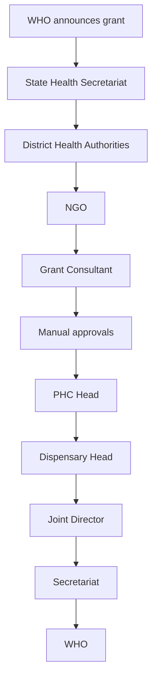
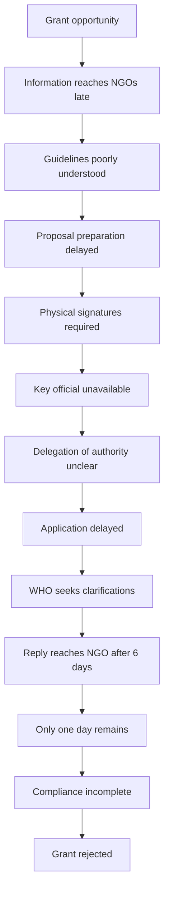
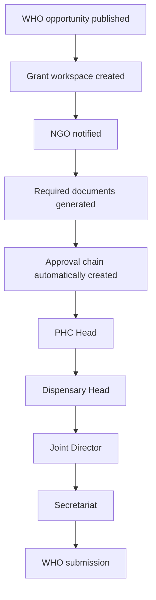
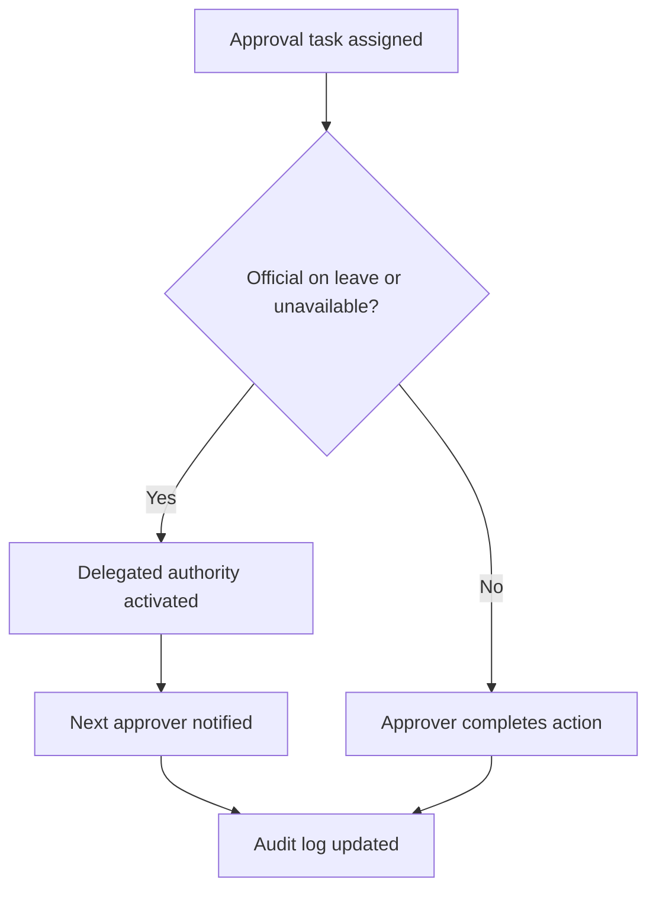
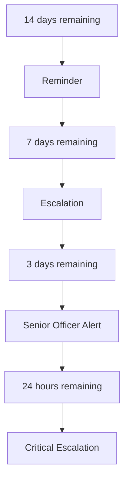
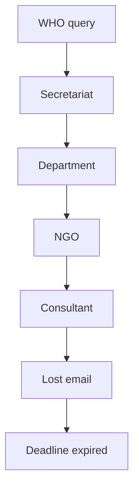
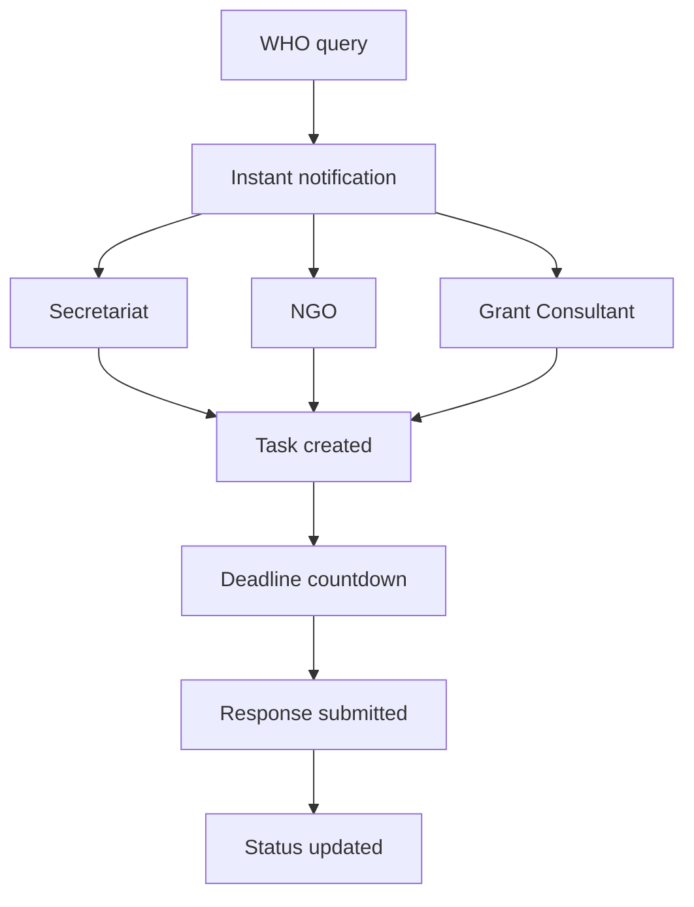
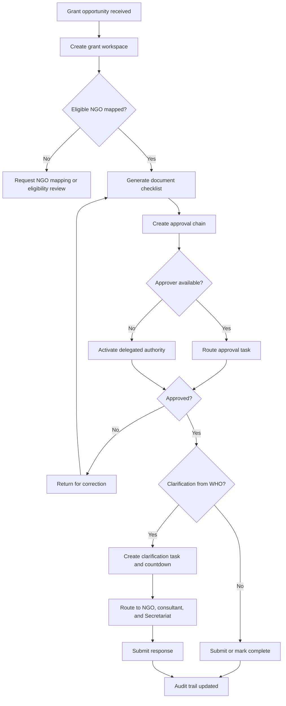

# Multi-Level Grant Application Workflow for NGOs

**Status:** Draft  
**Domain:** Non-Profits / GovTech / Public Health / Development Programs  
**Workflow Owner:** AXXESS TRIaxis Team  
**Document Owner:** AXXESS TRIaxis Team  
**Last Updated:** 2026-08-07  
**Version:** 0.1

## 1. Purpose

This workflow helps small and medium NGOs, government departments, and public-sector intermediaries coordinate complex international grant applications where success depends on timely approvals, clear ownership, deadline discipline, document routing, and auditable communication.

The workflow does not evaluate grant quality. It orchestrates the administrative pathway so a valid proposal is not lost because communication breaks down before the application is evaluated.

## 2. Problem Statement

Small and medium NGOs often fail to access international grants not because of poor program quality, but because grant workflows involve multiple organizations, manual approvals, fragmented communication, and unclear ownership.

In this case, three NGOs attempted to apply for a WHO grant. Although the funding opportunity existed, operational failures prevented successful submission and compliance.

The result was lost funding, delayed community programs, and no identifiable process owner accountable for the failure.

## 3. Current Workflow Without AXXESS

## 4. Communication Breakdown

## 5. Operational Failures

There is no single system that tracks:

- Grant lifecycle
- Pending approvals
- File movement
- Responsible authority
- Delegation of authority
- Response deadlines
- Compliance status
- Escalations

Instead, everyone says:

> "This isn't my responsibility."

while the grant deadline expires.

## 6. AXXESS Intelligent Grant Workflow

## 7. Scope

### In Scope

- Grant opportunity intake
- NGO notification
- Grant workspace creation
- Document checklist generation
- Proposal drafting support
- Approval chain creation
- File movement tracking
- Delegation of authority
- Deadline monitoring
- WHO clarification routing
- Stakeholder communication
- Escalations
- Audit trail

### Out of Scope

- Evaluation of grant quality by AI
- Replacement of WHO or donor eligibility decisions
- Replacement of government authority
- Automatic submission without authorized human approval
- Legal or policy interpretation without designated authority review

## 8. Actors

| Actor | Responsibility | TRIaxis Access Level |
|---|---|---|
| NGO | Prepare proposal and supporting documents | NGO User / Admin |
| Grant Consultant | Draft and revise submission | External Collaborator |
| PHC Head | Technical approval | Approver |
| Dispensary Head | Administrative verification | Approver |
| Joint Director | District approval | Senior Approver |
| Health Secretariat | State-level forwarding | Secretariat User / Admin |
| WHO | Evaluation and grant decision | External Stakeholder |
| TRIaxis Agent | Orchestrates tasks, deadlines, reminders, routing, escalations, and summaries | System |

## 9. Trigger

The workflow begins when a WHO grant opportunity or other international grant opportunity is published, forwarded, imported, or manually entered into AXXESS.

## 10. Preconditions

- Grant opportunity details are captured.
- Participating NGOs are mapped.
- Required approvals are configured.
- PHC Head, Dispensary Head, Joint Director, and Secretariat roles are mapped.
- Delegation rules are configured.
- Submission deadline and clarification deadlines are captured.
- Required documents and compliance checklist are configured.
- Communication channels are configured for notifications and reminders.

## 11. Data Inputs

| Input | Source | Required | Notes |
|---|---|---|---|
| Grant opportunity | WHO / donor portal / Secretariat / manual entry | Yes | Includes title, deadline, eligibility, and submission route |
| Grant guidelines | WHO / donor document | Yes | Used for checklist and document routing |
| NGO profile | NGO record | Yes | Includes eligibility and contact details |
| Proposal draft | NGO / consultant | Yes | Human-authored or human-reviewed |
| Supporting documents | NGO / government department | Yes | Compliance requirements vary by grant |
| Approval chain | Secretariat / district rules | Yes | PHC Head, Dispensary Head, Joint Director, Secretariat |
| Delegation rules | Government policy / admin configuration | Conditional | Used when an authority is unavailable |
| Clarification request | WHO / Secretariat | Conditional | Includes deadline and response requirement |
| Communication records | Email / platform messages / uploads | Yes | Used for audit trail |

## 12. Step-by-Step Flow

| Step | Owner | Action | TRIaxis Capability | Output |
|---:|---|---|---|---|
| 1 | Secretariat / NGO | Captures WHO grant opportunity | Grant intake | Grant workspace created |
| 2 | TRIaxis Agent | Extracts deadline, eligibility, and document requirements | Document parsing / workflow rules | Grant checklist |
| 3 | TRIaxis | Notifies eligible NGOs | Notifications | NGO action task |
| 4 | NGO | Uploads documents and proposal inputs | Document Hub / forms | Draft submission package |
| 5 | Grant Consultant | Drafts or revises proposal | External collaborator workflow | Proposal draft |
| 6 | TRIaxis | Creates approval chain | Workflow orchestration | PHC, Dispensary, Joint Director, Secretariat tasks |
| 7 | PHC Head | Provides technical approval | Human approval | Approved / returned |
| 8 | Dispensary Head | Completes administrative verification | Human approval | Verified / returned |
| 9 | Joint Director | Provides district approval | Human approval | District approval |
| 10 | Secretariat | Forwards to WHO | Human approval / submission record | Submitted package |
| 11 | WHO | Sends clarification if required | External communication | Clarification task |
| 12 | TRIaxis | Routes clarification instantly to NGO, Secretariat, and consultant | Deadline workflow | Response task and countdown |
| 13 | NGO / Consultant | Prepares clarification response | Document workflow | Response draft |
| 14 | Secretariat | Reviews and submits clarification response | Human approval | Response submitted |
| 15 | TRIaxis | Records all file movement, approvals, deadlines, and communications | Audit logs | Complete grant lifecycle history |

## 13. Automatic Task Assignment

Each approver receives:

- Required action
- Deadline
- Pending documents
- Dependency list
- Escalation rule
- Delegation fallback where applicable

## 14. Delegation Engine

No file remains blocked because one person is travelling, unavailable, or away from office.

## 15. Deadline Monitoring

## 16. WHO Clarification Workflow

Without AXXESS:

With AXXESS:

Everyone sees the same deadline.

## 17. Human-in-the-Loop

AXXESS never evaluates grant quality.

It orchestrates:

- Approvals
- Document routing
- Deadline monitoring
- Stakeholder communication
- Audit trails
- Escalation

## 18. Decision Points

## 19. Exceptions

| Exception | Detection Method | Resolution | Owner |
|---|---|---|---|
| Grant opportunity reaches NGO late | Intake timestamp vs published date | Escalate and compress timeline | Secretariat / NGO |
| Guidelines poorly understood | Checklist gaps / clarification flags | Assign consultant review | NGO / Consultant |
| Proposal preparation delayed | Task aging | Escalate to NGO leadership | NGO |
| Physical signature required | Approval dependency | Route to authorized signer or delegation workflow | Secretariat |
| Key official unavailable | Leave or no acknowledgement | Activate delegation engine | TRIaxis |
| Delegation unclear | Missing rule | Escalate to Secretariat | Secretariat |
| WHO clarification delayed in transit | Communication timestamp | Instant platform notification | TRIaxis |
| Clarification deadline near expiry | Countdown threshold | Critical escalation | Secretariat / NGO |
| Compliance incomplete | Checklist validation | Return task with missing items | NGO / Consultant |

## 20. Escalation Paths

| Scenario | Escalate To | SLA | Notes |
|---|---|---|---|
| 14 days remaining | Task owner | Same day | Reminder |
| 7 days remaining | Task owner and supervisor | Same day | Escalation |
| 3 days remaining | Senior officer / NGO leadership | Immediate | Senior alert |
| 24 hours remaining | Secretariat, NGO leadership, consultant | Immediate | Critical escalation |
| Approver unavailable | Delegated authority | Immediate | Log delegation source |
| WHO clarification received | NGO, consultant, Secretariat | Immediate | Shared deadline countdown |

## 21. Data Outputs

| Output | Destination | Format | Audit Requirement |
|---|---|---|---|
| Grant workspace | AXXESS grant module | Structured workspace | Required |
| Grant checklist | NGO / consultant dashboard | Task checklist | Required |
| Approval tasks | Approver queues | Assigned tasks | Required |
| Delegation record | Approval module | Delegated authority event | Required |
| Clarification task | NGO / consultant / Secretariat | Deadline task | Required |
| Submission package | Secretariat / WHO route | Documents and metadata | Required |
| Audit trail | Grant workspace | Chronological record | Required |

## 22. Roles and Permissions

| Capability | NGO | Consultant | PHC Head | Dispensary Head | Joint Director | Secretariat | TRIaxis Agent |
|---|---:|---:|---:|---:|---:|---:|---:|
| Create grant workspace | Yes | Conditional | No | No | No | Yes | Conditional |
| Upload documents | Yes | Yes | No | No | No | Yes | No |
| Draft proposal | Yes | Yes | No | No | No | Conditional | No |
| Approve technical section | No | No | Yes | No | No | Conditional | No |
| Verify administrative section | No | No | No | Yes | No | Conditional | No |
| Approve district forwarding | No | No | No | No | Yes | Yes | No |
| Submit or forward package | No | No | No | No | Conditional | Yes | No |
| Trigger delegation workflow | No | No | No | No | Conditional | Yes | Yes, by rule |
| View audit trail | Yes | Conditional | Conditional | Conditional | Conditional | Yes | No |

## 23. Audit Trail

Every workflow instance should record:

- Grant opportunity source
- Published date
- Intake date
- NGOs notified
- Documents requested
- Documents uploaded
- Proposal draft versions
- Approval chain created
- Approval task owner
- Task timestamps
- Approver decisions
- Delegation events
- WHO clarification timestamp
- Clarification routing timestamp
- Response deadline
- Response submission timestamp
- Escalations
- Final submission status
- Rejection or acceptance outcome where available

## 24. KPIs

### Operational

| KPI | Definition |
|---|---|
| Approval turnaround time | Time taken by each approver |
| Pending file age | Time a file remains at each stage |
| Escalation frequency | Number of reminders/escalations per grant |
| Delegation usage | Number of times delegation avoids blockage |
| Deadline adherence | Percentage of tasks completed before deadline |

### Program

| KPI | Definition |
|---|---|
| Grant submission success rate | Percentage of grant opportunities submitted successfully |
| Clarification response time | Time from WHO clarification to response submission |
| Proposal completion rate | Percentage of proposals completed before deadline |
| Grant conversion rate | Percentage of submissions awarded or advanced |

### Governance

| KPI | Definition |
|---|---|
| Process owner accountability | Percentage of tasks with named owner |
| Audit trail completeness | Percentage of workflows with complete activity history |
| File movement transparency | Percentage of stages with visible status |
| Department bottlenecks | Stages with repeated delays |

## 25. Risks and Controls

| Risk | Impact | Control |
|---|---|---|
| Late grant discovery | Lost preparation time | Opportunity monitoring and instant NGO notification |
| Unclear ownership | Tasks ignored | Named task owners and deadlines |
| Approver unavailable | File stuck | Delegation engine |
| Clarification delayed | Rejection due to late response | Instant routing and countdown |
| Compliance incomplete | Application rejected | Checklist and return-for-correction loop |
| Weak accountability | No one owns failure | Audit trail and process owner map |
| AI overreach | Incorrect substantive judgment | Human-in-the-loop approval and no AI grant evaluation |

## 26. Acceptance Criteria

- WHO or international grant opportunity can be captured.
- Grant workspace is created.
- Eligible NGOs are notified.
- Document checklist is generated.
- Approval chain is automatically created.
- PHC Head, Dispensary Head, Joint Director, and Secretariat approvals are tracked.
- Delegation authority is activated when an approver is unavailable and rules permit it.
- Deadline reminders and escalations are generated at 14 days, 7 days, 3 days, and 24 hours.
- WHO clarification is routed instantly to NGO, consultant, and Secretariat.
- Everyone sees the same clarification deadline.
- Submission and clarification response history are auditable.
- AXXESS does not evaluate grant quality or replace donor/government authority.

## 27. Implementation Notes

Required TRIaxis capabilities:

- Grant workspace
- Task assignment
- Document Hub
- Approval workflows
- Delegation engine
- Deadline monitoring
- Notifications
- Escalations
- External collaborator access
- RBAC
- Audit logs
- Clarification workflow
- Dashboards for NGO, district authority, Secretariat, and program owner

## 28. Enterprise Value Proposition

International grants are frequently lost not because funding is unavailable, but because administrative workflows fail under fragmented communication, manual approvals, and unclear accountability.

AXXESS transforms grant management into a transparent, digitally coordinated process where every stakeholder knows their responsibilities, every deadline is tracked, every approval is visible, and every communication is auditable.

By eliminating coordination failures rather than changing grant criteria, AXXESS helps governments and NGOs improve grant utilization, accelerate approvals, and increase access to development funding.

## 29. One-Line Pitch

> "Grants are rarely lost because communities don't need them - they are often lost because complex administrative workflows break down before the application is ever evaluated."

