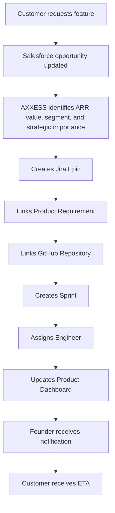
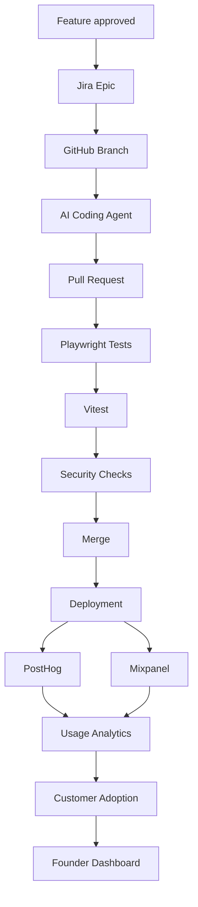
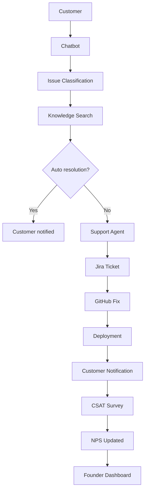
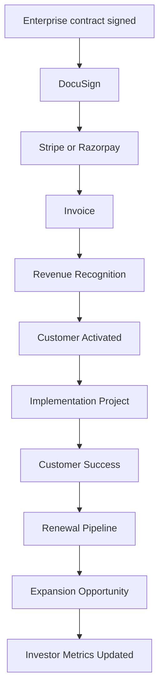
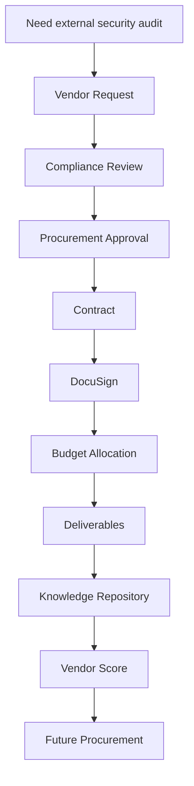
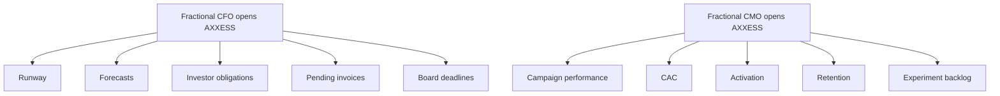

# AI-Native Startup Enterprise Orchestration Workflow

**Status:** Draft  
**Domain:** AI-Native Startups / Venture-Backed Companies / Enterprise Operations  
**Workflow Owner:** AXXESS TRIaxis Team  
**Document Owner:** AXXESS TRIaxis Team  
**Last Updated:** 2026-08-07  
**Version:** 0.1

## 1. Purpose

This workflow positions AXXESS as the Enterprise Intelligence and Orchestration Layer for modern AI-native, venture-backed startups.

The workflow does not replace best-of-breed systems such as GitHub, Jira, Linear, Salesforce, PostHog, Mixpanel, Stripe, Razorpay, DocuSign, or CI/CD tools. Instead, AXXESS connects them, preserves organizational memory, orchestrates AI agents and human teams, tracks cross-functional dependencies, and gives founders and executives a single source of operational truth.

## 2. Problem Statement

Modern startups already use world-class tools.

- GitHub builds software.
- Jira and Linear track work.
- Salesforce manages customers.
- PostHog and Mixpanel explain product usage.
- Stripe and Razorpay collect payments.
- DocuSign executes contracts.
- Playwright and Vitest automate testing.
- CI/CD deploys software.

The problem is not capability.

The problem is fragmentation.

Every system optimizes its own domain while founders are forced to mentally integrate product, engineering, finance, customers, legal, compliance, marketing, investors, and external experts into one coherent picture.

AXXESS becomes the institutional intelligence layer above the stack.

## 3. AI-Native Startup Architecture

```mermaid
flowchart TD
  A[Founders' Office] --> B[AXXESS Intelligence Layer]

  B --> C[Engineering]
  C --> C1[GitHub]
  C --> C2[Jira / Linear]
  C --> C3[Playwright]
  C --> C4[Vitest]
  C --> C5[CI/CD]

  B --> D[Product]
  D --> D1[PostHog]
  D --> D2[Mixpanel]
  D --> D3[Feature Flags]
  D --> D4[Roadmaps]

  B --> E[Sales]
  E --> E1[Salesforce]
  E --> E2[CRM]
  E --> E3[Pipeline]
  E --> E4[Forecasting]

  B --> F[Customer Success]
  F --> F1[AI Agents]
  F --> F2[Chatbots]
  F --> F3[Knowledge Hub]
  F --> F4[Support SLA]

  B --> G[Finance]
  G --> G1[Stripe]
  G --> G2[Razorpay]
  G --> G3[ERP]
  G --> G4[Budget]
  G --> G5[Runway]

  B --> H[Legal and Compliance]
  H --> H1[DocuSign]
  H --> H2[Vendor Contracts]
  H --> H3[Procurement]
  H --> H4[Compliance Repository]
  H --> H5[Policy Library]

  B --> I[Marketing]
  I --> I1[Campaigns]
  I --> I2[Attribution]
  I --> I3[Growth]
  I --> I4[Automation]

  B --> J[Investors]
  J --> J1[Board Reporting]
  J --> J2[KPIs]
  J --> J3[Fundraising]
  J --> J4[Data Room]

  B --> K[HR]
  K --> K1[ESOP / RSU]
  K --> K2[Payroll]
  K --> K3[Performance]
  K --> K4[Onboarding]

  B --> L[External Experts]
  L --> L1[Fractional CFO]
  L --> L2[Fractional CMO]
  L --> L3[Legal Counsel]
  L --> L4[Domain SMEs]
  L --> L5[Auditors / Consultants]
```

## 4. Scope

### In Scope

- Founder dashboard
- Cross-tool context layer
- Customer-to-product workflow
- Automated development lifecycle visibility
- Customer intelligence loop
- Revenue operations workflow
- Procurement workflow
- Investor reporting and data room updates
- Fractional leadership onboarding
- Engineering, product, sales, finance, legal, compliance, HR, marketing, and investor metric synchronization
- Knowledge retention across consultants and external experts
- AI agent orchestration
- Audit trail of cross-functional decisions and handoffs

### Out of Scope

- Replacement of specialized systems
- Autonomous legal, financial, hiring, or deployment decisions without authorized review
- Replacement of founders, executives, or board governance
- Replacement of engineering review, security review, or human product judgment

## 5. Actors

| Actor | Responsibility | TRIaxis Access Level |
|---|---|---|
| Founder / CEO | Reviews company operating truth, priorities, risks, and decisions | Executive Admin |
| CTO / Engineering Lead | Owns engineering velocity, quality, CI/CD, and releases | Engineering Admin |
| Product Lead | Owns roadmap, requirements, feature usage, and prioritization | Product Admin |
| Sales Lead | Owns pipeline, customer requests, forecasts, and revenue signals | Sales Admin |
| Customer Success Lead | Owns support, SLA, adoption, churn, and expansion risk | CS Admin |
| Finance Lead / Fractional CFO | Owns burn, runway, invoices, revenue, budget, and investor obligations | Finance Admin |
| Legal Counsel | Owns contracts, procurement, compliance, and legal review | Legal User |
| Fractional CMO | Owns campaign performance, CAC, activation, retention, and experiments | Marketing Admin |
| Investor / Board Observer | Reviews approved metrics, board reporting, and data room artifacts | Investor Viewer |
| AI Coding Agent | Assists implementation under engineering controls | System / Agent |
| TRIaxis Agent | Synchronizes tools, generates summaries, routes tasks, and detects dependencies | System |

## 6. Daily Product Workflow

## 7. Automated Development Lifecycle

Notice: every tool already exists.

AXXESS connects them.

## 8. Customer Intelligence Loop

## 9. Revenue Operations Workflow

## 10. Procurement Workflow

## 11. AI Founder Dashboard

Every morning, the founder sees a unified operating picture.

| Area | Signals |
|---|---|
| Growth | ARR, MRR, pipeline, forecast, customer segment movement |
| Finance | Burn, runway, cash flow, revenue, burn multiple, budget variance |
| Product | Feature usage, roadmap movement, product priority recommendations |
| Engineering | Deployments, failed builds, feature velocity, AI coding output, GitHub activity, Jira burndown, test coverage, failed pipelines |
| Customers | Churn risk, expansion, enterprise health, support backlog, CSAT, NPS |
| Analytics | PostHog feature usage, Mixpanel behavior, recommendation engine signals |
| Investors | Board pack, monthly KPIs, portfolio update, fundraising status, due diligence folder |
| Legal and Compliance | Contracts, procurement, compliance repository, policy library, vendor obligations |
| HR | ESOP, RSU, payroll, onboarding, performance, hiring readiness |

## 12. Fractional Leadership Workflow

Instead of asking a fractional leader to spend weeks understanding the business, AXXESS gives them governed context immediately.

Knowledge survives consultants.

## 13. Data Inputs

| Input | Source | Required | Notes |
|---|---|---|---|
| Customer requests | Salesforce / CRM / support tools | Yes | Used to connect revenue value to product work |
| Product requirements | Roadmap / PRD / Jira / Linear | Yes | Linked to epics, repos, and releases |
| Engineering activity | GitHub / Jira / Linear / CI/CD | Yes | Branches, PRs, tests, builds, deployments |
| Test results | Playwright / Vitest / CI | Yes | Used for release readiness |
| Product analytics | PostHog / Mixpanel | Yes | Usage, adoption, user behavior |
| Revenue data | Stripe / Razorpay / ERP | Yes | ARR, MRR, invoices, revenue recognition |
| Contract data | DocuSign / legal repository | Conditional | Used for revops and procurement |
| Finance data | ERP / budget / runway model | Yes | Burn, runway, budget, cash flow |
| Support data | AI agents / chatbots / tickets | Yes | SLA, backlog, CSAT, NPS |
| Investor data | KPI model / data room / board pack | Conditional | Used for reporting |
| HR data | Payroll / ESOP / onboarding / performance | Conditional | Used for workforce visibility |
| Expert contributions | Consultants / auditors / SMEs | Conditional | Preserved in Knowledge Hub |

## 14. Data Outputs

| Output | Destination | Format | Audit Requirement |
|---|---|---|---|
| Founder dashboard | Executive view | Unified dashboard | Required |
| Product priority recommendation | Product dashboard | Ranked recommendation | Required |
| Jira / Linear epic | Project management tool | Epic/task | Required |
| GitHub linkage | Engineering workflow | Repo/branch/PR link | Required |
| Customer ETA | CRM / customer success | Message/update | Required |
| Release readiness summary | Engineering dashboard | Test/build/deploy status | Required |
| Customer health update | CS dashboard | Health score / churn risk | Required |
| Revenue metrics | Finance / investor dashboard | ARR/MRR/revenue recognition | Required |
| Board pack | Investor workspace | KPI report | Conditional |
| Procurement record | Legal/compliance workspace | Vendor and contract record | Conditional |
| Knowledge artifact | Knowledge Hub | Summary / document / decision | Required |

## 15. Roles and Permissions

| Capability | Founder | Engineering | Product | Sales | CS | Finance | Legal | Investor | External Expert | TRIaxis Agent |
|---|---:|---:|---:|---:|---:|---:|---:|---:|---:|---:|
| View founder dashboard | Yes | Conditional | Conditional | Conditional | Conditional | Conditional | Conditional | Conditional | No | No |
| Create product epic | Yes | Yes | Yes | Conditional | Conditional | No | No | No | No | Conditional |
| Link GitHub work | Yes | Yes | Conditional | No | No | No | No | No | No | Conditional |
| View customer revenue context | Yes | No | Conditional | Yes | Yes | Conditional | No | No | No | Conditional |
| View finance/runway | Yes | No | No | No | No | Yes | Conditional | Conditional | Conditional | Conditional |
| View contracts | Yes | No | No | Conditional | Conditional | Conditional | Yes | Conditional | Conditional | Conditional |
| Generate board pack | Yes | No | No | No | No | Yes | Conditional | No | Conditional | Conditional |
| View investor workspace | Yes | No | No | No | No | Conditional | Conditional | Yes | No | No |
| Add expert knowledge | Yes | No | Conditional | Conditional | Conditional | Conditional | Conditional | No | Yes | No |
| Trigger cross-functional escalation | Yes | Conditional | Conditional | Conditional | Conditional | Conditional | Conditional | No | No | Yes |

## 16. Audit Trail

Every workflow instance should record:

- Source system
- Trigger event
- Customer, revenue, product, or compliance context
- AI summary generated
- Task or epic created
- GitHub repository or branch linked
- Human owner assigned
- Approval decision
- Test results
- Deployment status
- Customer notification
- Analytics result
- Revenue impact
- Board/investor metric update
- External expert input
- Knowledge artifact created
- Escalation events

## 17. KPIs

| KPI | Definition |
|---|---|
| Feature request to epic time | Time from customer request to tracked product work |
| Feature request to deployment time | Time from approved request to production release |
| Customer revenue-linked prioritization rate | Percentage of roadmap items linked to ARR, segment, or strategic account |
| PR cycle time | Time from branch creation to merge |
| Test pass rate | Playwright, Vitest, and CI success rate |
| Deployment frequency | Number of successful deployments per period |
| Adoption after release | Usage growth after deployment |
| Support-to-fix cycle time | Time from support issue to deployed fix |
| Churn risk resolution time | Time from risk detection to intervention |
| Board pack preparation time | Time required to generate monthly investor report |
| Fractional leader ramp time | Time from onboarding to useful contribution |
| Knowledge retention rate | Percentage of consultant/expert outputs captured in Knowledge Hub |

## 18. Risks and Controls

| Risk | Impact | Control |
|---|---|---|
| AXXESS treated as replacement for core systems | Tool conflict and adoption resistance | Position as orchestration layer above existing stack |
| AI creates work without owner | Unaccountable automation | Human ownership required for tasks and approvals |
| Investor data overexposed | Governance and confidentiality risk | RBAC and investor-specific views |
| AI coding agent merges unsafe code | Product/security risk | PR review, tests, security checks, and human merge controls |
| Finance or legal decisions automated improperly | Business risk | Human approval for finance, legal, compliance, and procurement decisions |
| Fragmented knowledge persists | Founder still acts as integration layer | Knowledge Hub and cross-system context graph |
| External experts lose context | Slow onboarding and repeated discovery | Governed expert dashboards and institutional memory |

## 19. Acceptance Criteria

- AXXESS connects to core systems without replacing them.
- Customer request can be linked to ARR, segment, strategic importance, product requirement, Jira/Linear epic, GitHub work, and customer ETA.
- Development lifecycle can show branch, PR, Playwright, Vitest, security checks, merge, deployment, and analytics.
- Customer support issue can flow from chatbot to support agent to Jira ticket to GitHub fix to deployment to CSAT/NPS update.
- Revenue workflow can connect DocuSign, Stripe/Razorpay, invoice, activation, implementation, renewal, expansion, and investor metrics.
- Procurement workflow can capture vendor request, compliance review, approval, contract, budget, deliverables, Knowledge Hub artifact, and vendor score.
- Founder dashboard shows growth, finance, product, engineering, customers, analytics, investors, legal/compliance, and HR.
- Fractional leaders can access governed role-specific context.
- Investor and board views are permissioned.
- Human approval remains required for material legal, finance, hiring, deployment, and governance actions.

## 20. Implementation Notes

Required TRIaxis capabilities:

- Cross-system integration layer
- Knowledge Hub
- Organizational memory
- AI agent orchestration
- Workflow orchestration
- RBAC
- Audit logs
- Executive dashboard
- Customer intelligence graph
- Product/engineering linkage
- Revenue operations workflow
- Investor reporting workspace
- Procurement workflow
- External expert workspace
- Data room support

## 21. Enterprise Value Proposition

Modern AI-native startups aspire to run lean teams, automate heavily, work with global investors, use distributed expertise, and compose best-of-breed SaaS tools.

Yet as the stack grows, operational fragmentation grows with it.

The differentiation for AXXESS is not another project manager or CRM. It is the operating system for the enterprise itself: the layer that understands context across engineering, product, finance, governance, customers, and investors, and turns disconnected tools into a continuously learning organization.

This is stronger than "AI workflow software."

It positions AXXESS as enterprise orchestration infrastructure for the next generation of AI-native companies.

## 22. One-Line Pitch

> "Modern startups do not need another tool. They need an intelligence layer that connects the tools they already use into one operational truth."

