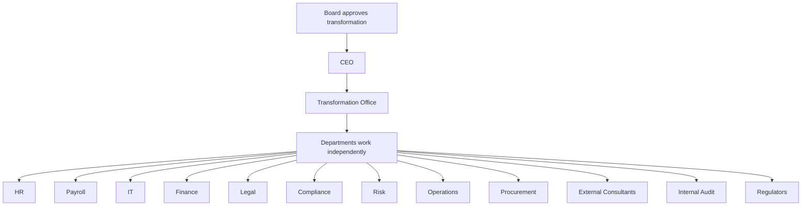
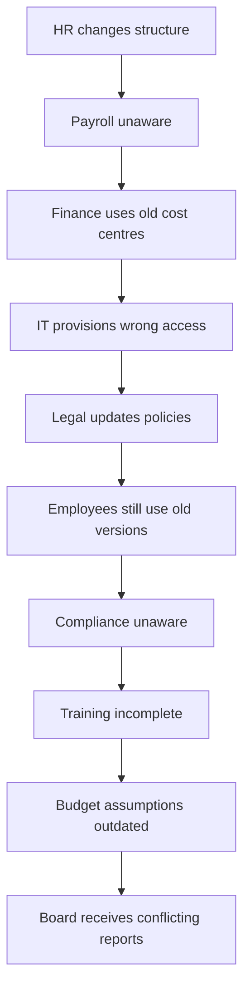
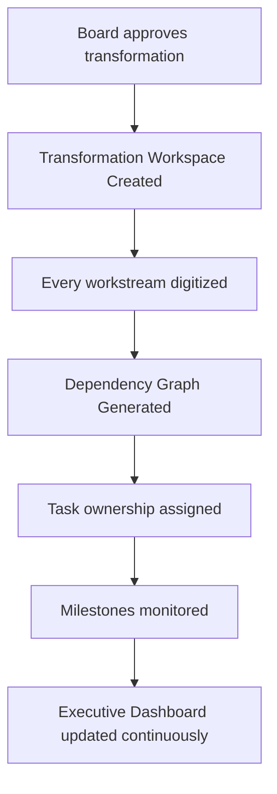
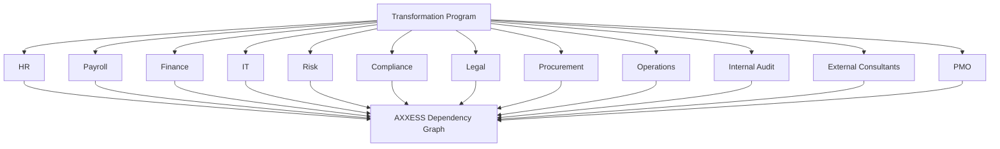
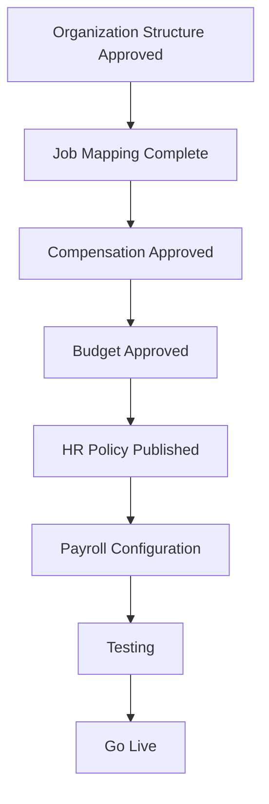
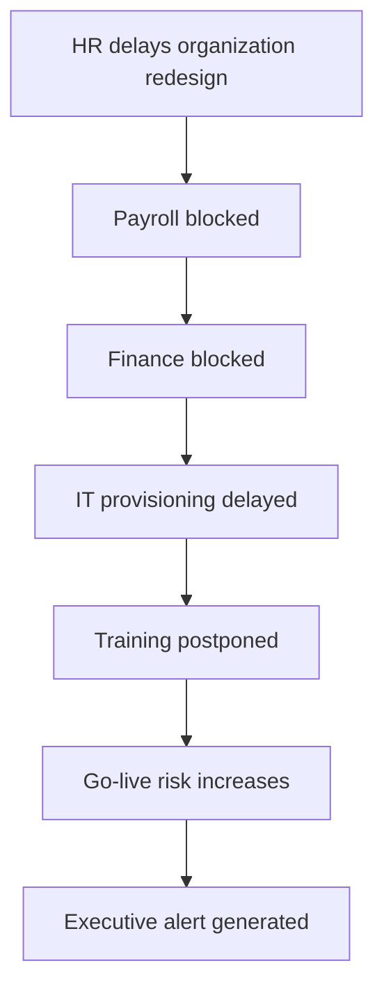
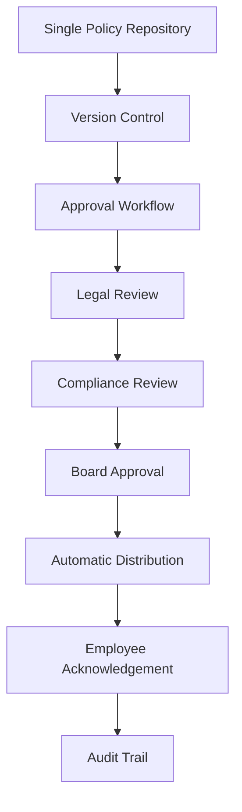
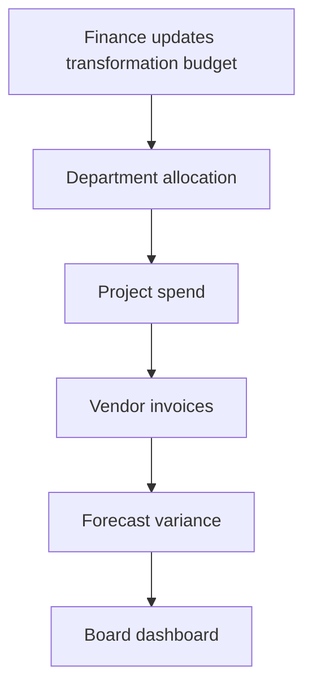

# Enterprise Transformation Management for a DIFC Financial Institution

**Status:** Draft  
**Domain:** Financial Services / DIFC / Enterprise Transformation / Regulated Operations  
**Workflow Owner:** AXXESS TRIaxis Team  
**Document Owner:** AXXESS TRIaxis Team  
**Last Updated:** 2026-08-07  
**Version:** 0.1

## 1. Purpose

This workflow positions AXXESS as the operational intelligence and transformation orchestration layer for a regulated DIFC-based financial institution executing a large-scale enterprise transformation.

The workflow does not replace ERP, HRMS, CRM, payroll, governance, risk, compliance, or project management systems. AXXESS sits above them as the Transformation Operating System, ensuring that every decision, dependency, approval, policy, budget change, vendor action, and employee transition remains synchronized from board approval to business-as-usual.

## 2. Background

A DIFC-based financial services group with operations across the UAE, Saudi Arabia, India, Singapore, and the United Kingdom launches a twelve-month enterprise transformation program.

The transformation includes:

- Organization restructuring
- Payroll migration
- HR policy harmonization
- Software modernization
- Budget restructuring
- Governance redesign
- Risk framework updates
- Process standardization
- Vendor rationalization
- AI implementation
- Regulatory documentation
- Human capital transition

The project involves over 600 employees, 18 departments, 70 vendors, multiple consulting firms, internal audit, legal, compliance, regulators, and board committees.

The transformation itself becomes the organization's biggest operational risk.

## 3. Current Workflow Without AXXESS



## 4. Operational Reality



## 5. Problems

Transformation projects fail because:

- Nobody owns cross-functional execution
- Dependencies remain invisible
- Policy versions diverge
- Communication becomes fragmented
- Vendors operate independently
- Executives lack real-time visibility
- Hundreds of parallel workstreams become impossible to monitor

## 6. AXXESS Enterprise Transformation Engine



## 7. Enterprise Architecture



Each workstream remains independent.

Every dependency remains connected.

## 8. Scope

### In Scope

- Transformation workspace creation
- Workstream digitization
- Dependency graph generation
- Task ownership assignment
- Milestone monitoring
- Executive dashboard
- Payroll migration readiness
- HR policy harmonization
- Organization restructuring dependency tracking
- Budget governance
- Vendor performance
- Software migration status
- Policy version control
- Board and committee approval tracking
- Regulatory documentation
- Internal audit visibility
- Human capital transition tracking
- AI implementation governance
- Risk closure
- Audit trail

### Out of Scope

- Strategic decision-making by AI
- Autonomous layoffs or compensation decisions
- Replacement of ERP, HRMS, payroll, legal, compliance, risk, or project management systems
- Replacement of board committees, regulators, legal counsel, or executive leadership
- Automated regulatory submission without authorized review

## 9. Actors

| Actor | Responsibility | TRIaxis Access Level |
|---|---|---|
| Board / Board Committee | Approves transformation, governance, and key decisions | Board Viewer / Approver |
| CEO | Owns strategic execution and executive oversight | Executive Admin |
| Transformation Office / PMO | Coordinates program execution | Program Admin |
| HR | Organization design, employee transition, role mapping, policy updates | HR Admin |
| Payroll | Payroll migration and readiness | Payroll User |
| Finance | Budget, cost centres, vendor spend, forecast variance | Finance Admin |
| IT | Software migration, access provisioning, systems readiness | IT Admin |
| Legal | Policy review, contracts, regulatory documentation | Legal Admin |
| Compliance | Compliance review, regulatory alignment, policy acknowledgement | Compliance Admin |
| Risk | Risk framework updates and risk closure | Risk Admin |
| Procurement | Vendor rationalization and procurement approvals | Procurement Admin |
| Operations | Process standardization and readiness | Operations Admin |
| Internal Audit | Audit visibility and findings tracking | Audit Viewer |
| External Consultants | Workstream support, deliverables, recommendations | External Collaborator |
| Regulators | Receive approved documentation where applicable | External Stakeholder |
| TRIaxis Agent | Synchronizes dependencies, tracks slippage, generates summaries, and escalates | System |

## 10. Example Dependency

Payroll migration cannot begin until:



If one activity slips, AXXESS automatically recalculates downstream milestones.

## 11. Intelligent Dependency Management



No manual follow-up is required for leaders to understand downstream risk.

## 12. AI-Assisted Executive Intelligence

Executives ask:

> "Why is Payroll delayed?"

AXXESS responds:

```text
Payroll is currently blocked because:

- HR hierarchy approval pending
- Compensation Committee meeting postponed
- Finance cost centre validation incomplete

Estimated delay: 8 business days
Affected departments: 5
Employees impacted: 612
Criticality: High
```

## 13. Policy Governance

Instead of:

```text
Policy_v7_Final.docx
Policy_Final_v8.docx
Policy_Final_v8_REAL.docx
Latest_Final_Approved.docx
```

AXXESS provides:



## 14. Human Capital Management

During restructuring, AXXESS coordinates:

- New reporting structures
- Employee transfers
- Payroll mapping
- Role changes
- Onboarding
- Offboarding
- Access provisioning
- Learning assignments

Every stakeholder works from identical information.

## 15. Budget Governance



Budget visibility remains real-time.

## 16. Executive Dashboard

The CEO can see:

- Transformation progress
- Budget utilization
- Critical risks
- Delayed tasks
- Department readiness
- Vendor performance
- Employee readiness
- Policy compliance
- Software migration status

without requesting twenty PowerPoint presentations.

## 17. Human-in-the-Loop

AXXESS never decides:

- Organizational design
- Restructuring strategy
- Compensation
- Layoffs
- Governance policy

Leadership makes every strategic decision.

AXXESS ensures:

- Communication
- Execution
- Accountability
- Dependency tracking
- Documentation
- Governance
- Auditability

remain synchronized throughout the transformation.

## 18. Data Inputs

| Input | Source | Required | Notes |
|---|---|---|---|
| Board approval | Board records / governance system | Yes | Program trigger |
| Transformation plan | PMO / consultants | Yes | Workstreams, milestones, owners |
| Organization structure | HRMS / HR files | Yes | Role mapping and payroll dependencies |
| Payroll migration plan | Payroll system / vendor | Yes | Payroll readiness |
| Budget | ERP / finance model | Yes | Budget, allocation, variance |
| Cost centres | Finance / ERP | Yes | Payroll and budget dependency |
| Policy documents | Legal / compliance repository | Yes | Version-controlled governance |
| Vendor contracts | Procurement / DocuSign / contract repository | Conditional | Vendor rationalization and performance |
| Risk register | Risk system | Yes | Risk closure and escalation |
| Compliance requirements | Compliance repository / regulator | Yes | Regulatory documentation |
| Software migration plan | IT systems / vendors | Conditional | System modernization |
| Employee transition data | HRMS / HR workstream | Yes | Transfers, onboarding, offboarding, training |
| Audit findings | Internal audit | Conditional | Audit closure |

## 19. Data Outputs

| Output | Destination | Format | Audit Requirement |
|---|---|---|---|
| Transformation workspace | AXXESS transformation module | Structured workspace | Required |
| Dependency graph | Executive / PMO dashboard | Linked dependency map | Required |
| Workstream dashboard | Department dashboards | Status and milestones | Required |
| Executive alert | CEO / PMO / board dashboard | Risk summary | Required |
| Payroll readiness status | Payroll / HR / finance dashboard | Readiness score | Required |
| Policy approval record | Policy repository | Version and approvals | Required |
| Employee acknowledgement | HR / compliance dashboard | Acknowledgement record | Required |
| Budget variance report | Finance / board dashboard | Variance summary | Required |
| Vendor performance score | Procurement dashboard | Scorecard | Conditional |
| Regulatory documentation pack | Compliance / legal workspace | Approved document set | Conditional |
| Audit trail | Transformation workspace | Chronological record | Required |

## 20. Roles and Permissions

| Capability | Board | CEO | PMO | HR | Payroll | Finance | IT | Legal | Compliance | Risk | Procurement | Audit | Consultant | TRIaxis Agent |
|---|---:|---:|---:|---:|---:|---:|---:|---:|---:|---:|---:|---:|---:|---:|
| View executive dashboard | Yes | Yes | Yes | Conditional | Conditional | Conditional | Conditional | Conditional | Conditional | Conditional | Conditional | Conditional | Conditional | No |
| Create transformation workspace | No | Yes | Yes | No | No | No | No | No | No | No | No | No | Conditional | No |
| Update workstream status | No | Conditional | Yes | Yes | Yes | Yes | Yes | Yes | Yes | Yes | Yes | Conditional | Conditional | No |
| Approve policy | Yes | Yes | Conditional | Conditional | No | Conditional | No | Yes | Yes | Conditional | No | No | No | No |
| View employee transition data | Conditional | Yes | Yes | Yes | Conditional | Conditional | Conditional | No | Conditional | No | No | No | No | Conditional |
| View budget | Conditional | Yes | Yes | No | Conditional | Yes | Conditional | No | Conditional | Conditional | Conditional | Conditional | Conditional | Conditional |
| View regulatory documentation | Conditional | Yes | Yes | No | No | Conditional | Conditional | Yes | Yes | Yes | No | Yes | Conditional | Conditional |
| Trigger dependency alert | No | Yes | Yes | Conditional | Conditional | Conditional | Conditional | Conditional | Conditional | Conditional | Conditional | Conditional | Conditional | Yes |
| View audit trail | Yes | Yes | Yes | Conditional | Conditional | Conditional | Conditional | Conditional | Conditional | Conditional | Conditional | Yes | Conditional | No |

## 21. Audit Trail

Every workflow instance should record:

- Board approval
- Transformation workspace creation
- Workstreams created
- Owners assigned
- Dependency graph changes
- Milestone dates
- Delayed tasks
- Downstream impact recalculations
- Executive alerts
- Policy versions
- Legal review
- Compliance review
- Board approval
- Employee distribution and acknowledgement
- Budget updates
- Vendor invoices
- Forecast variance
- Risk updates
- Audit findings
- Regulatory documentation status
- Human capital transition events
- Software migration status
- Final transition to business-as-usual

## 22. KPIs

### Transformation

| KPI | Definition |
|---|---|
| Overall program completion | Percentage of transformation completed |
| Milestone achievement | Percentage of milestones completed on schedule |
| Critical path delay | Delay on critical dependency chain |
| Dependency resolution time | Time to resolve blocking dependency |
| Change adoption rate | Employee/process adoption after change |

### Human Capital

| KPI | Definition |
|---|---|
| Employee transition status | Percentage of employees mapped, transferred, onboarded, or offboarded |
| Training completion | Percentage of required training completed |
| Policy acknowledgement | Percentage of employees acknowledging policies |
| Role mapping accuracy | Accuracy of employee-role-payroll mapping |
| Payroll readiness | Readiness score for payroll migration |

### Governance

| KPI | Definition |
|---|---|
| Board resolution implementation | Percentage of board-approved actions implemented |
| Policy approval cycle | Time from draft to approved policy |
| Regulatory compliance | Status of required regulatory documentation |
| Audit findings | Open, overdue, and closed audit findings |
| Risk closure | Percentage of transformation risks closed |

### Financial

| KPI | Definition |
|---|---|
| Budget variance | Actual vs approved transformation budget |
| Vendor performance | Delivery score by vendor |
| Transformation cost | Total program cost |
| Resource utilization | Internal and external resource usage |
| Forecast accuracy | Accuracy of budget and timeline forecasts |

## 23. Risks and Controls

| Risk | Impact | Control |
|---|---|---|
| Cross-functional owner missing | Workstream stalls | Named owners and PMO dashboard |
| Dependency invisible | Downstream milestones fail | Dependency graph and recalculation |
| Policy versions diverge | Compliance and employee confusion | Single policy repository and version control |
| Payroll migration begins too early | Incorrect salary, mapping, or access | Payroll readiness dependency gate |
| Finance uses old cost centres | Budget and payroll errors | Cost centre validation dependency |
| IT provisions wrong access | Security and operational risk | Role mapping and access provisioning dependency |
| Board receives conflicting reports | Poor governance | Single executive dashboard |
| Vendor operates independently | Delays and budget leakage | Vendor scorecard and deliverable tracking |
| Regulatory documentation incomplete | Compliance exposure | Regulatory documentation pack and approval workflow |
| AI overreach | Unauthorized decisions | Human-in-the-loop for strategy, layoffs, compensation, governance, and regulatory submissions |

## 24. Acceptance Criteria

- Board approval can trigger a transformation workspace.
- Every workstream can be digitized with owner, milestone, budget, and dependency.
- AXXESS generates a dependency graph.
- AXXESS recalculates downstream milestones when a dependency slips.
- Executives can ask why a workstream is delayed and receive source-backed explanation.
- Payroll migration readiness depends on organization structure, job mapping, compensation, budget, HR policy, testing, and go-live gates.
- Policy documents are version controlled.
- Legal, compliance, and board approvals are tracked.
- Employee policy acknowledgement is captured.
- Human capital transition status is visible.
- Budget utilization and forecast variance are visible.
- Vendor performance is tracked.
- Internal audit and risk closure are visible.
- Executive dashboard replaces fragmented manual status collection.
- AXXESS does not make strategic restructuring, compensation, layoff, governance, or regulatory decisions.

## 25. Implementation Notes

Required TRIaxis capabilities:

- Transformation workspace
- Dependency graph
- Workstream dashboards
- Executive dashboard
- Policy repository
- Version control
- Approval workflows
- Employee acknowledgement tracking
- Budget and vendor tracking
- HRMS/payroll/ERP/project management integrations
- Risk and audit tracking
- Regulatory documentation workspace
- External consultant access
- RBAC
- Audit logs
- AI-assisted executive query layer

## 26. Enterprise Value Proposition

Large-scale enterprise transformations rarely fail because executives lack strategy.

They fail because hundreds of interdependent activities across departments, vendors, and governance bodies lose synchronization.

AXXESS becomes the operational intelligence layer that orchestrates enterprise-wide transformation by connecting people, workflows, approvals, policies, budgets, risks, software implementations, and executive oversight into a single, continuously updated execution environment.

Rather than replacing ERP, HRMS, CRM, or project management systems, AXXESS acts as the Transformation Operating System sitting above them, ensuring every decision propagates across the organization in real time while preserving governance, accountability, and regulatory compliance.

This is a compelling DIFC use case because it aligns with the cross-functional transformations common in regulated financial institutions, where governance, auditability, change management, and coordination across business units are as critical as the underlying technology.

## 27. One-Line Pitch

> "Enterprise transformations don't fail because organizations lack vision - they fail because execution fragments across departments. AXXESS becomes the orchestration layer that keeps strategy, governance, people, technology, and execution synchronized from board approval to business-as-usual."

