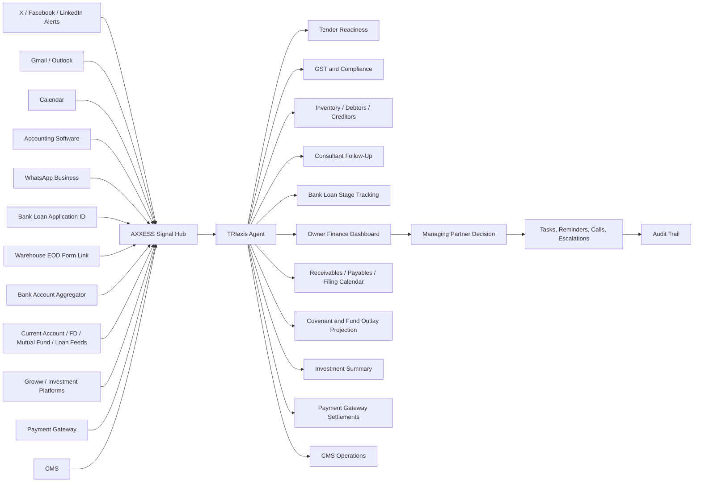
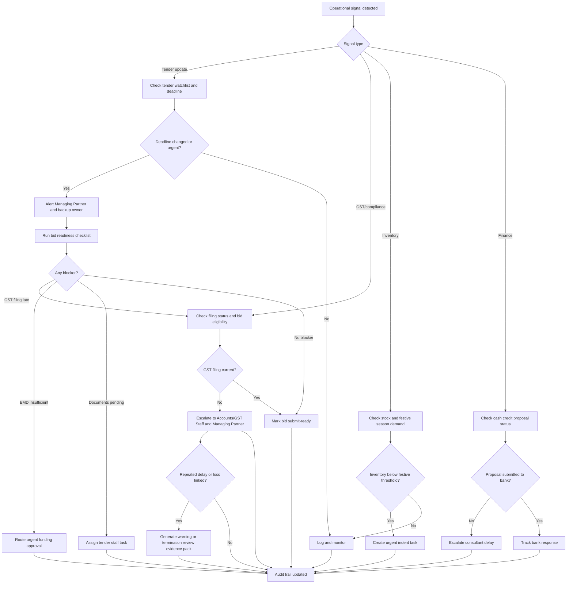
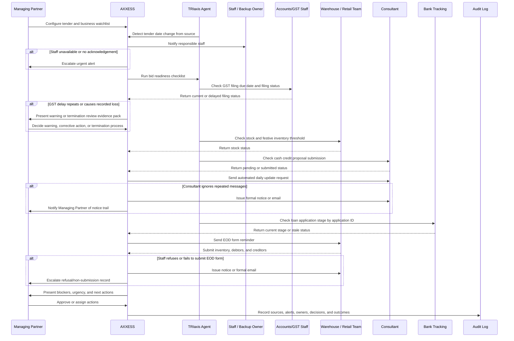
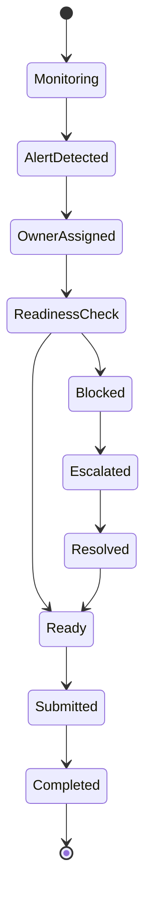

# MSME Tender, Compliance, Inventory, and Finance Command Center Workflow

**Status:** Draft  
**Domain:** MSME / Construction / Government Contracts / Retail Operations  
**Workflow Owner:** Mr. Sudipta Koushik Sarmah, Founder & MD, AXXESS  
**Document Owner:** AXXESS TRIaxis Team  
**Last Updated:** 2026-08-06  
**Version:** 0.1

## 1. Purpose

This workflow enables an MSME owner or managing partner to avoid high-cost operational misses caused by scattered information, staff dependency, weak compliance visibility, offsite inventory gaps, and slow financial coordination.

The workflow is designed for a construction and government contracts MSME that also has related retail inventory exposure. It addresses the lived reality of many Indian MSMEs: the most important business risks often do not appear in one system. They appear across WhatsApp groups, government tender portals, email inboxes, social media notifications, GST filings, warehouse stock, consultants, banks, staff availability, and owner memory.

AXXESS TRIaxis acts as a command center that watches these fragmented channels, extracts urgent signals, checks readiness, routes responsibilities, escalates missed actions, and creates a provable audit trail.

AXXESS helps by integrating the channels that MSME owners already depend on: social media alerts from X, Facebook, and LinkedIn; Gmail and Outlook; Calendar; accounting software; WhatsApp Business; bank loan tracking application IDs; bank account aggregators; current account, FD, mutual fund, and loan balance feeds; investment platforms such as Groww; payment gateways; CMS systems; consultant follow-ups; GST portal/API or authorized GST data integrations; and warehouse EOD reporting forms. The platform turns these channels into reminders, stage updates, agentic AI assistant calls, task nudges, compliance evidence, real-time finance visibility, centralized payments visibility, and compulsory daily operating updates.

## 2. Scenario

An MSME firm is engaged in construction and government contracts. The firm is structured as a partnership with one Managing Partner and one sleeping partner.

The Managing Partner and his team have been preparing for a specialist government tender bid for three months. The firm is technically well qualified, the bid preparation is advanced, and earnest money has been arranged.

However:

- The government prepones the tender date due to administrative reasons.
- The Managing Partner is part of many WhatsApp contractor groups but does not have time to skim hundreds of messages every day.
- The government notification arrives by email, but the staff member who handles email is on leave for marriage.
- The update also goes out on X, Facebook, and LinkedIn, but the Managing Partner is inactive on social media and is in his 50s.
- By the time he learns of the change, the deadline has passed or the earnest money requirement has increased.
- He arranges the additional earnest money but the online bid still will not go through because the last quarter's GST filing is late.
- The GST delay happened because staff neglected the filing.
- Separately, the firm's offsite warehouse gives no daily stock updates.
- Festive season has started and the connected garments retail shop is low on inventory.
- By the time indenting happens and stock arrives, the highest sales volume period will have passed.
- The Managing Partner also checks with the bank about a cash credit proposal and learns that the bank has not received it.
- The consultant entrusted with the application says he was not aware of the urgency and was waiting to submit applications in bulk.

The business loses opportunity not because the owner lacks capability, but because operational signals are late, unprioritized, or trapped with people who are unavailable.

## 3. Scope

### In Scope

- Tender notification monitoring
- WhatsApp contractor group signal extraction
- Email monitoring and staff leave backup
- Government portal and public notification tracking
- Social media alert monitoring for official tender updates
- Earnest money readiness tracking
- GST filing status and compliance readiness check
- GST portal/API or authorized GST data integration for filing due dates, filing status, and compliance evidence
- Repeated GST delay accountability workflow, including warning or termination notice support where delay causes losses
- Bid submission readiness checklist
- Warehouse stock visibility
- Festive season inventory risk alerts
- Cash credit proposal tracking
- Real-time current account, FD, mutual fund, and loan balance visibility through bank account aggregator integrations
- Investment summaries from platforms such as Groww
- Centralized payment gateway visibility
- CMS integration for business content, product, service, or customer-facing workflows
- EMI and cash credit interest servicing reminders
- Projected fund outlay requirements for bank covenants and payables
- Receivables tracking
- Payables tracking
- Tax filing and regulatory filing tracking
- Loan balance visibility
- Consultant task monitoring
- Automated daily consultant update requests
- Bank loan tracking by application ID
- Agentic AI assistant customer service reminder calls
- Gmail, Outlook, Calendar, accounting software, WhatsApp Business, and social media alert integration
- EOD inventory, debtor, and creditor update forms for offsite staff
- Notice and email issuance when consultants, staff, or responsible parties repeatedly ignore required updates
- Escalation to Managing Partner and responsible staff
- Audit trail of alerts, actions, delays, and owner decisions

### Out of Scope

- Legal interpretation of tender conditions without human review
- Automated submission of government bids without authorized approval
- Replacement of chartered accountant, consultant, or banking relationship manager
- Financial advice or credit approval decisions
- Inventory purchasing without owner or delegated approval

## 4. Actors

| Actor | Role in Workflow | TRIaxis Access Level |
|---|---|---|
| Managing Partner | Owns business decisions, bid readiness, escalation, and approvals | Owner / Admin |
| Sleeping Partner | Receives visibility into major risks and decisions where configured | Partner Viewer |
| Tender Staff | Tracks bid documents, EMD, portal deadlines, and submissions | Operations User |
| Email Handling Staff | Monitors official email and routes tender notifications | Operations User |
| Accounts / GST Staff | Manages GST filing and compliance status | Finance User |
| Warehouse Staff | Updates offsite stock and dispatch status | Inventory User |
| Retail Shop Manager | Reports festive season inventory needs | Retail User |
| Consultant | Prepares and submits cash credit proposal or tender-related documentation | External Collaborator |
| Bank Relationship Manager | Receives cash credit proposal and responds to query | External Stakeholder |
| TRIaxis Agent | Monitors signals, summarizes urgency, checks readiness, routes tasks, and escalates misses | System |

## 5. Trigger

The workflow may start from any high-risk operational signal:

- Tender date change
- Government notification
- WhatsApp group message mentioning deadline, corrigendum, EMD, preponed date, or bid portal
- Email from department, tender portal, consultant, bank, or government office
- Social media post from official government handle
- GST filing delay
- Bid readiness checklist failure
- Low warehouse inventory before festive season
- Cash credit proposal not submitted
- Staff absence affecting critical workflow ownership

## 6. Preconditions

- MSME tenant is configured in AXXESS TRIaxis.
- Managing Partner and team roles are mapped.
- Tender watchlist is configured with department names, project names, tender IDs, keywords, and deadlines.
- Official email inbox or forwarding rule is connected.
- WhatsApp group ingestion or approved message-forwarding mechanism is configured.
- Government tender portal sources are configured where available.
- GST compliance dates and filing status source are connected or manually updated.
- GST portal/API access, GSP integration, accounting software GST data, or other authorized GST status source is configured.
- Staff responsibility for GST filing is assigned with due dates, acknowledgement rules, and escalation thresholds.
- Warehouse stock update process is configured.
- Consultant tasks and bank proposal milestones are tracked as projects or external tasks.
- Bank loan application ID is captured for stage tracking.
- Bank account aggregator consent and account connections are configured where available.
- Current account, FD, mutual fund, loan, EMI, and cash credit data feeds are connected or manually reconciled.
- Bank covenant requirements, EMI schedules, cash credit interest servicing dates, receivables, payables, and filing calendars are configured.
- Investment platform connections or manual portfolio summaries are configured where required.
- Payment gateway sources are configured for centralized collection and settlement visibility.
- CMS integration is configured where the MSME uses a CMS for product, service, website, or customer-facing content operations.
- EOD reporting forms are configured for offsite warehouse staff.
- Reminder rules are configured for due dates, consultant updates, inventory updates, debtor updates, creditor updates, and critical deadlines.

## 7. Data Inputs

| Input | Source | Required | Notes |
|---|---|---|---|
| Tender ID / project name | Tender team / government portal | Yes | Used for watchlist and matching |
| Tender deadline | Tender portal / notification | Yes | Includes original and revised dates |
| Earnest money requirement | Tender document / corrigendum | Yes | Used for bid readiness |
| WhatsApp contractor group messages | Approved ingestion / forwarded messages | Conditional | Extracts relevant alerts from high-volume groups |
| Official email | Connected inbox / forwarding | Yes | Staff leave backup required |
| Social media notification | Official government handles | Conditional | X, Facebook, LinkedIn |
| Gmail and Outlook messages | Connected inboxes / forwarding rules | Yes | Used for tender, bank, consultant, and compliance alerts |
| Calendar events | Connected Calendar | Conditional | Used for tender due dates, GST dates, consultant deadlines, bank follow-up dates |
| Accounting software data | Accounting integration / export | Conditional | GST, debtors, creditors, dues, and cash flow readiness |
| WhatsApp Business messages | WhatsApp Business integration | Conditional | Used for operational reminders and customer/service follow-up calls |
| Staff leave calendar | HR / manual update | Conditional | Used for backup routing |
| GST filing status | GST portal/API, GSP, accounting software, GST system, or manual entry | Yes | Critical bid eligibility check |
| GST filing due dates | GST portal/API, Calendar, accounting software, or compliance configuration | Yes | Used for reminders and escalation |
| GST delay history | Compliance workflow / audit logs | Conditional | Used for repeated negligence review |
| Warehouse stock | Warehouse staff / inventory sheet / integration | Conditional | Daily stock visibility |
| EOD warehouse form | AXXESS form link | Yes for offsite warehouse process | Staff must update inventory, debtors, and creditors before leaving site |
| Retail inventory requirement | Shop manager / sales forecast | Conditional | Festive season risk |
| Cash credit proposal status | Consultant task / bank confirmation | Conditional | Tracks submission and urgency |
| Bank loan application ID | Bank / consultant / owner entry | Conditional | Used to retrieve or record stage updates |
| Bank account aggregator feed | Account aggregator / bank integration | Conditional | Current account, FD, mutual fund, and loan balance visibility |
| Current account balance | Bank account feed | Conditional | Used for liquidity and payable planning |
| FD balance | Bank account feed | Conditional | Used for available collateral or liquidity view |
| Mutual fund balance | Account aggregator / investment feed | Conditional | Used for overall fund availability view |
| Investment platform summary | Groww or similar investment platform / manual upload | Conditional | Summarizes mutual funds, securities, and other available investment balances |
| Payment gateway data | Payment gateway integration | Conditional | Centralizes payment collections, settlements, failures, and refunds |
| CMS records | CMS integration | Conditional | Product, service, content, campaign, or customer-facing updates where applicable |
| Loan balances | Bank account feed / loan tracking | Conditional | Shows outstanding liability position |
| EMI schedule and payment status | Bank feed / accounting software / manual entry | Conditional | Used to detect missed EMI |
| Cash credit interest servicing status | Bank feed / accounting software / manual entry | Conditional | Used to detect missed servicing |
| Receivables | Accounting software / EOD form / invoice system | Conditional | Used for cash flow projection |
| Payables | Accounting software / EOD form / vendor records | Conditional | Used for fund outlay projection |
| Bank covenant requirements | Loan sanction terms / bank documents | Conditional | Used to forecast compliance and fund requirements |
| Tax and regulatory filing calendar | Accounting software / compliance configuration | Conditional | Tracks GST, tax, and regulatory filings |

## 8. Step-by-Step Flow

| Step | Owner | Action | TRIaxis Capability | Output |
|---:|---|---|---|---|
| 1 | Managing Partner / Tender Staff | Creates tender watchlist and bid readiness plan | Projects / CRM / workflow setup | Tender command center created |
| 2 | TRIaxis Agent | Monitors email, forwarded WhatsApp messages, official sources, and configured alerts | Integrations / RAG / signal extraction | Relevant update detected |
| 3 | TRIaxis Agent | Flags tender date as preponed and compares against readiness plan | Workflow rules / deadline tracking | Urgent deadline alert |
| 4 | TRIaxis | Checks staff ownership and leave status | Role routing / staff calendar | Backup owner assigned if staff absent |
| 5 | TRIaxis Agent | Runs bid readiness check | Checklist / compliance / documents | Readiness score and blockers |
| 6 | TRIaxis | Checks GST filing due date and filing status through configured GST integration or authorized source | GST portal/API / GSP / accounting integration / compliance workflow | GST status, due date, and delay evidence |
| 7 | Accounts / GST Staff | Updates or resolves GST filing status | Compliance task | GST blocker cleared or escalated |
| 8 | TRIaxis | Detects repeated GST delay or loss-linked compliance negligence | Compliance rules / audit trail | Warning or termination review event |
| 9 | Managing Partner | Reviews GST delay history and decides warning, corrective action, or termination process | Human approval / notice workflow | Decision logged |
| 10 | Managing Partner | Approves urgent EMD or bid action | Human approval | Decision logged |
| 11 | TRIaxis | Tracks online bid readiness | Tender workflow | Submit-ready or blocked status |
| 12 | Warehouse Staff / Retail Manager | Updates stock and festive season inventory requirement | Inventory workflow | Low stock alert |
| 13 | TRIaxis Agent | Flags stock-out risk and recommends indent timing | Analytics / workflow rules | Inventory action task |
| 14 | Consultant | Updates cash credit proposal status | External task tracking | Submitted, pending, or blocked status |
| 15 | TRIaxis | Escalates unsubmitted proposal when urgency is missed | Notifications / escalation | Managing Partner alert |
| 16 | TRIaxis Agent | Sends automated daily update request to consultant until project status is updated | WhatsApp Business / email / task reminders | Consultant update trail |
| 17 | TRIaxis | Tracks bank loan application ID and shows stage updates | Bank workflow / finance tracking | Current loan stage visible |
| 18 | TRIaxis | Pulls current account, FD, mutual fund, and loan balances from account aggregator or connected sources | Account aggregator / finance cockpit | Real-time fund position |
| 19 | TRIaxis | Summarizes investments from Groww or similar platforms where connected or uploaded | Investment integration / finance cockpit | Investment balance summary |
| 20 | TRIaxis | Centralizes payment gateway collections, settlements, failures, and refunds | Payment gateway integration | Payment position |
| 21 | TRIaxis | Syncs CMS records where relevant to business operations | CMS integration | Content, product, service, or campaign status |
| 22 | TRIaxis Agent | Projects fund outlay required for payables, EMI, cash credit interest, tender EMD, GST, tax, regulatory filings, and bank covenants | Cash flow projection / analytics | Fund requirement forecast |
| 23 | TRIaxis | Tracks receivables and payables | Accounting integration / EOD forms / payment gateway | Collection and payment status |
| 24 | TRIaxis | Sends reminders if EMI is missed or cash credit interest is not serviced | Bank feed / reminders / escalation | Servicing alert |
| 25 | TRIaxis | Tracks tax filings and regulatory filings | Compliance calendar / accounting integration | Filing status and due date alerts |
| 26 | TRIaxis Agent | Places agentic AI assistant reminder calls for overdue customer service, consultant, finance, or operational follow-ups where configured | Agentic AI assistant calls | Call log and response status |
| 27 | Warehouse Staff | Completes compulsory EOD form before leaving offsite warehouse | Form link / reminders / inventory workflow | Inventory, debtors, creditors updated |
| 28 | TRIaxis | Detects repeated ignored messages, refusal, GST delay, missed servicing, or non-submission | Escalation rules / audit logs | Non-compliance event |
| 29 | TRIaxis | Issues notice or formal email to responsible party after configured threshold | Notice workflow / email / WhatsApp Business | Documented notice trail |
| 30 | TRIaxis | Records all signals, decisions, delays, reminders, calls, forms, notices, and task ownership | Audit logs | Complete operational history |

## 9. Integration Architecture

## 10. Decision Points

## 11. Exceptions

| Exception | Detection Method | Resolution | Owner |
|---|---|---|---|
| Staff handling email is on leave | Leave calendar / no acknowledgement | Route notification to backup owner and Managing Partner | TRIaxis |
| WhatsApp volume hides relevant update | Keyword and source monitoring | Extract and summarize only relevant tender messages | TRIaxis Agent |
| Tender date is preponed | Deadline comparison | Escalate urgent action and re-run readiness checklist | Tender Staff |
| EMD requirement increases | Corrigendum extraction | Route funding approval to Managing Partner | TRIaxis Agent |
| GST filing is late | GST portal/API, GSP, accounting integration, or compliance status check | Escalate immediately because it may block tender submission | Accounts/GST Staff |
| GST filing delay repeats | Delay history crosses configured threshold | Generate warning notice or termination review file for Managing Partner | Managing Partner |
| GST delay causes business loss | Tender blocked, penalty, missed deadline, or recorded financial impact | Link loss event to filing delay evidence and responsible owner | Managing Partner / Accounts |
| Online bid portal rejects submission | Submission readiness check / user report | Identify blocker and assign resolution | Tender Staff |
| Warehouse does not provide daily update | Missing update rule | Escalate stock update task | Warehouse Staff |
| Festive stock threshold breached | Inventory threshold | Create indent and owner approval task | Retail Manager |
| Consultant delays proposal submission | Task overdue / bank non-receipt | Escalate consultant and notify Managing Partner | Consultant |
| Consultant does not provide daily update | No response to automated reminder | Repeat reminder and escalate after configured threshold | TRIaxis / Managing Partner |
| Consultant ignores repeated notices | No response after configured number of reminders | Issue formal notice by email and log for record | Managing Partner / TRIaxis |
| Bank loan stage is unknown | Missing application ID or stale status | Request application ID or call bank workflow owner | Finance User |
| Account aggregator feed unavailable | Consent expired / integration error | Alert Finance User and fall back to last verified balance | Finance User |
| Investment platform summary unavailable | Groww or similar platform sync unavailable | Use last verified summary and request refresh | Finance User |
| Payment gateway settlement mismatch | Gateway data differs from accounting records | Reconcile collections, settlements, refunds, and failures | Accounts |
| CMS update impacts business operations | Product, service, campaign, or content update is stale | Notify responsible CMS owner and log update status | Operations User |
| EMI missed | Bank feed, accounting record, or payment schedule mismatch | Alert Managing Partner and Finance User immediately | Finance User |
| Cash credit interest not serviced | Bank feed or servicing schedule check | Alert Managing Partner and Finance User immediately | Finance User |
| Covenant funding gap projected | Forecast shows insufficient funds for covenant or payable | Escalate projected outlay and recommended funding window | Managing Partner |
| Receivable overdue | Invoice aging crosses threshold | Trigger debtor follow-up and owner visibility | Accounts |
| Payable due without funds | Payable schedule and balance forecast mismatch | Escalate fund planning requirement | Finance User |
| Tax or regulatory filing due | Filing calendar threshold reached | Send reminders and escalate missed filing | Accounts/GST Staff |
| Warehouse staff leaves without EOD update | Form not submitted before cutoff | Send reminder, block closeout, escalate to Managing Partner | Warehouse Staff |
| Staff refuses to fill stock details | Explicit refusal or repeated non-submission | Issue notice/email and record refusal in audit trail | Managing Partner / Retail Manager |
| Debtors or creditors not updated | EOD form incomplete | Require completion before site closeout | Warehouse Staff / Accounts |

## 12. Escalation Paths

| Scenario | Escalate To | SLA | Notes |
|---|---|---|---|
| Tender deadline preponed | Managing Partner and Tender Staff backup | Immediate | High-priority alert |
| EMD shortfall | Managing Partner | Immediate | Include amount, due date, and source |
| GST filing late before bid | Accounts/GST Staff and Managing Partner | Same day | Bid blocker |
| Repeated GST filing delay | Managing Partner | Same day | Warning or termination notice package may be generated |
| GST delay causes loss | Managing Partner and Partner Viewer if configured | Immediate | Preserve GST status, reminder history, staff acknowledgements, and loss linkage |
| Email owner absent | Backup Operations User | Immediate | Staff leave should not block critical alerts |
| Inventory below festive threshold | Retail Manager and Managing Partner | Same day | Sales season risk |
| Cash credit proposal not submitted | Consultant and Managing Partner | Same day | Include bank response evidence |
| Bank loan application stage changes | Managing Partner / Finance User | Same day | Show application ID and current stage |
| EMI missed or likely to be missed | Managing Partner and Finance User | Immediate | Include account, amount, due date, and available balance |
| Cash credit interest not serviced | Managing Partner and Finance User | Immediate | Include servicing date and outstanding amount |
| Bank covenant risk projected | Managing Partner and Partner Viewer if configured | Same day | Include projected fund outlay requirement |
| Receivable overdue | Accounts and Managing Partner | Configurable | Trigger customer follow-up workflow |
| Payable due and fund gap projected | Managing Partner and Finance User | Configurable | Supports payment planning |
| Tax or regulatory filing overdue | Accounts/GST Staff and Managing Partner | Same day | Formal reminder and audit trail |
| Payment gateway settlement mismatch | Accounts and Managing Partner | Same day | Reconcile gateway, bank, and accounting data |
| Consultant misses daily update | Consultant, then Managing Partner | Configurable | Automated daily message continues until updated |
| Consultant ignores multiple reminders | Managing Partner | Configurable | Formal notice or email is generated and logged |
| EOD warehouse form incomplete | Warehouse Staff, Retail Manager, Managing Partner | Before site closeout | Inventory, debtors, and creditors are mandatory |
| Staff refuses EOD stock/debtor/creditor update | Retail Manager and Managing Partner | Same day | Notice or email is generated and logged |
| No acknowledgement of critical task | Managing Partner | Configurable, recommended 2-4 hours | Escalate until accepted |

## 13. Data Outputs

| Output | Destination | Format | Audit Requirement |
|---|---|---|---|
| Tender deadline alert | Managing Partner dashboard / notification | Urgent alert | Required |
| Bid readiness checklist | Tender command center | Structured checklist | Required |
| GST blocker alert | Compliance workflow | Blocker status | Required |
| GST filing evidence | Compliance workflow / audit trail | Due date, filing status, reminders, acknowledgements | Required |
| GST delay warning notice | Notice workflow / email | Draft or issued notice with evidence references | Conditional |
| GST termination review file | Owner dashboard / HR or operations record | Delay history, losses, reminders, staff response | Conditional |
| EMD readiness status | Tender workflow | Amount and status | Required |
| Staff backup assignment | Task module | Owner update | Required |
| Inventory low-stock alert | Inventory dashboard / notification | Alert and indent task | Required |
| Cash credit proposal status | Finance workflow | Submitted / pending / blocked | Required |
| Consultant escalation | Task and communication log | Escalation record | Required |
| Daily consultant update request | WhatsApp Business / email / task log | Automated message and response | Required |
| Formal consultant notice | Email / notice workflow | Notice text, delivery timestamp, acknowledgement status | Required |
| Bank loan stage update | Finance dashboard | Application ID and stage | Required |
| Real-time financial position | Owner finance dashboard | Current account, FD, mutual fund, loan balances | Conditional |
| Investment summary | Owner finance dashboard | Groww or similar platform summary | Conditional |
| Payment gateway summary | Finance dashboard | Collections, settlements, failures, refunds | Conditional |
| CMS sync status | Operations dashboard | Content, product, service, or campaign record status | Conditional |
| EMI missed alert | Finance workflow / notification | Amount, date, account, status | Required if triggered |
| Cash credit interest servicing alert | Finance workflow / notification | Due date, outstanding amount, status | Required if triggered |
| Fund outlay projection | Finance dashboard | Payables, EMI, CC interest, covenants, filings, EMD | Conditional |
| Receivables aging | Finance dashboard | Debtor, amount, due date, aging bucket | Conditional |
| Payables schedule | Finance dashboard | Creditor, amount, due date, fund gap | Conditional |
| Tax and regulatory filing status | Compliance dashboard | Due date, filed status, delay | Conditional |
| Loan balance summary | Finance dashboard | Loan type, outstanding balance, due amount | Conditional |
| Agentic AI assistant call log | Customer service / operations log | Call attempt, response, summary | Required |
| EOD warehouse submission | Inventory and finance workflow | Inventory, debtors, creditors | Required |
| Staff refusal notice | Email / notice workflow / HR or operations record | Notice text and refusal history | Required |
| Operational audit timeline | Owner dashboard | Chronological history | Required |

## 14. Roles and Permissions

| Capability | Managing Partner | Sleeping Partner | Tender Staff | Accounts/GST Staff | Warehouse Staff | Retail Manager | Consultant | TRIaxis Agent |
|---|---:|---:|---:|---:|---:|---:|---:|---:|
| Configure tender watchlist | Yes | No | Yes | No | No | No | No | No |
| View critical alerts | Yes | Conditional | Yes | Conditional | Conditional | Conditional | Conditional | No |
| Approve EMD action | Yes | Conditional | No | No | No | No | No | No |
| Update bid documents | Yes | No | Yes | No | No | No | Conditional | No |
| Update GST status | Yes | No | No | Yes | No | No | Conditional | No |
| Review GST delay warning or termination record | Yes | Conditional | No | Conditional | No | No | No | Conditional |
| Update warehouse stock | Yes | No | No | No | Yes | Conditional | No | No |
| Create inventory indent | Yes | No | No | No | Conditional | Yes | No | Conditional |
| Update cash credit proposal | Yes | No | No | Conditional | No | No | Yes | No |
| View bank loan stage | Yes | Conditional | No | Yes | No | No | Conditional | Conditional |
| View current account / FD / mutual fund / loan balances | Yes | Conditional | No | Yes | No | No | No | Conditional |
| View investment summaries | Yes | Conditional | No | Yes | No | No | No | Conditional |
| View payment gateway summary | Yes | Conditional | Conditional | Yes | No | Conditional | No | Conditional |
| View receivables and payables | Yes | Conditional | No | Yes | Conditional | Conditional | No | Conditional |
| Configure covenant and fund outlay projections | Yes | Conditional | No | Yes | No | No | No | Conditional |
| View tax and regulatory filing calendar | Yes | Conditional | No | Yes | No | No | Conditional | Conditional |
| View CMS sync status | Yes | Conditional | Conditional | No | No | Conditional | Conditional | Conditional |
| Submit EOD inventory/debtors/creditors form | Yes | No | No | Conditional | Yes | Yes | No | No |
| Send automated consultant reminders | Yes | No | Conditional | No | No | No | Conditional | Yes |
| Issue formal notice/email | Yes | Conditional | Conditional | Conditional | Conditional | Conditional | Conditional | Yes, after rule trigger |
| Place configured reminder calls | Yes | No | Conditional | Conditional | No | Conditional | No | Yes |
| Escalate overdue action | Yes | No | Conditional | Conditional | Conditional | Conditional | Conditional | Yes |
| View audit trail | Yes | Conditional | Conditional | Conditional | Conditional | Conditional | Conditional | No |

## 15. Audit Trail

Every workflow instance should record:

- Tender watchlist creation
- Original tender deadline
- Revised tender deadline
- Source of revised notification
- Time notification was received or detected
- Staff owner assigned to the notification
- Staff leave or non-acknowledgement status
- WhatsApp, email, portal, or social source reference
- Bid readiness checklist result
- EMD amount and readiness status
- GST filing status at time of bid readiness check
- GST filing due date and actual filing date
- GST portal/API, GSP, accounting software, or authorized source response
- GST reminder history
- Accounts/GST Staff acknowledgement or non-acknowledgement
- Repeated GST delay count
- GST delay linkage to blocked bid, penalty, missed opportunity, or financial loss where recorded
- Warning or termination notice draft/issue history
- Blockers identified
- Tasks assigned and accepted
- Escalations sent
- Warehouse stock update status
- Festive inventory threshold alert
- Cash credit proposal status
- Bank loan application ID and stage updates
- Bank account aggregator consent and sync status
- Current account, FD, mutual fund, and loan balance snapshots
- Investment platform summaries, including Groww-style summaries where connected
- Payment gateway collections, settlements, failures, and refunds
- CMS sync status for connected business records
- EMI due dates, payment status, and missed payment alerts
- Cash credit interest servicing due dates and missed servicing alerts
- Receivables aging and debtor follow-up actions
- Payables schedule and projected funding gaps
- Bank covenant requirements and projected fund outlay
- Tax filing and regulatory filing due dates, reminders, and status
- Consultant communication and bank confirmation
- Automated daily consultant reminders
- Notices or formal emails issued for repeated consultant non-response
- Agentic AI assistant reminder call attempts and outcomes
- EOD warehouse form submissions
- Staff refusal or repeated non-submission notices
- Inventory, debtor, and creditor updates
- Owner decisions and approvals
- Final outcome

## 16. KPI Framework

| KPI | Definition | Measurement Source |
|---|---|---|
| Critical alert detection time | Time from external signal to AXXESS alert | Source and alert timestamps |
| Tender readiness score | Percentage of checklist items complete before deadline | Bid readiness checklist |
| Missed deadline rate | Number of deadline misses across tenders | Tender workflow history |
| Compliance blocker rate | Percentage of bids blocked by GST or other compliance gaps | Compliance logs |
| GST on-time filing rate | Percentage of GST filings completed before due date | GST integration / compliance logs |
| Repeated GST delay count | Number of repeated late filing events by responsible owner or period | Compliance audit logs |
| Loss-linked compliance incidents | Number of business loss events linked to compliance delay | Tender and compliance workflow |
| Staff dependency risk | Number of critical tasks blocked by absent or non-responsive staff | Task ownership logs |
| Inventory stock-out risk events | Number of low-stock alerts during festive window | Inventory dashboard |
| Cash credit submission delay | Time from owner instruction to bank receipt | Consultant task logs |
| Escalation acknowledgement time | Time from critical alert to owner or backup acknowledgement | Notification logs |
| Consultant update compliance | Percentage of days with consultant status update received | Consultant task logs |
| Bank loan visibility rate | Percentage of tracked loan proposals with current stage available | Finance workflow |
| Real-time balance availability | Percentage of configured accounts with current balance available | Account aggregator sync logs |
| Investment summary freshness | Time since last investment summary refresh | Investment integration logs |
| Payment settlement reconciliation rate | Percentage of gateway settlements matched to accounting/bank records | Payment and accounting logs |
| CMS sync freshness | Time since last successful CMS sync | CMS integration logs |
| EMI servicing adherence | Percentage of EMI obligations serviced on or before due date | Bank/accounting logs |
| Cash credit interest servicing adherence | Percentage of CC interest obligations serviced on or before due date | Bank/accounting logs |
| Receivables overdue ratio | Overdue receivables as percentage of total receivables | Accounting dashboard |
| Payables funding gap | Projected shortfall against due payables and covenant obligations | Finance projection |
| Filing compliance rate | Percentage of tax and regulatory filings completed before due date | Compliance calendar |
| EOD warehouse compliance | Percentage of days inventory, debtors, and creditors are submitted before cutoff | Form logs |
| Reminder call completion rate | Percentage of configured calls completed or acknowledged | Agentic AI assistant logs |
| Notice issuance count | Number of formal notices or emails issued for repeated non-response | Notice workflow logs |
| Repeat non-compliance rate | Percentage of responsible parties repeatedly ignoring required updates | Audit logs |

## 17. Risks and Controls

| Risk | Impact | Control |
|---|---|---|
| Tender update missed | Bid opportunity lost | Multi-source monitoring and urgent escalation |
| Staff absence blocks action | Delay or deadline miss | Backup owner routing and no-acknowledgement escalation |
| GST filing delay discovered too late | Online bid rejection | Compliance readiness check before submission window |
| Repeated GST negligence | Tender loss, penalty, or owner financial damage | GST integration, reminders, acknowledgement logs, warning workflow, termination review evidence |
| EMD amount changes unnoticed | Bid cannot be submitted | Corrigendum extraction and funding alert |
| WhatsApp overload | Important signal buried | Keyword extraction and summary digest |
| Social media inactivity | Official update missed | Monitor official handles centrally |
| Offsite stock opacity | Festive sales loss | Daily warehouse update and threshold alerts |
| Consultant waits to submit in bulk | Cash credit delayed | Task urgency, deadline, and bank receipt tracking |
| Sleeping partner lacks visibility | Governance friction | Optional partner dashboard for critical events |
| Reminder fatigue | Important alerts ignored | Severity tiers, acknowledgement tracking, and escalation rules |
| EOD form filled inaccurately | Wrong stock or financial view | Mandatory fields, timestamping, and manager review |
| Bank stage update stale | Owner acts on old information | Last-updated timestamp and follow-up task |
| Account aggregator consent expires | Real-time balance visibility breaks | Consent expiry reminders and fallback to last verified balance |
| Investment summary stale | Owner overestimates available liquidity | Last-updated timestamp and refresh reminder |
| Payment gateway settlement mismatch | Collections or refunds misstated | Gateway-bank-accounting reconciliation workflow |
| CMS data stale | Product, service, or customer-facing operations drift | CMS sync status and owner notification |
| EMI or cash credit servicing missed | Credit score damage, penalty, or covenant breach | Due-date reminders, balance checks, and immediate escalation |
| Covenant breach risk missed | Bank relationship or limit renewal affected | Fund outlay projection and covenant alerts |
| Receivables not collected on time | Cash flow stress | Aging dashboard and automated debtor follow-up |
| Payables underestimated | Supplier disruption or penalty | Payables forecast and fund gap alert |
| Tax or regulatory filing missed | Penalty or compliance risk | Filing calendar, reminders, escalation, and audit trail |
| Informal non-compliance remains undocumented | Weak accountability | Formal notices, emails, timestamps, and acknowledgement logs |
| Staff disputes refusal record | Internal conflict | Preserve reminder history, form non-submission history, notice text, and delivery receipts |
| Warning or termination process handled casually | Employment or partnership dispute | Human approval, documented evidence pack, and role-based access to notices |

## 18. Acceptance Criteria

- Managing Partner can configure a tender watchlist.
- AXXESS detects tender deadline changes from configured sources.
- AXXESS escalates critical tender changes when staff owner is unavailable.
- Bid readiness checklist includes EMD, documents, GST filing, deadlines, and portal readiness.
- GST filing delay is flagged as a bid blocker.
- GST portal/API, GSP, accounting software, or authorized GST source integration can remind the owner and responsible staff before due dates.
- Repeated GST filing delay creates an evidence-backed warning or termination review workflow.
- If GST delay leads to recorded losses, AXXESS links the loss event to reminder history, filing status, staff acknowledgement, and delay timeline.
- AXXESS records the source and timestamp of every critical notification.
- Warehouse stock updates are tracked daily or as configured.
- Festive season inventory thresholds trigger alerts and indent tasks.
- Cash credit proposal status is tracked from consultant assignment to bank receipt.
- Consultant delay is escalated when urgency is missed.
- AXXESS can send automated daily messages to the consultant requesting project updates.
- Repeated consultant non-response triggers a formal notice or email after the configured threshold.
- Bank loan application ID is stored and used for stage tracking.
- Bank account aggregator integrations can show current account, FD, mutual fund, and loan balances where consent and source access are available.
- Investment platforms such as Groww can be summarized in the owner finance dashboard.
- Payment gateway collections, settlements, failures, and refunds are centralized.
- CMS integration is available for product, service, website, campaign, or customer-facing operational records.
- EMI missed alerts and cash credit interest servicing reminders are generated.
- AXXESS projects fund outlay requirements for bank covenants and service payables.
- Receivables, payables, tax filings, and regulatory filings are tracked.
- Loan balances are visible in the owner finance dashboard.
- Gmail, Outlook, Calendar, accounting software, WhatsApp Business, and configured social media alerts are represented in the workflow.
- Agentic AI assistant reminder calls are logged with attempt and response status.
- Offsite warehouse staff receive reminders to submit EOD inventory, debtors, and creditors through a form link.
- EOD warehouse form completion is visible to the Managing Partner.
- Staff refusal or repeated failure to submit EOD stock, debtor, and creditor details triggers a notice or email.
- Notices, emails, reminders, delivery events, and acknowledgements are captured in the audit trail.
- Managing Partner receives a single operational timeline across tender, compliance, inventory, and finance.

## 19. Implementation Notes

Required TRIaxis capabilities:

- Workflow orchestration
- Integrations
- Notifications
- Audit trails
- Role-based access
- Email monitoring
- Gmail
- Outlook
- Calendar
- Accounting software integration
- GST portal/API, GSP, or authorized GST status integration
- WhatsApp signal ingestion or approved forwarding
- WhatsApp Business end-to-end integration
- Tender portal watchlist
- Social media source monitoring for official accounts
- X, Facebook, and LinkedIn alert monitoring
- Compliance checklist
- Inventory workflow
- Form link generation for offsite staff
- Debtor and creditor update capture
- External collaborator task tracking
- Bank loan application ID tracking
- Bank account aggregator integration
- Current account, FD, mutual fund, and loan balance dashboard
- Investment platform summary, including Groww-style summaries
- Payment gateway integration
- CMS integration
- EMI and cash credit interest servicing reminders
- Receivables and payables tracking
- Bank covenant and fund outlay projection
- Tax and regulatory filing tracker
- Agentic AI assistant reminder calls
- Notice and formal email generation
- Non-response and refusal audit trail
- Warning and termination review evidence pack for repeated compliance negligence
- Conversational AI for owner summaries

This workflow should be positioned as an MSME command center. It does not require frontier AI. It requires disciplined orchestration across channels that MSME owners already depend on but cannot personally monitor every hour.

## 20. Sequence View

## 21. Lifecycle View

