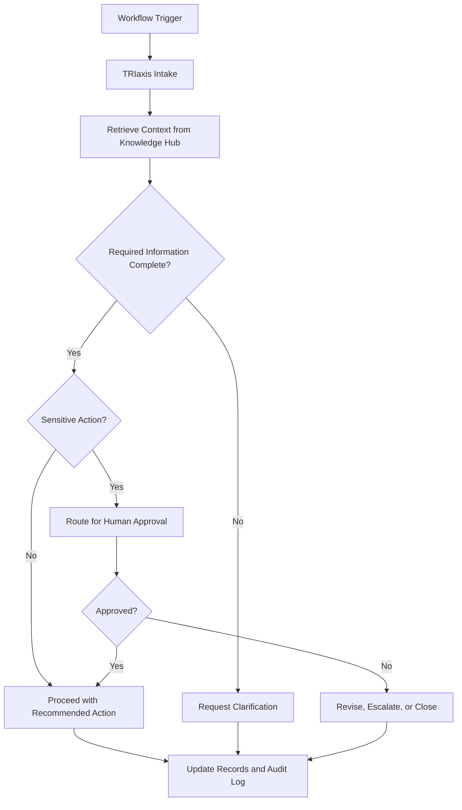
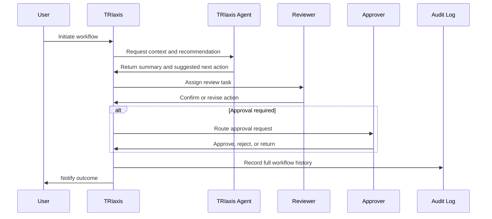

# Workflow Name

**Status:** Draft  
**Domain:** Healthcare / Non-Profits / Education / Shared Operations  
**Workflow Owner:** Mrs. Ritashree Mahanta, Cofounder & COO, AXXESS  
**Document Owner:** AXXESS TRIaxis Team  
**Last Updated:** 2026-08-06  
**Version:** 0.1

## 1. Purpose

Describe the operational purpose of the workflow in plain business language.

This section should answer:

- What problem does this workflow solve?
- Who benefits from it?
- What should be faster, safer, more transparent, or more accountable after implementation?
- How does TRIaxis improve the current process?

## 2. Scope

### In Scope

- List the activities covered by this workflow.
- Include human actions, AI-assisted actions, approvals, data capture, notifications, and audit events.

### Out of Scope

- List adjacent activities that are intentionally excluded.
- Mention dependencies handled by other workflows.

## 3. Actors

| Actor | Role in Workflow | TRIaxis Access Level |
|---|---|---|
| Requestor | Initiates the workflow | User |
| Coordinator | Reviews intake and assigns next action | Manager |
| Approver | Approves sensitive or high-impact actions | Approver |
| Domain Lead | Handles exceptions and policy interpretation | Admin / Domain Lead |
| TRIaxis Agent | Assists with retrieval, drafting, routing, summarization, or execution | System |

## 4. Trigger

Describe the event that starts the workflow.

Examples:

- New request submitted
- Document uploaded
- Meeting completed
- Customer, patient, donor, student, or stakeholder status changed
- SLA threshold reached
- Approval required

## 5. Preconditions

Before the workflow begins:

- Required user must be authenticated.
- Tenant context must be active.
- Required role permissions must be available.
- Relevant records, documents, or knowledge sources must be indexed or attached.
- Applicable policy, consent, or authorization requirements must be satisfied.

## 6. Data Inputs

| Input | Source | Required | Notes |
|---|---|---|---|
| Request details | User form / CRM / project / meeting | Yes | Capture source terminology from Ritashree's workflow. |
| Supporting documents | Document Hub / upload / integration | Conditional | Used for context and evidence. |
| Stakeholder information | CRM / manual entry / imported record | Conditional | Must respect tenant isolation and permissions. |
| Policy or SOP reference | Knowledge Hub | Conditional | Used by TRIaxis Agent for guided recommendations. |

## 7. Step-by-Step Flow

| Step | Owner | Action | TRIaxis Capability | Output |
|---:|---|---|---|---|
| 1 | Requestor | Initiates workflow | Intake form / CRM / meeting / document trigger | Workflow record created |
| 2 | TRIaxis Agent | Retrieves relevant context | Knowledge Hub / RAG / document indexing | Context summary |
| 3 | Coordinator | Reviews request | Dashboard / task queue | Assigned next action |
| 4 | TRIaxis Agent | Recommends action or drafts output | AI model invocation / workflow rules | Draft recommendation |
| 5 | Approver | Reviews sensitive action if required | Human-in-the-loop approval | Approved / rejected / returned |
| 6 | Coordinator | Executes or schedules action | Tasks / projects / meetings / CRM automation | Action completed |
| 7 | TRIaxis | Records activity | Audit logs / analytics | Traceable workflow history |

## 8. Decision Points

## 9. Exceptions

| Exception | Detection Method | Resolution | Owner |
|---|---|---|---|
| Missing required information | Intake validation / reviewer check | Request clarification | Coordinator |
| Conflicting records | Agent confidence flag / manual review | Escalate to Domain Lead | Coordinator |
| Permission mismatch | RBAC check | Reassign or request access | Admin |
| Sensitive action without approval | Workflow rule | Hold action until approval | Approver |
| External system unavailable | Integration error | Retry or manual fallback | Operations |

## 10. Escalation Paths

| Scenario | Escalate To | SLA | Notes |
|---|---|---|---|
| High-risk decision | Domain Lead | Define per workflow | Requires documented rationale |
| Approval delayed | Approver's manager / Admin | Define per workflow | Notify stakeholders |
| Data inconsistency | Operations / Admin | Define per workflow | Preserve original records |
| Compliance concern | Compliance owner / Domain Lead | Immediate | Stop automated execution |

## 11. Data Outputs

| Output | Destination | Format | Audit Requirement |
|---|---|---|---|
| Workflow record | TRIaxis workflow module | Structured record | Required |
| Recommendation summary | Task / CRM / project / meeting note | Text summary | Required |
| Approval decision | Approval module | Approved / rejected / returned | Required |
| Final action | CRM / project / document / notification | Depends on workflow | Required |
| KPI event | Analytics | Metric event | Required |

## 12. Roles and Permissions

| Capability | User | Manager | Approver | Admin | TRIaxis Agent |
|---|---:|---:|---:|---:|---:|
| Create request | Yes | Yes | Yes | Yes | No |
| View own records | Yes | Yes | Yes | Yes | Conditional |
| View all domain records | No | Yes | Yes | Yes | Conditional |
| Recommend action | No | Yes | Yes | Yes | Yes |
| Execute action | Conditional | Yes | Conditional | Yes | Conditional |
| Approve sensitive action | No | No | Yes | Yes | No |
| Override workflow | No | No | Conditional | Yes | No |
| View audit log | No | Yes | Yes | Yes | No |

## 13. Audit Trail

Every workflow instance should record:

- Trigger source
- Initiating user
- Tenant ID
- Timestamp
- Inputs received
- Knowledge sources accessed
- AI model or agent action invoked
- Recommendation generated
- Human reviewer or approver
- Approval decision
- Final action taken
- Exceptions and escalations
- Record updates
- Completion timestamp

## 14. KPI Framework

| KPI | Definition | Measurement Source |
|---|---|---|
| Cycle time | Time from trigger to completion | Workflow timestamps |
| SLA adherence | Percentage completed within target time | Workflow analytics |
| Approval turnaround time | Time from approval request to decision | Approval logs |
| Exception rate | Percentage requiring manual exception handling | Exception logs |
| Rework rate | Percentage returned for clarification or correction | Workflow status changes |
| Automation assist rate | Percentage of steps supported by TRIaxis Agent | Agent activity logs |
| User adoption | Number of active users or teams using the workflow | Usage analytics |

## 15. Risks and Controls

| Risk | Impact | Control |
|---|---|---|
| Incorrect AI recommendation | Poor decision or operational error | Human-in-the-loop review for sensitive actions |
| Unauthorized access | Data exposure | RBAC, tenant isolation, audit logs |
| Incomplete data | Delayed or incorrect action | Required fields and clarification loop |
| Over-automation | Loss of domain judgment | Approval thresholds and escalation rules |
| Poor traceability | Weak accountability | Immutable audit trail and decision history |

## 16. Acceptance Criteria

The workflow is ready when:

- All required actors and permissions are defined.
- Trigger and completion criteria are clear.
- Required inputs and outputs are documented.
- Decision points and approval gates are explicit.
- Exceptions and escalations are documented.
- Audit trail requirements are complete.
- KPIs are measurable using TRIaxis events or logs.
- Domain terminology has been reviewed by Ritashree Mahanta or the designated domain owner.
- Implementation notes are sufficient for engineering and product teams.

## 17. Implementation Notes

Capture product and engineering notes here:

- Required TRIaxis modules
- Required integrations
- Required data models
- Required notifications
- Required approval rules
- Required analytics events
- Tenant configuration requirements
- Web Lite or mobile-specific behavior
- Localization requirements
- Deployment considerations

## 18. Sequence View

## 19. Open Questions

- Which terms from Ritashree Mahanta's original workflow must remain unchanged?
- Which steps require mandatory human review?
- What is the target SLA?
- Which records should be visible to which roles?
- Which actions can TRIaxis execute directly?
- Which actions must remain recommendation-only?

